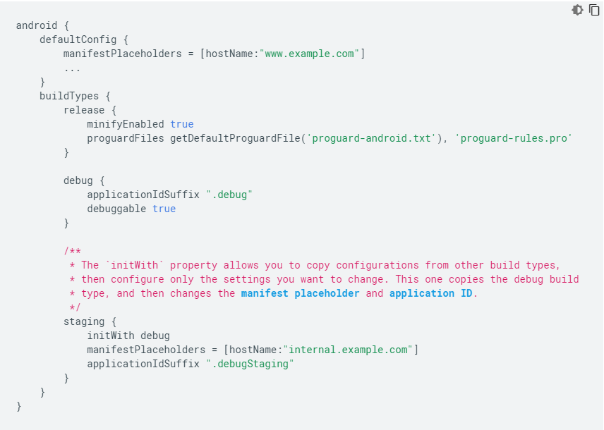
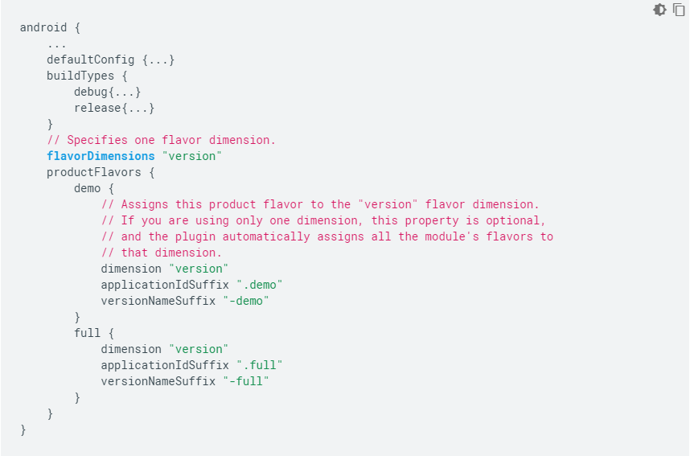

# Build Type, Product Flavor, Build Variant

## Build Type
**Build Types** controls how to build and package your app, for example whether or not ProGuard is run, how the resulting application package is signed and whether debug symbols are to be included. By default, the build system defines two build types: `debug` and `release`.

## Product Flavor
**Product Flavor** configuration defines a customized version of the application build. It can be used to specify custom features, minimum and target API levels, device and API requirements like layout, drawable and custom code. This can help create different label apps as well. Flavours can vary in adding different features or customizing exisitng features, different icons and resources, different styles and strings etc.

## Build Variant
The combination of **Build Type** and **Product Flavor** is known as **Build Variant**. For example, for above build types (debug and release) and product flavours (demo and full versions), build variants can be: `demoDebug`, `demoRelease`, `fullDebug`, `fullRelease`.

## Links
https://developer.android.com/studio/build/build-variants  
https://wajahatkarim.com/2018/04/difference-between-build-type-flavour-and-build-variant-in-android/  
https://stackoverflow.com/questions/27905934/why-are-build-types-distinct-from-product-flavors
