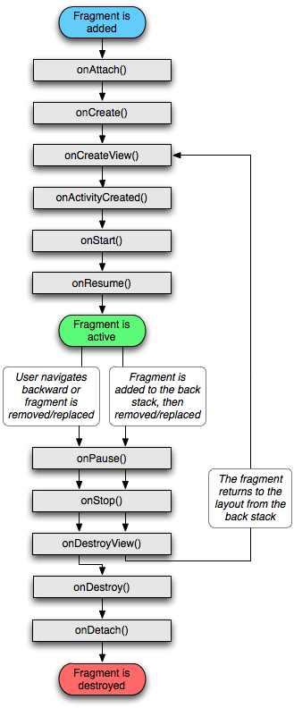
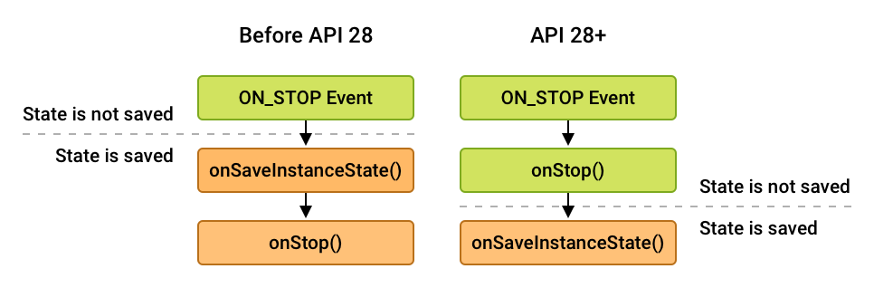

# Fragment Lifecycle
Each `Fragment` instance has its own lifecycle. When a user navigates and interacts with your app, your fragments transition through various states in their lifecycle as they are added, removed, and enter or exit the screen.

To manage lifecycle, `Fragment` implements `LifecycleOwner`, exposing a `Lifecycle` object that you can access through the `getLifecycle()` method.

Each possible `Lifecycle` state is represented in the `Lifecycle.State` enum[1](https://developer.android.com/guide/fragments/lifecycle#:~:text=Each%20Fragment%20instance,Lifecycle.State%20enum.):
- `INITIALIZED`
- `CREATED`
- `STARTED`
- `RESUMED`
- `DESTROYED`

As an alternative to using a `LifecycleObserver`, the `Fragment` class includes callback methods that correspond to each of the changes in a fragment's lifecycle. These include `onCreate()`, `onStart()`, `onResume()`, `onPause()`, `onStop()`, and `onDestroy()`.

A fragment's view has a separate `Lifecycle` that is managed independently from that of the fragment's `Lifecycle`. Fragments maintain a `LifecycleOwner` for their view, which can be accessed using `getViewLifecycleOwner()` or `getViewLifecycleOwnerLiveData()`. Having access to the view's `Lifecycle` is useful for situations where a Lifecycle-aware component should only perform work while a fragment's view exists, such as observing `LiveData` that is only meant to be displayed on the screen.[2](https://developer.android.com/guide/fragments/lifecycle#:~:text=As%20an%20alternative,on%20the%20screen.)

## [Fragment lifecycle states and callbacks](https://developer.android.com/guide/fragments/lifecycle#states)
Image below shows ach of the fragment's `Lifecycle` states and how they relate to both the fragment's lifecycle callbacks and the fragment's view `Lifecycle`:

As a fragment progresses through its lifecycle, it moves upward and downward through its states. For example, a fragment that is added to the top of the back stack moves upward from `CREATED` to `STARTED` to `RESUMED`. Conversely, when a fragment is popped off of the back stack, it moves downward through those states, going from `RESUMED` to `STARTED` to `CREATED` and finally `DESTROYED`.

When moving upward through its lifecycle states, a fragment first calls the associated lifecycle callback for its new state. Once this callback is finished, the relevant `Lifecycle.Event` is emitted to observers by the fragment's `Lifecycle`, followed by the fragment's view `Lifecycle`, if it has been instantiated.

### [Fragment CREATED](https://developer.android.com/guide/fragments/lifecycle#fragment_created)
When your fragment reaches the `CREATED` state, it has been added to a `FragmentManager` and the `onAttach()` method has already been called.

This would be the appropriate place to restore any saved state associated with the fragment itself through the fragment's `SavedStateRegistry`. Note that the fragment's view has not been created at this time, and any state associated with the fragment's view should be restored only after the view has been created.

This transition invokes the `onCreate()` callback. The callback also receives a `savedInstanceState` `Bundle` argument containing any state previously saved by `onSaveInstanceState()`. Note that `savedInstanceState` has a `null` value the first time the fragment is created, but it is always non-null for subsequent recreations, even if you do not override `onSaveInstanceState()`.

### [Fragment CREATED and View INITIALIZED](https://developer.android.com/guide/fragments/lifecycle#fragment_created_and_view_initialized)
The fragment's view `Lifecycle` is created only when your `Fragment` provides a valid `View` instance. In most cases, you can use the fragment constructors that take a `@LayoutId`, which automatically inflates the view at the appropriate time. You can also override `onCreateView()` to programmatically inflate or create your fragment's view.

If and only if your fragment's view is instantiated with a non-null `View`, that `View` is set on the fragment and can be retrieved using `getView()`. The `getViewLifecycleOwnerLiveData()` is then updated with the newly `INITIALIZED` `LifecycleOwner` corresponding with the fragment's view. The `onViewCreated()` lifecycle callback is also called at this time.

This is the appropriate place to set up the initial state of your view, to start observing `LiveData` instances whose callbacks update the fragment's view, and to set up adapters on any `RecyclerView` or `ViewPager2` instances in your fragment's view.

### [Fragment and View CREATED](https://developer.android.com/guide/fragments/lifecycle#fragment_and_view_created)
After the fragment's view has been created, the previous view state, if any, is restored, and the view's `Lifecycle` is then moved into the `CREATED` state. The view lifecycle owner also emits the `ON_CREATE` event to its observers. Here you should restore any additional state associated with the fragment's view.

This transition also invokes the `onViewStateRestored()` callback.

### [Fragment and View STARTED](https://developer.android.com/guide/fragments/lifecycle#fragment_and_view_started)
It is strongly recommended to tie Lifecycle-aware components to the `STARTED` state of a fragment, as this state guarantees that the fragment's view is available, if one was created, and that it is safe to perform a `FragmentTransaction` on the child `FragmentManager` of the fragment. If the fragment's view is non-null, the fragment's view `Lifecycle` is moved to `STARTED` immediately after the fragment's `Lifecycle` is moved to `STARTED`.

When the fragment becomes `STARTED`, the `onStart()` callback is invoked.

### [Fragment and View RESUMED](https://developer.android.com/guide/fragments/lifecycle#fragment_and_view_resumed)
When the fragment is visible, all `Animator` and `Transition` effects have finished, and the fragment is ready for user interaction. The fragment's `Lifecycle` moves to the `RESUMED` state, and the `onResume()` callback is invoked.

The transition to `RESUMED` is the appropriate signal to indicate that the user is now able to interact with your fragment. 

### [Fragment and View STARTED](https://developer.android.com/guide/fragments/lifecycle#fragment_and_view_started_2)
As the user begins to leave the fragment, and while the fragment is still visible, the `Lifecycle`s for the fragment and for its view are moved back to the `STARTED` state and emit the `ON_PAUSE` event to their observers. The fragment then invokes its `onPause()` callback.

### [Fragment and View CREATED](https://developer.android.com/guide/fragments/lifecycle#fragment_and_view_created_2)
Once the fragment is no longer visible, the `Lifecycle`s for the fragment and for its view are moved into the `CREATED` state and emit the `ON_STOP` event to their observers. This state transition is triggered not only by the parent activity or fragment being stopped, but also by the saving of state by the parent activity or fragment. This behavior guarantees that the `ON_STOP` event is invoked before the fragment's state is saved. This makes the `ON_STOP` event the last point where it is safe to perform a `FragmentTransaction` on the child `FragmentManager`.

The ordering of the `onStop()` callback and the saving of the state with `onSaveInstanceState()` differs based on API level. For all API levels prior to API 28, `onSaveInstanceState()` is invoked before `onStop()`. For API levels 28 and higher, the calling order is reversed:

### [Fragment CREATED and View DESTROYED](https://developer.android.com/guide/fragments/lifecycle#fragment_created_and_view_destroyed)
After all of the exit animations and transitions have completed, and the fragment's view has been detached from the window, the fragment's view `Lifecycle` is moved into the `DESTROYED` state and emits the `ON_DESTROY` event to its observers. The fragment then invokes its `onDestroyView()` callback. At this point, the fragment's view has reached the end of its lifecycle and `getViewLifecycleOwnerLiveData()` returns a `null` value.

At this point, all references to the fragment's view should be removed, allowing the fragment's view to be garbage collected.

### [Fragment DESTROYED](https://developer.android.com/guide/fragments/lifecycle#fragment_destroyed)
If the fragment is removed, or if the `FragmentManager` is destroyed, the fragment's `Lifecycle` is moved into the `DESTROYED` state and sends the `ON_DESTROY` event to its observers. The fragment then invokes its `onDestroy()` callback. At this point, the fragment has reached the end of its lifecycle.

# Links
[Fragment lifecycle](https://developer.android.com/guide/fragments/lifecycle)

# Further reading
[Android Fragment Lifecycle](https://www.digitalocean.com/community/tutorials/android-fragment-lifecycle)

[Handling Lifecycles with Lifecycle-Aware Components](https://developer.android.com/topic/libraries/architecture/lifecycle)

[The Lifecycle of Fragment in Android](https://blog.stackademic.com/the-lifecycle-of-fragment-in-android-6a38efe67ebe)
