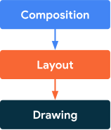

# Jetpack Compose Phases
Like most other UI toolkits, Compose renders a frame through several distinct *phases*. If we look at the Android View system, it has three main phases: measure, layout, and drawing. Compose is very similar but has an important additional phase called *composition* at the start.

## [The three phases of a frame](https://developer.android.com/jetpack/compose/phases#3-phases)
Compose has three main phases:
- **Composition**: What UI to show. Compose runs composable functions and creates a description of your UI.
- **Layout**: *Where* to place UI. This phase consists of two steps: measurement and placement. Layout elements measure and place themselves and any child elements in 2D coordinates, for each node in the layout tree.
- **Drawing**: *How* it renders. UI elements draw into a Canvas, usually a device screen.



The order of these phases is generally the same, allowing data to flow in one direction from composition to layout to drawing to produce a frame (also known as [unidirectional data flow](https://developer.android.com/jetpack/compose/architecture#udf)). `BoxWithConstraints` and `LazyColumn` and `LazyRow` are notable exceptions, where the composition of its children depends on the parent's layout phase.

You can safely assume that these three phases happen virtually for every frame, but for the sake of performance, Compose avoids repeating work that would compute the same results from the same inputs in all of these phases. Compose [skips](https://developer.android.com/jetpack/compose/mental-model#skips) running a composable function if it can reuse a former result, and Compose UI doesn't re-layout or re-draw the entire tree if it doesn't have to. Compose performs only the minimum amount of work required to update the UI. This optimization is possible because Compose tracks state reads within the different phases.

## [State reads](https://developer.android.com/jetpack/compose/phases#state-reads)
When you read the value of a [snapshot state](https://developer.android.com/jetpack/compose/state) during one of the phases listed above, Compose automatically tracks what it was doing when the value was read. This tracking allows Compose to re-execute the reader when the state value changes, and is the basis of state observability in Compose.

State is commonly created using `mutableStateOf()` and then accessed through one of two ways: by directly accessing the value property, or alternatively by using a Kotlin property delegate. You can read more about them in [State in composables](https://developer.android.com/jetpack/compose/state#state-in-composables). For the purposes of this guide, a "state read" refers to either of those equivalent access methods.

```
// State read without property delegate.
val paddingState: MutableState<Dp> = remember { mutableStateOf(8.dp) }
Text(
    text = "Hello",
    modifier = Modifier.padding(paddingState.value)
)
```

or

```
// State read with property delegate.
var padding: Dp by remember { mutableStateOf(8.dp) }
Text(
    text = "Hello",
    modifier = Modifier.padding(padding)
)
```

Under the hood of the [property delegate](https://kotlinlang.org/docs/delegated-properties.html), "getter" and "setter" functions are used to access and update the State’s `value`. These getter and setter functions are only invoked when you reference the property as a value, and not when it is created, which is why the two ways above are equivalent.

Each block of code that can be re-executed when a read state changes is a restart scope. Compose keeps track of state value changes and *restart* scopes in different phases.

## [Phased state reads](https://developer.android.com/jetpack/compose/phases#phased-state-reads)

### [Phase 1: Composition](https://developer.android.com/jetpack/compose/phases#phase1-comp)
State reads within a `@Composable` function or lambda block affect composition and potentially the subsequent phases. When the state value changes, the recomposer schedules reruns of all the composable functions which read that state value. Note that the runtime may decide to skip some or all of the composable functions if the inputs haven't changed. See [Skipping if the inputs haven't changed](https://developer.android.com/jetpack/compose/lifecycle#skipping) for more information.

Depending on the result of composition, Compose UI runs the layout and drawing phases. It might skip these phases if the content remains the same and the size and the layout won't change.

### [Phase 2: Layout](https://developer.android.com/jetpack/compose/phases#phase2-layout)
The layout phase consists of two steps: *measurement* and *placement*. The measurement step runs the measure lambda passed to the `Layout` composable, the `MeasureScope.measure` method of the `LayoutModifier` interface, and so on. The placement step runs the placement block of the `layout` function, the lambda block of `Modifier.offset { … }`, and so on.

State reads during each of these steps affect the layout and potentially the drawing phase. When the state value changes, Compose UI schedules the layout phase. It also runs the drawing phase if size or position has changed.

To be more precise, the measurement step and the placement step have separate restart scopes, meaning that state reads in the placement step don't re-invoke the measurement step before that. However, these two steps are often intertwined, so a state read in the placement step can affect other restart scopes that belong to the measurement step.

```
var offsetX by remember { mutableStateOf(8.dp) }
Text(
    text = "Hello",
    modifier = Modifier.offset {
        // The `offsetX` state is read in the placement step
        // of the layout phase when the offset is calculated.
        // Changes in `offsetX` restart the layout.
        IntOffset(offsetX.roundToPx(), 0)
    }
)
```

### [Phase 3: Drawing](https://developer.android.com/jetpack/compose/phases#phase3-drawing)
State reads during drawing code affect the drawing phase. Common examples include `Canvas()`, `Modifier.drawBehind`, and `Modifier.drawWithContent`. When the state value changes, Compose UI runs only the draw phase.

```
var color by remember { mutableStateOf(Color.Red) }
Canvas(modifier = modifier) {
    // The `color` state is read in the drawing phase
    // when the canvas is rendered.
    // Changes in `color` restart the drawing.
    drawRect(color)
}
```


# Links
[Jetpack Compose Phases](https://developer.android.com/jetpack/compose/phases)

# Further reading
[Compose phases](https://medium.com/androiddevelopers/compose-phases-7fe6630ea037)
