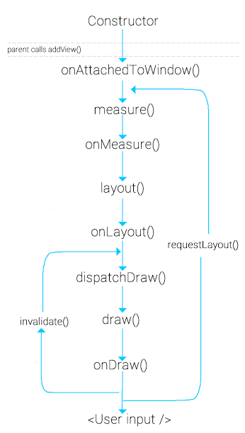

# View lifecycle
`View` class represents the basic building block for user interface components. A View occupies a rectangular area on the screen and is responsible for drawing and event handling. View is the base class for *widgets*, which are used to create interactive UI components (buttons, text fields, etc.).

Every `Activity` has it’s own lifecycle similarly Views also have a lifecycle. A view which was rendered on the screen must undergo these lifecycle methods to get drawn on the screen correctly.

- `onAttachedToWindow()` - Called when the view is attached to a window. This is the phase where the view knows it can be active and has a surface for drawing. So we can start allocating any resources or set up listeners.
- `onFinishInflate()` - Called after a view and all of its children has been inflated from XML.
- `onMeasure(int, int)` - Called to determine the size requirements for this view and all of its children.
- `onLayout(boolean, int, int, int, int)` - Called when this view should assign a size and position to all of its children.
- `onSizeChanged(int, int, int, int)` - Called when the size of this view has changed.
- `onDraw(android.graphics.Canvas)` - Canvas object generated (or updates) has a list of OpenGL-ES commands (displayList) to send to the GPU. Never create objects in `onDraw()` as it gets called a number of times.
- `invalidate()` - method that insists on force reDrawing of a particular view that we wish to show changes. Needs to be called when there was a change in view’s appearance.
- `requestLayout()` - At some point, there is a state change in the view. `requestLayout()` is the signal to the view system that it needs to recalculate the Measure and Layout phase of the views (measure → layout → draw).
- `onDetachedFromWindow()` - This is called when the view is detached from a window. At this point, it no longer has a surface for drawing. This place where you need to stop doing any kind of work that is scheduled or clean up resources that are allocated. This method is called when we call remove view on the `ViewGroup` or when the `Activity` is destroyed etc.

## Links 
https://proandroiddev.com/the-life-cycle-of-a-view-in-android-6a2c4665b95e  
https://codentrick.com/android-view-lifecycle/  
https://medium.com/@sahoosunilkumar/understanding-view-lifecycle-in-android-e42890aab16  
https://developer.android.com/reference/android/view/View  
