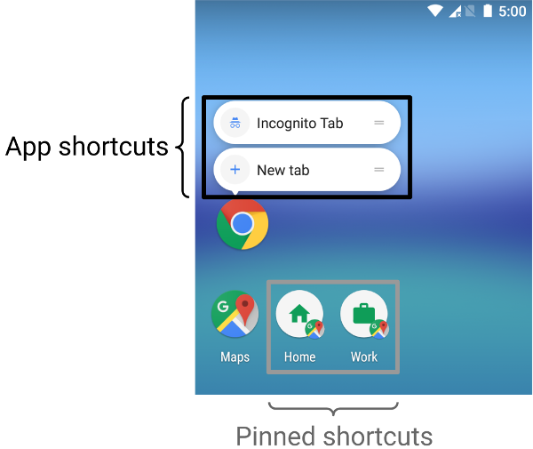

# App Shortcuts
Shortcuts deliver specific types of content to your users by helping them quickly access parts of your app.<sup>[1](https://developer.android.com/develop/ui/views/launch/shortcuts/creating-shortcuts#:~:text=Shortcuts%20deliver%20specific%20types%20of%20content%20to%20your%20users%20by%20helping%20them%20quickly%20access%20parts%20of%20your%20app.)</sup>



As a developer, you can define shortcuts to perform specific actions in your app. You can display these shortcuts in a supported launcher or assistant—like Google Assistant—and help your users quickly start common or recommended tasks within your app.<sup>[2](https://developer.android.com/develop/ui/views/launch/shortcuts#:~:text=As%20a%20developer%2C%20you%20can%20define%20shortcuts%20to%20perform%20specific%20actions%20in%20your%20app.%20You%20can%20display%20these%20shortcuts%20in%20a%20supported%20launcher%20or%20assistant%E2%80%94like%20Google%20Assistant%E2%80%94and%20help%20your%20users%20quickly%20start%20common%20or%20recommended%20tasks%20within%20your%20app.)</sup>

Each shortcut references one or more intents, each of which launches a specific action in your app when users select the shortcut. The types of shortcuts you create for your app depend on the app's use case.<sup>[3](https://developer.android.com/develop/ui/views/launch/shortcuts#:~:text=Each%20shortcut%20references%20one%20or%20more%20intents%2C%20each%20of%20which%20launches%20a%20specific%20action%20in%20your%20app%20when%20users%20select%20the%20shortcut.%20The%20types%20of%20shortcuts%20you%20create%20for%20your%20app%20depend%20on%20the%20app%27s%20use%20case.)</sup>

You can publish the following types of shortcuts for your app:<sup>[4](https://developer.android.com/develop/ui/views/launch/shortcuts#:~:text=You%20can%20publish,user%20grants%20permission.)</sup>
- **Static shortcuts** are defined in a resource file that is packaged into an APK or app bundle;
- **Dynamic shortcuts** can be pushed, updated, and removed by your app only at runtime;
- **Pinned shortcuts** can be added to supported launchers at runtime if the user grants permission.

## [Static shortcuts](https://developer.android.com/develop/ui/views/launch/shortcuts/creating-shortcuts#static)
Static shortcuts are best for apps that link to content using a consistent structure throughout the lifetime of a user's interaction with the app. Because most launchers only display four shortcuts at once, static shortcuts are useful for performing a routine task in a consistent way, such as if the user wants to view their calendar or email in a specific way.

To create a static shortcut, do the following:
- In your app's `AndroidManifest.xml` file, find the activity whose intent filters are set to the `android.intent.action.MAIN` action and the `android.intent.category.LAUNCHER` category;
- Add a `<meta-data>` element to this activity that references the resource file where the app's shortcuts are defined;
- Create a new resource file called `res/xml/shortcuts.xml`;
- In the new resource file, add a `<shortcuts>` root element that contains a list of `<shortcut>` elements. In each `<shortcut>` element, include information about a static shortcut including its icon, description labels, and the intents it launches within the app.

## [Dynamic shortcuts](https://developer.android.com/develop/ui/views/launch/shortcuts/creating-shortcuts#dynamic)
Dynamic shortcuts provide links to specific, context-sensitive actions within your app. These actions can change between uses of your app and while your app is running. Good uses for dynamic shortcuts include calling a specific person, navigating to a specific location, and loading a game from the user's last save point. You can also use dynamic shortcuts to open a conversation.

The `ShortcutManagerCompat` Jetpack library is a helper for the `ShortcutManager` API, which lets you manage dynamic shortcuts in your app. Using the ShortcutManagerCompat library reduces boilerplate code and helps ensure that your shortcuts work consistently across Android versions.

The `ShortcutManagerCompat` API lets your app perform the following operations with dynamic shortcuts:
- **Push and update**: use `pushDynamicShortcut()` to publish and update your dynamic shortcuts. If there are already dynamic or pinned shortcuts with the same ID, each mutable shortcut updates;
- **Remove**: remove a set of dynamic shortcuts using `removeDynamicShortcuts()`. Remove all dynamic shortcuts using `removeAllDynamicShortcuts()`.

Here's an example of creating a dynamic shortcut and associating it with your app:
```
val shortcut = ShortcutInfoCompat.Builder(context, "id1")
        .setShortLabel("Website")
        .setLongLabel("Open the website")
        .setIcon(IconCompat.createWithResource(context, R.drawable.icon_website))
        .setIntent(Intent(Intent.ACTION_VIEW,
                Uri.parse("https://www.mysite.example.com/")))
        .build()

ShortcutManagerCompat.pushDynamicShortcut(context, shortcut)
```

## [Pinned shortcuts](https://developer.android.com/develop/ui/views/launch/shortcuts/creating-shortcuts#pinned)
On Android 8.0 (API level 26) and higher, you can create pinned shortcuts. Unlike static and dynamic shortcuts, pinned shortcuts appear in supported launchers as separate icons. 

To pin a shortcut to a supported launcher using your app, complete the following steps:
- Use `isRequestPinShortcutSupported()` to verify that the device's default launcher supports in-app pinning of shortcuts;
- Create a `ShortcutInfo` object in one of two ways, depending on whether the shortcut exists:
  - If the shortcut exists, create a `ShortcutInfo` object that contains only the existing shortcut's ID. The system finds and pins all other information related to the shortcut automatically;
  - If you're pinning a new shortcut, create a `ShortcutInfo` object that contains an ID, an intent, and a short label for the new shortcut.
- Pin the shortcut to the device's launcher by calling `requestPinShortcut()`. During this process, you can pass in a `PendingIntent` object, which notifies your app only when the shortcut pins successfully. After a shortcut is pinned, your app can update its contents using the `updateShortcuts()` method.

## [Best practices for shortcuts](https://developer.android.com/develop/ui/views/launch/shortcuts/best-practices)
- **Follow the design guidelines**. To make your app's shortcuts visually consistent with the shortcuts used for system apps, follow the [App Shortcuts Icon Design Guidelines](https://developer.android.com/static/shareables/design/app-shortcuts-design-guidelines.pdf);
- **Publish only four distinct shortcuts**. Although the API supports a combination of up to 15 static and dynamic shortcuts for your app, we recommend that you publish only four distinct shortcuts, to improve their visual appearance in the launcher;
- **Limit shortcut description length**. The space in the menu that shows your app's shortcuts in the launcher is limited. When possible, limit the length of the "short description" of a shortcut to 10 characters and limit the length of the "long description" to 25 characters;
- **Maintain shortcut and action usage history**. For each shortcut you create, consider the different ways a user can accomplish the same task directly within your app. Call `reportShortcutUsed()` in each of these situations so that the launcher maintains an accurate history of how frequently a user performs the actions representing your shortcuts;
- **Update shortcuts only when their meaning is retained**. When changing dynamic and pinned shortcuts, only call updateShortcuts() when changing the information of a shortcut that retains its meaning;
- **Check dynamic shortcuts whenever you launch your app**. Dynamic shortcuts aren't preserved when the user restores their data onto a new device. For this reason, we recommend that you check the number of objects returned by `getDynamicShortcuts()` each time you launch your app and re-publish dynamic shortcuts as needed.

# Links
[App shortcuts overview](https://developer.android.com/develop/ui/views/launch/shortcuts)

[Create shortcuts](https://developer.android.com/develop/ui/views/launch/shortcuts/creating-shortcuts)

[Best practices for shortcuts](https://developer.android.com/develop/ui/views/launch/shortcuts/best-practices)

# Further reading
[Extend dynamic shortcuts to Google Assistant with App Actions](https://codelabs.developers.google.com/codelabs/appactions-dynamic-shortcuts#0)

[Manage shortcuts](https://developer.android.com/develop/ui/views/launch/shortcuts/managing-shortcuts)
