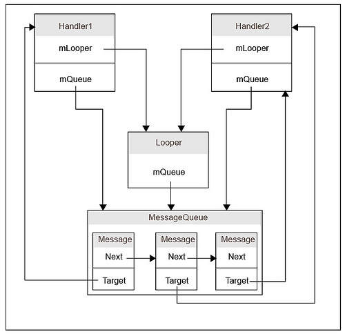

# Handler, MessageQueue, Looper

## Main classes
To describe the whole flow, we need to understand what the purpose of the following classes:
- `Runnable`;
- `Thread`;
- `Message`;
- `MessageQueue`;
- `Handler`;
- `Looper`.

### [Runnable](https://developer.android.com/reference/java/lang/Runnable)
The `Runnable` interface should be implemented by any class whose instances are intended to be executed by a thread. The class must define a method of no arguments called `run`.

This interface is designed to provide a common protocol for objects that wish to execute code while they are active. Being active simply means that a thread has been started and has not yet been stopped.

### [Thread](https://developer.android.com/reference/java/lang/Thread)
A *thread* is a thread of execution in a program. The Java Virtual Machine allows an application to have multiple threads of execution running concurrently.

Java offers two types of threads: user threads and daemon threads.

User threads are high-priority threads. **The JVM will wait for any user thread to complete its task before terminating it**.

On the other hand, **daemon threads are low-priority threads whose only role is to provide services to user threads**.

Since daemon threads are meant to serve user threads and are only needed while user threads are running, they won't prevent the JVM from exiting once all user threads have finished their execution. [source](https://www.baeldung.com/java-daemon-thread#difference-between-daemon-and-user-threads)

When a Java Virtual Machine starts up, there is usually a single non-daemon thread (which typically calls the method named `main` of some designated class). 

When an application is launched in Android, it creates the first thread of execution, known as the "main" thread. The main thread is responsible for dispatching events to the appropriate user interface widgets as well as communicating with components from the Android UI toolkit.

### Message, MessageQueue
[`Message`](https://developer.android.com/reference/android/os/Message) defines a message containing a description and arbitrary data object. This object contains two extra int fields and an extra object field that allow you to not do allocations in many cases.

[`MessageQueue`](https://developer.android.com/reference/android/os/MessageQueue) is low-level class holding the list of messages. When a process is created for your application, its main thread is dedicated to running a `MessageQueue` that takes care of managing the top-level application objects (activities, broadcast receivers, etc) and any windows they create. Messages are not added directly to a `MessageQueue`, but rather through `Handler`. 

### [Handler](https://developer.android.com/reference/android/os/Handler)
A `Handler` allows you to send and process `Message` and `Runnable` objects associated with a thread's `MessageQueue`. Each `Handler` instance is associated with a single thread and that thread's message queue. There are two main uses for a `Handler`:
- Schedule messages and runnables to be executed at some point in the future;
- Enqueue an action to be performed on a different thread than your own.

When you create a new `Handler` it is bound to a `Looper`.

### Looper
The `Looper` class maintains a `MessageQueue` and used to run a message loop for a thread. An important character of `Looper` is that it's associated with the thread within which the `Looper` is created. This association is **kept forever** and can't be broken nor changed. Also note that a thread **can't be associated with more than one Looper**.

## Overview 
The relationships between Looper, Handler and MessageQueue is shown below:

As the name indicates, the `Handler` class is mainly responsible for handling (adding, removing, dispatching) messages of current thread's `MessageQueue`. A `Handler` instance is also bound to a thread. The binding between `Handler` and `Thread` is achieved via `Looper` and `MessageQueue`.
 `Handler` is always bound to a `Looper`, and subsequently bound to the thread associated with the `Looper`. Unlike `Looper`, multiple `Handler` instances can be bound to the same thread. Whenever we call [post](https://developer.android.com/reference/android/os/Handler.html#post%28java.lang.Runnable%29) or any methods alike on the `Handler`, a new message is added to the associated `MessageQueue`. The target field of the message is set to current `Handler` instance.  When the `Looper` received this message, it invokes [dispatchMessage](https://developer.android.com/reference/android/os/Handler.html#dispatchMessage%28android.os.Message%29) on message's target field, so that the message routes back to to the `Handler` instance to be handled, but on the correct thread. 

# Links
[Better performance through threading](https://developer.android.com/topic/performance/threads)

[Daemon Threads in Java](https://www.baeldung.com/java-daemon-thread)

[Deep dive in Handler, Message, MessageQueue, and Looper](https://medium.com/@iamatul_k/deep-dive-in-handler-message-messagequeue-and-looper-7ee10eab4716)

[What is the relationship between Looper, Handler and MessageQueue in Android?](https://stackoverflow.com/a/12878111)

# Further Reading
[Understanding Android Core: Looper, Handler, and HandlerThread](https://janisharali.com/blog/android-core-looper-handler-and-handlerthread-bd54d69fe91a)

[Decoding Handler and Looper in Android](https://proandroiddev.com/decoding-handler-and-looper-in-android-d4f3f2449513)

[Under the Hood — Loopers, Handlers and Message Queue and how do they help in communication with the UI Thread?](https://proandroiddev.com/where-do-loopers-handlers-and-message-queue-come-from-and-how-do-they-help-in-communication-with-6eee4557fe55)
