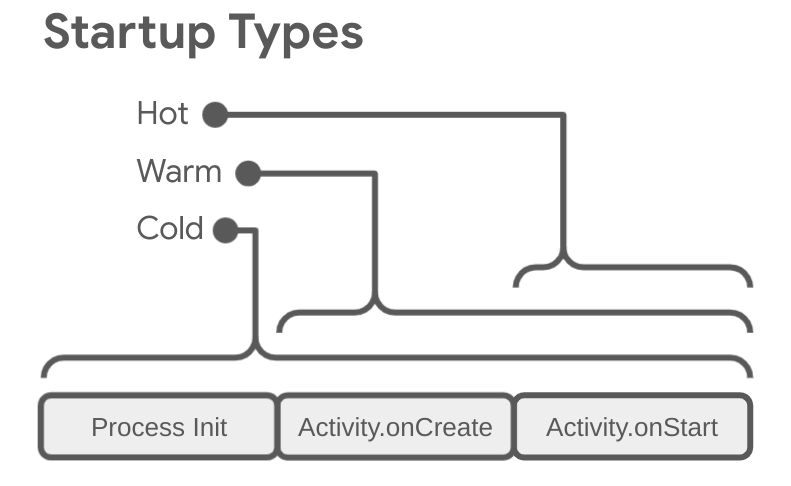

# App startup time
App launch can take place in one of three states:
- Cold start;
- Warm start;
- Hot start.

Each state affects how long it takes for your app to become visible to the user. In a cold start, your app starts from scratch. In the other states, the system needs to bring the running app from the background to the foreground.[1](https://developer.android.com/topic/performance/vitals/launch-time#:~:text=App%20launch%20can,to%20the%20foreground.)

Two important metrics for determining app startup are [time to initial display (TTID)](https://developer.android.com/topic/performance/vitals/launch-time#time-initial) and [time to fully drawn (TTFD)](https://developer.android.com/topic/performance/vitals/launch-time#time-full). TTID is the time taken to display the first frame, and TTFD is the time taken for the app to become fully interactive. Both are equally important, as TTID lets the user know that the app is loading, and TTFD is when the app is actually useable. If either of these is too long, the user might exit your app before it even fully loads.[2](https://developer.android.com/topic/performance/vitals/launch-time#:~:text=Two%20important%20metrics,even%20fully%20loads.)

## [Cold start](https://developer.android.com/topic/performance/vitals/launch-time#cold)
A cold start refers to an app's starting from scratch. This means that until this start, the system's process creates the app's process. Cold starts happen in cases such as your app launching for the first time since the device booted or since the system killed the app.

This type of start presents the greatest challenge to minimizing startup time, because the system and app have more work to do than in the other launch states.

At the beginning of a cold start, the system has the three following tasks:
- Load and launch the app;
- Display a blank starting window for the app immediately after launch;
- Create the app process.

As soon as the system creates the app process, the app process is responsible for the next stages:
- Create the app object;
- Launch the main thread;
- Create the main activity;
- Inflate views;
- Layout the screen;
- Perform the initial draw.

When the app process completes the first draw, the system process swaps out the displayed background window, replacing it with the main activity. At this point, the user can start using the app.

Figure below shows how the system and app processes hand off work between each other:

### [App creation](https://developer.android.com/topic/performance/vitals/launch-time#app-creation)
When your app launches, the blank starting window remains on the screen until the system finishes drawing the app for the first time. At this point, the system process swaps the starting window for your app, letting the user interact with the app.

If you override `Application.onCreate()` in your own app, the system invokes the `onCreate()` method on your app object. Afterwards, the app spawns the main thread, also known as the *UI thread*, and tasks it with creating your main activity.

From this point, system- and app-level processes proceed in accordance with the [app lifecycle stages](https://developer.android.com/guide/components/activities/process-lifecycle).

### [Activity creation](https://developer.android.com/topic/performance/vitals/launch-time#act-creation)
After the app process creates your activity, the activity performs the following operations:
- Initializes values;
- Calls constructors;
- Calls the callback method, such as `Activity.onCreate()`, appropriate to the current lifecycle state of the activity.

Typically, the `onCreate()` method has the greatest impact on load time, because it performs the work with the highest overhead: loading and inflating views and initializing the objects needed for the activity to run.

## [Warm start](https://developer.android.com/topic/performance/vitals/launch-time#warm)
A warm start encompasses a subset of the operations that take place during a cold start. At the same time, it represents more overhead than a hot start. There are many potential states that can be considered warm starts, such as the following:
- The user backs out of your app but then re-launches it. The process might continue to run, but the app must recreate the activity from scratch using a call to `onCreate()`;
- The system evicts your app from memory and then the user re-launches it. The process and the activity needs to restart, but the task can benefit somewhat from the saved instance state bundle passed into `onCreate()`.

## [Hot start](https://developer.android.com/topic/performance/vitals/launch-time#hot)
A hot start of your app has lower overhead than a cold start. In a hot start, the system brings your activity to the foreground. If all of your app's activities are still resident in memory, then the app can avoid repeating object initialization, layout inflation, and rendering.

However, if some memory is purged in response to memory trimming events, such as `onTrimMemory()`, then these objects need to be recreated in response to the hot start event.

A hot start displays the same on-screen behavior as a cold start scenario. The system process displays a blank screen until the app finishes rendering the activity.

## [Common issues](https://developer.android.com/topic/performance/vitals/launch-time#common)

### [Heavy app initialization](https://developer.android.com/topic/performance/vitals/launch-time#heavy-app)
Launch performance can suffer when your code overrides the `Application` object and executes heavy work or complex logic when initializing that object. Your app might waste time during startup if your `Application` subclasses perform initializations that don't need to be done yet.

Some initializations might be completely unnecessary, such as when initializing state information for the main activity when the app is actually started up in response to an intent. With an intent, the app uses only a subset of the previously initialized state data.

Other challenges during app initialization include garbage collection events that are impactful or numerous, or disk I/O happening concurrently with initialization, which further blocks the initialization process. Garbage collection is especially a consideration with the Dalvik runtime; the Android Runtime (ART) performs garbage collection concurrently, minimizing that operation's impact.

**Solutions to the problem**. Whether the problem lies with unnecessary initializations or with disk I/O, the solution is lazy initialization. In other words, only initialize objects that are immediately needed. Instead of creating global static objects, move to a singleton pattern where the app initializes objects only the first time it needs them.

Also, consider using a dependency injection framework like [Hilt](https://developer.android.com/training/dependency-injection/hilt-android) that creates objects and dependencies when they are injected for the first time.

If your app uses content providers to initialize app components at startup, consider using the [App Startup library](https://developer.android.com/topic/libraries/app-startup) instead.

### [Heavy activity initialization](https://developer.android.com/topic/performance/vitals/launch-time#heavy-act)
Activity creation often entails a lot of high-overhead work. Often, there are opportunities to optimize this work to achieve performance improvements. Such common issues include the following:
- Inflating large or complex layouts;
- Blocking screen drawing on disk, or network I/O;
- Loading and decoding bitmaps;
- Rasterizing `VectorDrawable` objects;
- Initialization of other subsystems of the activity.

**Solutions to the problem**. There are many potential bottlenecks, but two common problems and remedies are as follows:
- The larger your view hierarchy, the more time the app takes to inflate it. Two steps you can take to address this issue are the following:
  - Flatten your view hierarchy by reducing redundant or nested layouts;
  - Don't inflate parts of the UI that don't need to be visible during launch. Instead, use a `ViewStub` object as a placeholder for sub-hierarchies that the app can inflate at a more appropriate time.
- Having all of your resource initialization on the main thread can also slow down startup. You can address this issue as follows:
  - Move all resource initialization so that the app can perform it lazily on a different thread;
  - Let the app load and display your views, and then later update visual properties that are dependent on bitmaps and other resources.

### [Custom splash screens](https://developer.android.com/topic/performance/vitals/launch-time#themed)
You might see extra time added during startup if you previously used one of the following methods to implement a custom splash screen in Android 11 (API level 30) or earlier:
- Using the `windowDisablePreview` theme attribute to turn off the initial blank screen drawn by the system during launch;
- Using a dedicated `Activity`.

Starting with Android 12, migrating to the `SplashScreen` API is required. This API enables a faster startup time and lets you tweak your splash screen in the following ways:
- Set a theme to change the splash screen's appearance;
- Control how long the splash screen is displayed with `windowSplashScreenAnimationDuration`;
- Customize the splash screen animation, and gracefully handle the animation for dismissing the splash screen.

Furthermore, the compat library backports the [`SplashScreen API`](https://developer.android.com/develop/ui/views/launch/splash-screen/migrate) to enable backward-compatibility and to create a consistent look and feel for splash screen display across all Android versions.

# Links
[App startup time](https://developer.android.com/topic/performance/vitals/launch-time)

# Further reading
[How Not to Let the Cold App Start on Android Scare Away Your Users](https://maddevs.io/blog/cold-app-start-on-android/)

[Automatically Profile App Startup Time Performance on Pull Requests](https://medium.com/@sofipalamarchuk/automatically-profile-app-startup-time-performance-on-pull-requests-742208769f0)

# Next questions
[What do you know about Hilt?](https://github.com/Kirchhoff-/Android-Interview-Questions/blob/master/Libraries/What%20do%20you%20know%20about%20hilt.md)

[What do you know about App Startup library?](https://github.com/Kirchhoff-/Android-Interview-Questions/blob/master/Android/What%20do%20you%20know%20about%20App%20Startup.md)

[What's ViewStub?](https://github.com/Kirchhoff-/Android-Interview-Questions/blob/master/Android/What's%20ViewStub.md)
