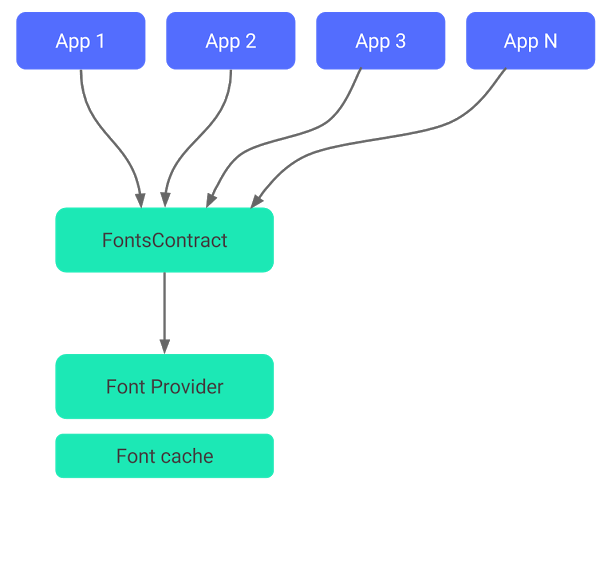

# Downloadable fonts
The Downloadable Fonts feature lets APIs request fonts from a provider application instead of bundling files into the app or letting the app download fonts. Downloadable Fonts is available on devices running Android API versions 14 and higher through the AndroidX Core library.

Downloadable Fonts offers the following benefits:
- Reduces the app size, therefore increasing the app installation success rate;
- Improves the overall system health, as multiple apps can share the same font through a provider. This saves users cellular data, phone memory, and disk space. In this model, the font is fetched over the network when needed.<sup>[1](https://developer.android.com/develop/ui/views/text-and-emoji/downloadable-fonts#:~:text=The%20Downloadable%20Fonts%20feature,the%20network%20when%20needed.)</sup>

## [How does Downloadable Fonts work?](https://developer.android.com/develop/ui/views/text-and-emoji/downloadable-fonts#downloadable-fonts-process)
A font provider is an application that retrieves fonts and caches them locally so other apps can request and share fonts. The following figure illustrates the process:


## [Use Downloadable Fonts programmatically](https://developer.android.com/develop/ui/views/text-and-emoji/downloadable-fonts#programmatically)
As of Android 8.0 (API level 26), AndroidX Core provides full support for Downloadable Fonts. To use the Downloadable Fonts feature programmatically, interact with two key classes:
- `android.graphics.fonts.FontRequest`: this class lets you create a font request;
- `FontsContractCompat`: this class lets you create a new `Typeface` object based on the font request.

Your app retrieves fonts from the font provider by using the `FontsContract` API. Each provider has its own set of restrictions on the Android versions and query language it supports. 

The following sample code illustrates the overall Downloadable Fonts process:
```
val request = FontRequest(
        "com.example.fontprovider.authority",
        "com.example.fontprovider",
        "my font",
        certs
)
val callback = object : FontsContract.FontRequestCallback() {

    override fun onTypefaceRetrieved(typeface: Typeface) {
        // Your code to use the font goes here.
        ...
    }

    override fun onTypefaceRequestFailed(reason: Int) {
        // Your code to deal with the failure goes here.
        ...
    }
}
FontsContract.requestFonts(context, request, handler, null, callback)
```

## [Use Downloadable Fonts with AndroidX Core](https://developer.android.com/develop/ui/views/text-and-emoji/downloadable-fonts#via-support-lib)
The AndroidX Core provides support for the Downloadable Fonts feature on devices running Android API versions 14 or higher. The `androidx.core.provider` package contains `FontsContractCompat` and `FontRequest` classes to implement the backward-compatible Downloadable Fonts feature support. 

To download fonts using AndroidX, import the `FontsContractCompat` and `FontRequest` classes from the `androidx.core.provider` package. Create instances of these classes instead of `FontsContract` and `android.graphics.fonts.FontRequest` framework classes.

## [Use Downloadable Fonts as resources in XML](https://developer.android.com/develop/ui/views/text-and-emoji/downloadable-fonts#using-downloadable-fonts-as-resources)
Android 8.0 (API level 26) and AndroidX Core offer a faster and more convenient way to declare a custom font as a resource in the XML layout. This means that there is no need to bundle the font as an asset. You can define a custom font for your entire theme, which accelerates usability for multiple weights and styles, such as bold, medium, or light, when provided.

**1**. Create a new XML file in the `res/font` folder;

**2**. Add a `<font-family>` root element and set the font-related attributes, as shown in the following sample XML file:
  ```
  <?xml version="1.0" encoding="utf-8"?>
  <font-family xmlns:android="http://schemas.android.com/apk/res/android"
          android:fontProviderAuthority="com.example.fontprovider.authority"
          android:fontProviderPackage="com.example.fontprovider"
          android:fontProviderQuery="example font"
          android:fontProviderCerts="@array/certs">
  </font-family>
  ```
**3**. Refer to the file as `@font/font_file_name` in the layout XML file. You can also use the `getFont()` method to retrieve the file programmatically, such as `getFont(R.font.font_file_name)`.

## [Pre-declare fonts in the manifest](https://developer.android.com/develop/ui/views/text-and-emoji/downloadable-fonts#predeclaring-fonts)
Layout inflation and resource retrieval are synchronous tasks. By default, the first attempt to retrieve fonts triggers a request to the font provider, and therefore increases the first layout time. To avoid the delay, you can pre-declare fonts that need to be retrieved in your manifest. After the system retrieves the font from the provider, it is available immediately. If font retrieval takes longer than expected, the system aborts the fetching process and uses the default font.
To pre-declare fonts in the manifest, complete the following steps:

**1**. Create a resources array in `res/values/arrays.xml` and declare the fonts that you want to prefetch:
```
res/values/arrays.xml
<?xml version="1.0" encoding="utf-8"?>
<resources>
    <array name="preloaded_fonts">
        <item>@font/font1</item>
        <item>@font/font2</item>
    </array>
</resources>
```

**2**. Use a meta-data tag to declare the resource array in your manifest:
```
<meta-data android:name="preloaded_fonts" android:resource="@array/preloaded_fonts" />
```

# Links  
[Use Downloadable Fonts](https://developer.android.com/develop/ui/views/text-and-emoji/downloadable-fonts)

# Further reading
[Downloadable fonts (in Jetpack Compose)](https://developer.android.com/jetpack/compose/text/fonts#downloadable-fonts)

[Downloadable Fonts](https://blog.stylingandroid.com/downloadable-fonts/)
