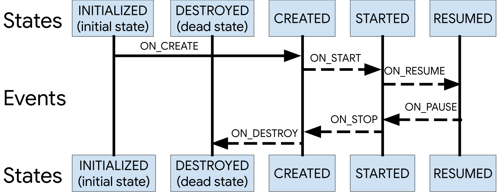

# Lifecycle
Lifecycle-aware components perform actions in response to a change in the lifecycle status of another component, such as activities and fragments. These components help you produce better-organized, and often lighter-weight code, that is easier to maintain.

A common pattern is to implement the actions of the dependent components in the lifecycle methods of activities and fragments. However, this pattern leads to a poor organization of the code and to the proliferation of errors. By using lifecycle-aware components, you can move the code of dependent components out of the lifecycle methods and into the components themselves.

The `androidx.lifecycle` package provides classes and interfaces that let you build lifecycle-aware components—which are components that can automatically adjust their behavior based on the current lifecycle state of an activity or fragment.

## Lifecycle
`Lifecycle` is a class that holds the information about the lifecycle state of a component (like an activity or a fragment) and allows other objects to observe this state.

`Lifecycle` uses two main enumerations to track the lifecycle status for its associated component:
- **Event**. The lifecycle events that are dispatched from the framework and the `Lifecycle` class. These events map to the callback events in activities and fragments.
- **State**. The current state of the component tracked by the Lifecycle object.



A class can monitor the component's lifecycle status by adding annotations to its methods. Then you can add an observer by calling the `addObserver()` method of the `Lifecycle` class and passing an instance of your observer, as shown in the following example:

```
class MyObserver : LifecycleObserver {

    @OnLifecycleEvent(Lifecycle.Event.ON_RESUME)
    fun connectListener() {
        ...
    }

    @OnLifecycleEvent(Lifecycle.Event.ON_PAUSE)
    fun disconnectListener() {
        ...
    }
}

myLifecycleOwner.getLifecycle().addObserver(MyObserver())
```

## LifecycleOwner

`LifecycleOwner` is a single method interface that denotes that the class has a `Lifecycle`. It has one method, `getLifecycle()`, which must be implemented by the class. If you're trying to manage the lifecycle of a whole application process instead, see `ProcessLifecycleOwner`.

This interface abstracts the ownership of a `Lifecycle` from individual classes, such as `Fragment` and `AppCompatActivity`, and allows writing components that work with them. Any custom application class can implement the `LifecycleOwner` interface.

Components that implement `LifecycleObserver` work seamlessly with components that implement `LifecycleOwner` because an owner can provide a lifecycle, which an observer can register to watch.

For the location tracking example, we can make the `MyLocationListener` class implement `LifecycleObserver` and then initialize it with the activity's `Lifecycle` in the `onCreate()` method. This allows the `MyLocationListener` class to be self-sufficient, meaning that the logic to react to changes in lifecycle status is declared in `MyLocationListener` instead of the activity. Having the individual components store their own logic makes the activities and fragments logic easier to manage.

```
class MyActivity : AppCompatActivity() {
    private lateinit var myLocationListener: MyLocationListener

    override fun onCreate(...) {
        myLocationListener = MyLocationListener(this, lifecycle) { location ->
            // update UI
        }
        Util.checkUserStatus { result ->
            if (result) {
                myLocationListener.enable()
            }
        }
    }
}
```

A common use case is to avoid invoking certain callbacks if the `Lifecycle` isn't in a good state right now. For example, if the callback runs a fragment transaction after the activity state is saved, it would trigger a crash, so we would never want to invoke that callback.

To make this use case easy, the `Lifecycle` class allows other objects to query the current state.

```
fun enable() {
        enabled = true
        if (lifecycle.currentState.isAtLeast(Lifecycle.State.STARTED)) {
            // connect if not connected
        }
    }
```

With this implementation, our `LocationListener` class is completely lifecycle-aware. If we need to use our `LocationListener` from another activity or fragment, we just need to initialize it. All of the setup and teardown operations are managed by the class itself.

## Use cases for lifecycle-aware components
- Switching between coarse and fine-grained location updates. Use lifecycle-aware components to enable fine-grained location updates while your location app is visible and switch to coarse-grained updates when the app is in the background;
- Stopping and starting video buffering. Use lifecycle-aware components to start video buffering as soon as possible, but defer playback until app is fully started. You can also use lifecycle-aware components to terminate buffering when your app is destroyed;
- Starting and stopping network connectivity. Use lifecycle-aware components to enable live updating (streaming) of network data while an app is in the foreground and also to automatically pause when the app goes into the background;
- Pausing and resuming animated drawables. Use lifecycle-aware components to handle pausing animated drawables when while app is in the background and resume drawables after the app is in the foreground.

## Links
https://developer.android.com/topic/libraries/architecture/lifecycle
