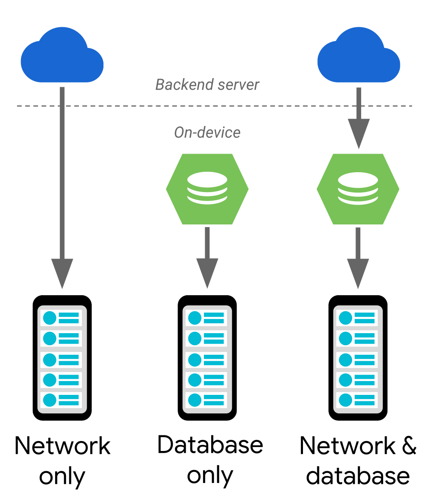

# Paging library
The Paging Library helps you load and display small chunks of data at a time. Loading partial data on demand reduces usage of network bandwidth and system resources.

The Paging Library supports the following data architectures:
- Served only from a backend server;
- Stored only in an on-device database;
- A combination of the other sources, using the on-device database as a cache.



In the case of a network-only or database-only solution, the data flows directly to your app's UI model. If you're using a combined approach, data flows from your backend server, into an on-device database, and then to your app's UI model. Every once in a while, the endpoint of each data flow runs out of data to load, at which point it requests more data from the component that provided the data. For example, when an on-device database runs out of data, it requests more data from the server.

## Library architecture

### PagedList

The Paging Library's key component is the `PagedList` class, which loads chunks of your app's data, or *pages*. As more data is needed, it's paged into the existing `PagedList` object. If any loaded data changes, a new instance of `PagedList` is emitted to the observable data holder from a `LiveData` or RxJava2-based object. As `PagedList` objects are generated, your app's UI presents their contents, all while respecting your UI controllers' `lifecycles`.

The following code snippet shows how you can configure your app's view model to load and present data using a `LiveData` holder of `PagedList` objects:
```
class ConcertViewModel(concertDao: ConcertDao) : ViewModel() {
    val concertList: LiveData<PagedList<Concert>> =
            concertDao.concertsByDate().toLiveData(pageSize = 50)
}
```

### Data
Each instance of `PagedList` loads an up-to-date snapshot of your app's data from its corresponding `DataSource` object. Data flows from your app's backend or database into the `PagedList` object.

The following example uses the Room persistence library to organize your app's data, but if you want to store your data using another means, you can also [provide your own data source factory](https://developer.android.com/topic/libraries/architecture/paging/data#custom-data-source).

```
@Dao
interface ConcertDao {
    // The Int type parameter tells Room to use a PositionalDataSource object.
    @Query("SELECT * FROM concerts ORDER BY date DESC")
    fun concertsByDate(): DataSource.Factory<Int, Concert>
}
```

### UI
The `PagedList` class works with a `PagedListAdapter` to load items into a `RecyclerView`. These classes work together to fetch and display content as it's loaded, prefetching out-of-view content and animating content changes.

## Benefits of using the Paging library
- In-memory caching for your paged data. This ensures that your app uses system resources efficiently while working with paged data.
- Built-in request deduplication, ensuring that your app uses network bandwidth and system resources efficiently.
- Configurable `RecyclerView` adapters that automatically request data as the user scrolls toward the end of the loaded data.
- First-class support for Kotlin coroutines and `Flow`, as well as `LiveData` and RxJava.
- Built-in support for error handling, including refresh and retry capabilities.

## Links
https://developer.android.com/topic/libraries/architecture/paging  
https://developer.android.com/topic/libraries/architecture/paging/v3-overview  
https://developer.android.com/topic/libraries/architecture/paging/data#custom-data-source
