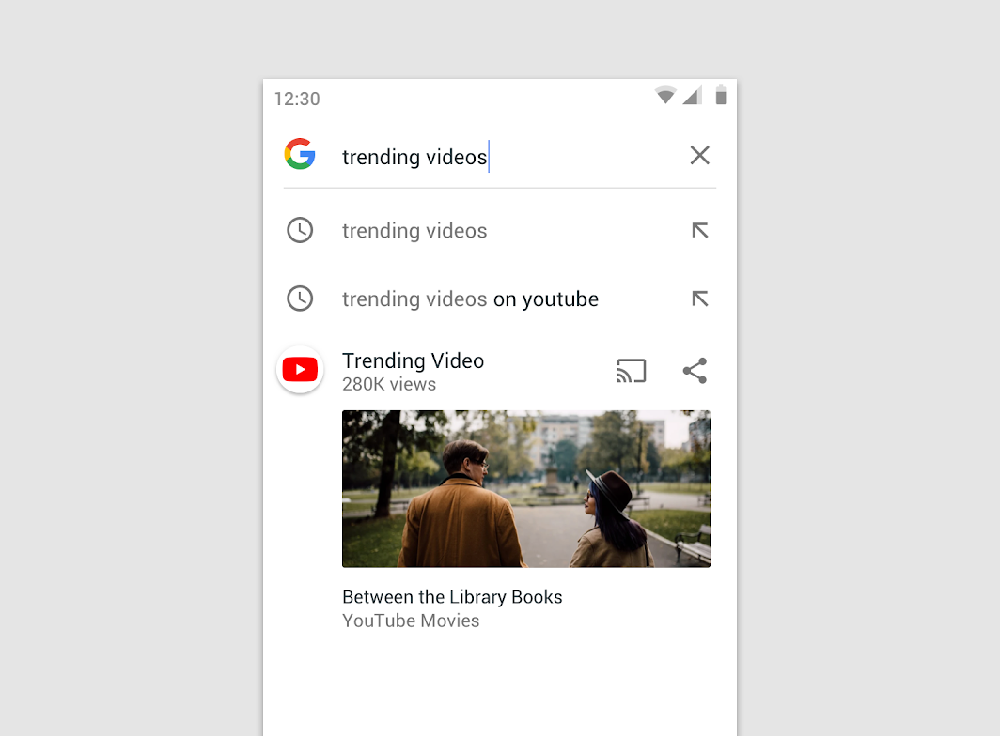
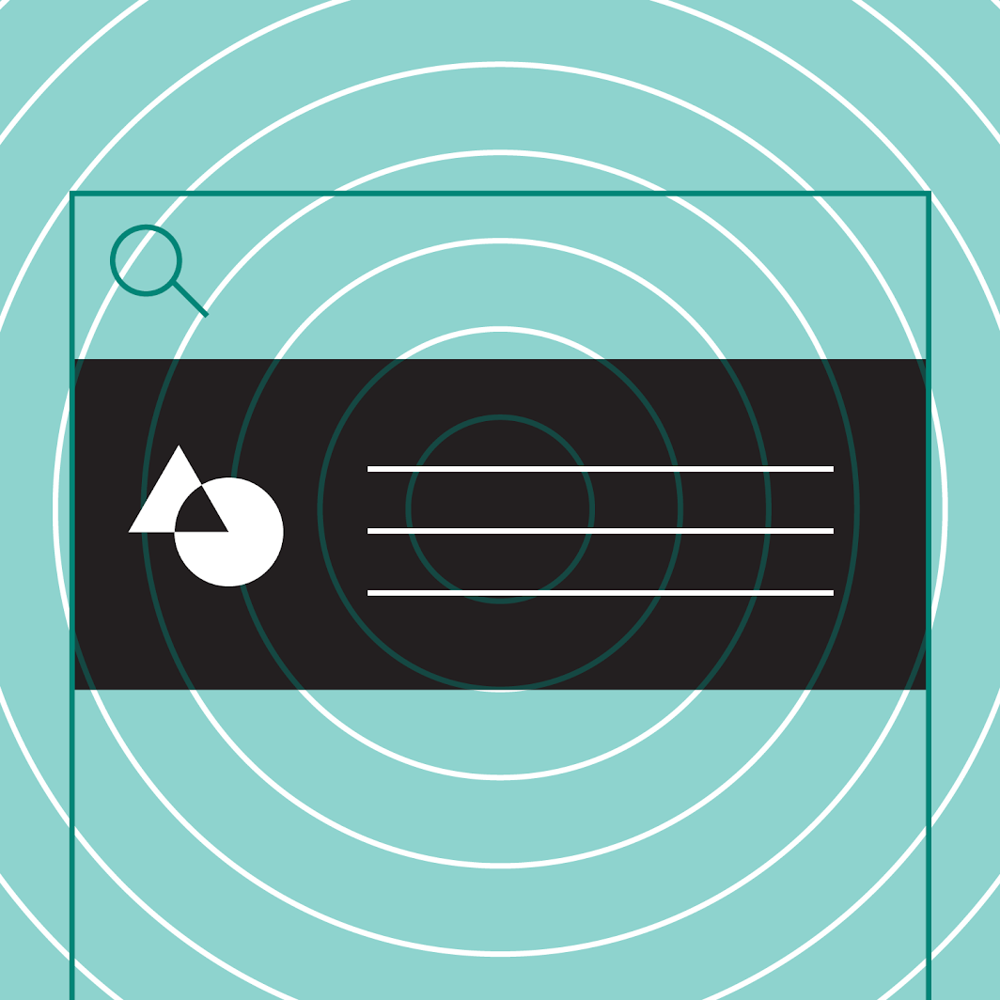
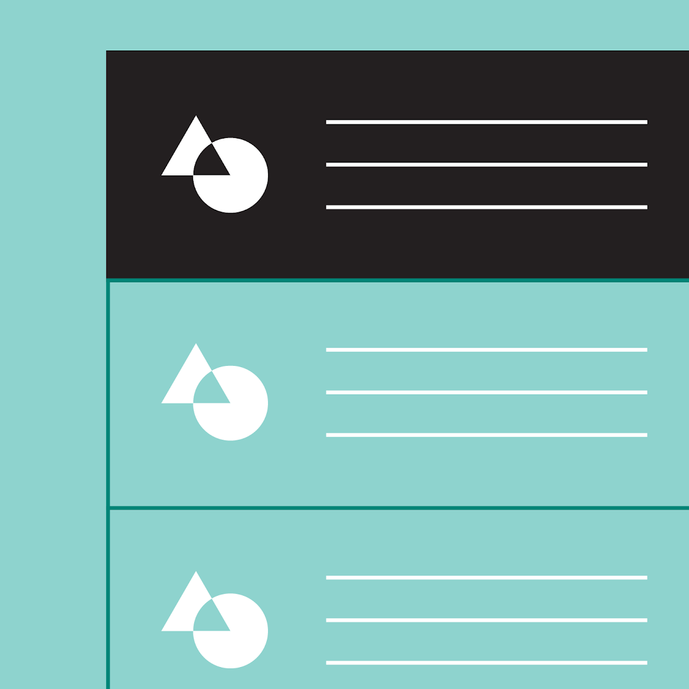
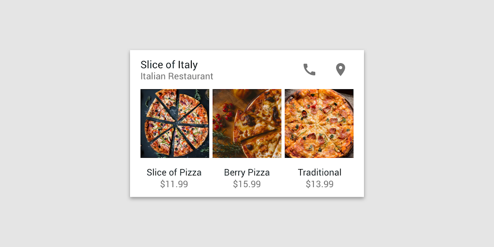
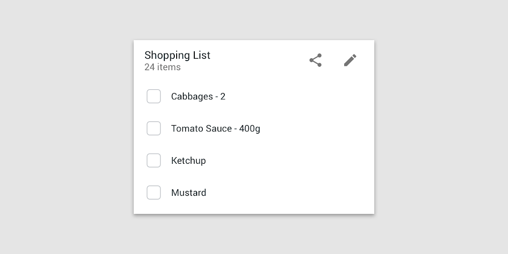
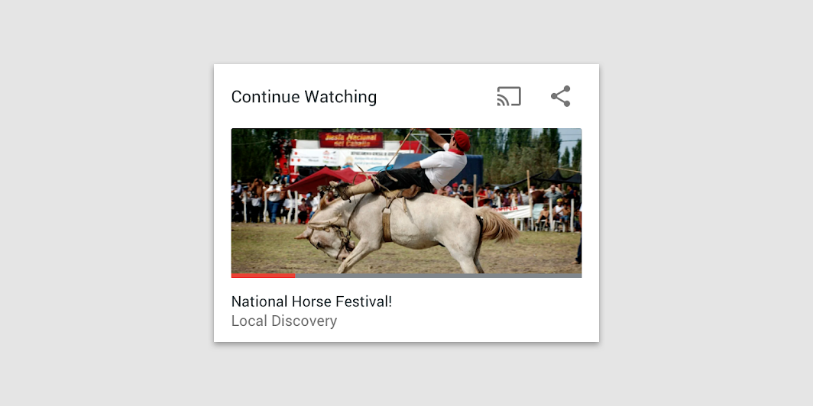

# Slices
Slices are UI templates that can display rich, dynamic, and interactive content from your app from within the Google Search app and also in other places like the Google Assistant. Slices can help users perform tasks faster by enabling engagement outside of the fullscreen app experience.

Components can display small, customizable search content called slices as part of search results.

## Principles

Slices focus on one task, or a set of related tasks, and highlight the most important information. Slices reflect content or features from your app.

**Focused**

Slices focus on one task, or a set of related tasks, and highlight the most important information.

**Related**

Slices reflect content or features from your app.

**Relevant**

Slices provide only the information and controls needed to complete a task.

## Examples

**Navigation**. Slices provide navigation to a specific feature, or content, in an app.

**Task completion**. Slices allow users to complete tasks inline, such as by displaying controls like toggles or sliders.

**Content discovery**. Slices remind users of past interactions with an app’s content and features.

# Links
[Slices](https://developer.android.com/guide/slices)

[Android slices](https://material.io/design/platform-guidance/android-slices.html)

# Further reading
[Android Slices: Build interactive results for Google Search](https://www.youtube.com/watch?v=a7IVH5aNwwc)

[Android Jetpack: Android Slices (Part-1) Introduction](https://proandroiddev.com/android-jetpack-android-slices-introduction-cf0ce0f3e885)

[Android Jetpack: Android Slices Part-2](https://proandroiddev.com/android-jetpack-android-slices-part-2-688bede57f2d)
