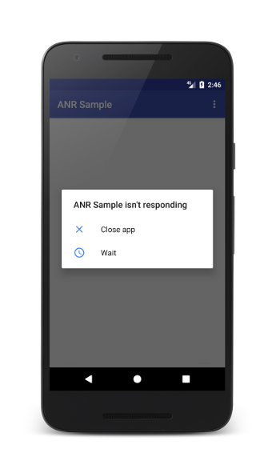
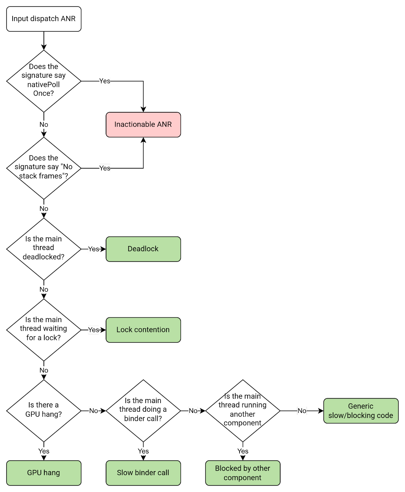
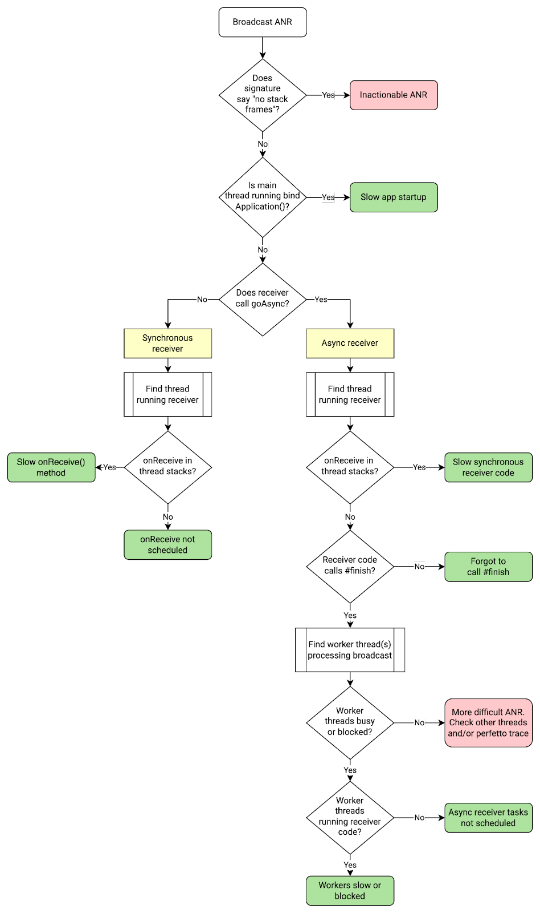
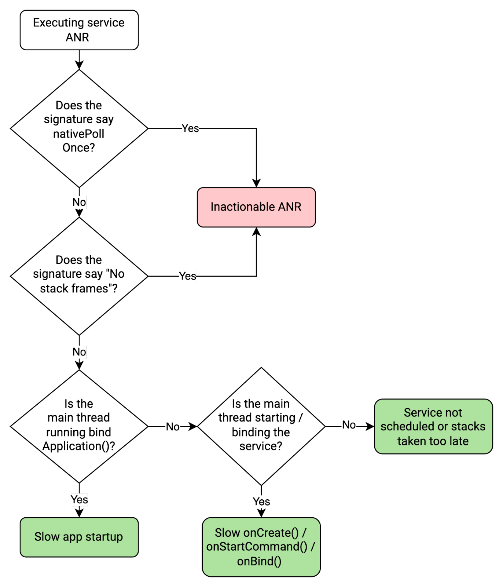
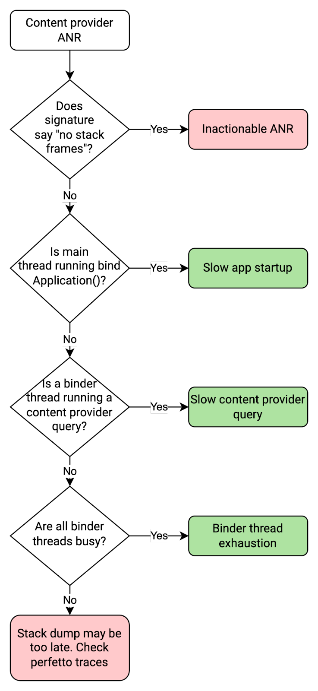

# ANR (Application Not Responding)
When the UI thread of an Android app is blocked for too long, an "Application Not Responding" (ANR) error is triggered. If the app is in the foreground, the system displays a dialog to the user, as shown on image below. The ANR dialog gives the user the opportunity to force quit the app. <sup>[1](https://developer.android.com/topic/performance/vitals/anr#:~:text=When%20the%20UI%20thread%20of%20an%20Android%20app%20is%20blocked%20for%20too%20long%2C%20an%20%22Application%20Not%20Responding%22%20(ANR)%20error%20is%20triggered.%20If%20the%20app%20is%20in%20the%20foreground%2C%20the%20system%20displays%20a%20dialog%20to%20the%20user%2C%20as%20shown%20in%20figure%201.%20The%20ANR%20dialog%20gives%20the%20user%20the%20opportunity%20to%20force%20quit%20the%20app.)</sup>



ANRs are a problem because the app's main thread, which is responsible for updating the UI, can't process user input events or draw, causing frustration to the user.

An ANR is triggered for your app when one of the following conditions occur: <sup>[2](https://developer.android.com/topic/performance/vitals/anr#:~:text=An%20ANR%20is%20triggered%20for%20your%20app%20when%20one%20of%20the%20following%20conditions%20occur%3A)</sup>
- **Input dispatching timed out**: If your app has not responded to an input event (such as key press or screen touch) within 5 seconds;
- **Executing service**: If a service declared by your app cannot finish executing `Service.onCreate()` and `Service.onStartCommand()/Service.onBind()` within a few seconds;
- **Service.startForeground() not called**: If your app uses `Context.startForegroundService()` to start a new service in the foreground, but the service then does not call `startForeground()` within 5 seconds;
- **Broadcast of intent**: If a `BroadcastReceiver` hasn't finished executing within a set amount of time. If the app has any activity in the foreground, this timeout is 5 seconds;
- **`JobScheduler` interactions**: If a `JobService` does not return from `JobService.onStartJob()` or `JobService.onStopJob()` within a few seconds, or if a user-initiated job starts and your app doesn't call `JobService.setNotification()` within a few seconds after `JobService.onStartJob()` was called.

Keep in mind that when determining the cause of ANRs, it's helpful to distinguish between system and app issues. <sup>[3](https://developer.android.com/topic/performance/anrs/diagnose-and-fix-anrs#:~:text=Keep%20in%20mind%20that%20when%20determining%20the%20cause%20of%20ANRs%2C%20it%27s%20helpful%20to%20distinguish%20between%20system%20and%20app%20issues.)</sup>

When the system is in a bad state, the following issues can cause ANRs:
- Transient issues in the system server cause usually fast binder calls to be slow;
- Issues with the system server and high device load cause app threads to not be scheduled.

## Diagnose ANRs
There are some common patterns to look for when diagnosing ANRs: <sup>[4](https://developer.android.com/topic/performance/vitals/anr#diagnose-anrs:~:text=There%20are%20some%20common%20patterns%20to%20look%20for%20when%20diagnosing%20ANRs)</sup>
- The app is doing slow operations involving I/O on the main thread;
- The app is doing a long calculation on the main thread;
- The main thread is doing a synchronous binder call to another process, and that other process is taking a long time to return;
- The main thread is blocked waiting for a synchronized block for a long operation that is happening on another thread;
- The main thread is in a deadlock with another thread, either in your process or via a binder call. The main thread is not just waiting for a long operation to finish, but is in a deadlock situation.

### [Input dispatch timeout](https://developer.android.com/topic/performance/anrs/diagnose-and-fix-anrs#input-dispatch)

Input dispatch ANRs occur when the app's main thread doesn't respond to an input event, such as a swipe or key press, in time. Since the app is in the foreground when input dispatch timeouts occur, they're almost always visible to the user and very important to mitigate.

Input dispatch ANRs are usually caused by issues on the main thread. If the main thread was blocked waiting to acquire a lock, the holder thread can also be involved.

Here are some common causes and suggested fixes for input dispatch ANRs.

| HTTP | HTTPS | HTTPS |
|---|---|---|
| Slow binder call  |  Main thread makes a long synchronous binder call  |  Move the call off the main thread or try to optimize the call, if you own the API |
| Many consecutive binder calls  | Main thread makes many consecutive synchronous binder calls  | Don't perform binder calls in a tight loop |
| Blocking I/O  | Main thread makes blocking I/O call, such as database or network access  | Move all blocking IO off the main thread  |
| Lock contention  | Main thread is blocked waiting to acquire a lock  | Reduce lock contention between the main thread and other thread, optimize slow code in the other thread  |
| Expensive frame  | Rendering too much in a single frame, causing severe jank.  |  Do less work rending the frame |
| Blocked by other component  | A different component, such as a broadcast receiver, is running and blocking the main thread  | Move non-UI work off the main thread as much as possible. Run broadcast receivers on a different thread  |
| GPU hang	| GPU hang is a system or hardware issue that causes rendering to be blocked and hence an input dispatch ANR  | Unfortunately, there usually aren't any fixes on the app side. If possible, contact the hardware team to troubleshoot.  |

The following flow chart shows how to determine the cause of an input timeout dispatch ANR:



### [No focused window](https://developer.android.com/topic/performance/anrs/diagnose-and-fix-anrs#no-focused-window-anr)
While events like touch are sent directly to the relevant window based on hit testing, events such as keys need a target. This target is referred to as the *focused window*. There's only one focused window per display, and it's usually the window that the user is currently interacting with. If a focused window can't be found, input raises a *no-focused-window ANR*. A no-focused-window ANR is a type of input dispatch ANR.

No-focused-window ANRs are usually caused by either of the following issues:
- The app is doing too much work and is too slow to draw the first frame;
- The main window is not focusable. If a window is flagged with `FLAG_NOT_FOCUSABLE`, the user can't send key or button events to it.

```
override fun onCreate(savedInstanceState: Bundle) {
  super.onCreate(savedInstanceState)
  setContentView(R.layout.activity_main)
  window.addFlags(WindowManager.LayoutParams.FLAG_FLAG_NOT_FOCUSABLE)
}
```

### [Broadcast receiver timeout](https://developer.android.com/topic/performance/anrs/diagnose-and-fix-anrs#broadcast-receiver-anr)
A broadcast receiver ANR occurs when a broadcast receiver doesn't handle a broadcast in time. For synchronous receivers, or receivers that don't call `goAync()`, a timeout means that `onReceive()` didn't complete in time. For async receivers, or receivers that call `goAsync()`, a timeout means that `PendingResult.finish()` wasn't called in time.

Broadcast receiver ANRs often happen in these threads:
- Main thread, if the issue is slow app startup;
- Thread running broadcast receiver, if the issue is slow `onReceive()` code;
- Broadcast worker threads, if the issue is slow `goAsync()` broadcast code.

| Cause | Applies to	|  What happened	 |  Suggested fix	 |
|---|---|---|---|
| Slow app startup  | All receivers	  |  The app took too long to do a cold start  | Optimize slow app start  |
| `onReceive()` not scheduled	 | All receivers	| The broadcast receiver thread was busy doing other work and could not start the `onReceive()` method  | Don't perform long-running tasks on receiver thread  |
| Slow `onReceive()`	| All receivers, but mainly synchronous ones	| The `onReceive()` method started but was blocked or slow so did not complete in time  | Optimize slow receiver code  |
| Async receiver tasks not scheduled	  |  `goAsync()` receivers	 | The onReceive() method tried to execute work on a blocked worker thread pool, so the work never started	  | The `onReceive()` method tried to execute work on a blocked worker thread pool, so the work never started  |
| Workers slow or blocked	 | `goAsync()` receivers	  | There was a blocking or slow operation somewhere in the worker thread pool while processing the broadcast   | Optimize slow async receiver code  |
| Forgot to call `PendingResult.finish`	  | `goAsync()` receivers	 | Call to `finish()` is missing from the code path	 | Ensure finish() is always called  |

The following flow chart shows how to determine the cause of a broadcast receiver ANR:


To avoid broadcast receiver ANRs, follow these best practices:
- Make sure that app startup is fast, since it's counted in the ANR timeout if the app is started to handle the broadcast;
- If `goAsync()` is used, make sure `PendingResult.finish()` is called quickly. This is subject to the same ANR timeout as synchronous broadcast receivers;
- If `goAsync()` is used, make sure the worker thread(s) aren't shared with other long-running or blocking operations;
- Consider using `registerReceiver()` to run broadcast receivers in a non-main thread, to avoid blocking UI code running in the main thread.

### [Execute service timeout](https://developer.android.com/topic/performance/anrs/diagnose-and-fix-anrs#execute-service-anr)
An execute service ANR happens when the app's main thread doesn't start a service in time. Specifically, a service doesn't finish executing `onCreate()` and `onStartCommand()` or `onBind()` within the timeout period.

The following table lists common causes of execute service ANRs and suggested fixes:
| Cause | What | Suggested fix |
|---|---|---|
| Slow app startup	 | The app takes too long to perform a cold start  | Optimize slow app start  |
| Slow `onCreate()`, `onStartCommand()`, or `onBind()`  | The service component's `onCreate()`, `onStartCommand()`, or `onBind()` method takes too long to execute on the main thread  | Optimize slow code. Move slow operations off the critical path where possible  |
| Not scheduled (main thread blocked before `onStart()`)	  |  The app's main thread is blocked by another component before the service can be started	|  Move other component's work off the main thread. Optimize other component's blocking code |

The following flow chart describes how to debug an execute service ANR:


To avoid execute service ANRs, follow these general best practices:
- Make sure that app startup is fast, since it's counted in the ANR timeout if the app is started to run the service component;
- Make sure that the service's `onCreate()`, `onStartCommand()`, and `onBind()` methods are fast;
- Avoid running any slow or blocking operations on the main thread from other components; these operations can prevent a service from starting quickly.

### [Content provider not responding](https://developer.android.com/topic/performance/anrs/diagnose-and-fix-anrs#content-provider-anr)
A content provider ANR happens when a remote content provider takes longer than the timeout period to respond to a query, and is killed.

The following table lists common causes of content provider ANRs and suggested fixes:

| Cause | What happens		|  Signal	 |  Suggested fix	 |
|---|---|---|---|
| Slow content provider query	  | The content provider takes too long to execute or is blocked.	  | The `android.content.ContentProvider$Transport.query` frame is in the binder thread	  | Optimize content provider query. Find out what is blocking the binder thread  |
| Slow app startup	| The content provider's app takes too long to start up  | The `ActivityThread.handleBindApplication` frame is in the main thread	 | Optimize app startup  |
| Binder thread exhaustion—all binder threads are busy	| All binder threads are busy serving other synchronous requests so the content provider binder call can't run	  | The app isn't starting, all binder threads are busy, and the content provider isn't running	 | Reduce load on binder threads  |

The following flow chart describes how to debug a content provider ANR:


To avoid content provider ANRs, follow these best practices:
- Make sure that app startup is fast, since it's counted in the ANR timeout if the app is started to run the content provider;
- Make sure that the content provider queries are fast;
- Don't perform lots of concurrent blocking binder calls that can block all the app's binder threads.

## [Detect the problem (Android vitals)](https://developer.android.com/topic/performance/vitals/anr#android-vitals)
If you have already published your app, you can use Android vitals to see information on ANRs for your app. You can use other tools to detect ANRs in the field but note that 3P tools cannot report ANRs on older versions of Android (Android 10 and below), unlike Android vitals.

Android vitals can help you monitor and improve your app's ANR rate. Android vitals measures several ANR rates:
- **ANR rate**: The percentage of your daily active users who experienced any type of ANR;
- **User-perceived ANR rate**: The percentage of your daily active users who experienced at least one *user-perceived ANR*. Currently only ANRs of type `Input dispatching timed out` are considered user-perceived;
- **Multiple ANR rate**: The percentage of your daily active users who experienced at least two ANRs.

## [Avoid ANRs](https://developer.android.com/topic/performance/anrs/keep-your-app-responsive#avoid-anrs)
The following are general tips to avoid ANRs:
- Keep the main thread unblocked at all times, and use threads strategically;
  - Don't perform blocking or long-running operations on the app's main thread. Instead, create a worker thread and do most of the work there;
  - Try to minimize any lock contention between the main thread and other threads;
  - Minimize any non-UI related work on the main thread, such as when handling broadcasts or running services. Any method that runs in the UI thread must do as little work as possible on that thread. In particular, activities must do as little as possible to set up in key lifecycle methods, such as `onCreate()` and `onResume()`;
  - Be careful when sharing thread pools between components. Don't use the same threads for potentially long-blocking operations and time-sensitive tasks such as broadcast receiving.
- Keep app startup fast. Minimize slow or blocking operations in the app's startup code, such as methods run during dagger initialization;
- If you're using `BroadcastReceiver`, consider running broadcast receivers in a non-main thread using `Context.registerReceiver`.

# Links
[ANRs](https://developer.android.com/topic/performance/vitals/anr)

[Diagnose and fix ANRs](https://developer.android.com/topic/performance/anrs/diagnose-and-fix-anrs)

[Keep your app responsive](https://developer.android.com/topic/performance/anrs/keep-your-app-responsive)

# Next questions
[What is deadlock?](https://github.com/Kirchhoff-/Android-Interview-Questions/blob/master/General/What%20is%20deadlock.md)

# Further reading
[Android: Tackling Application Not Responding(ANRs)](https://medium.com/codex/android-tackling-application-not-responding-anrs-3c91360cd023)
