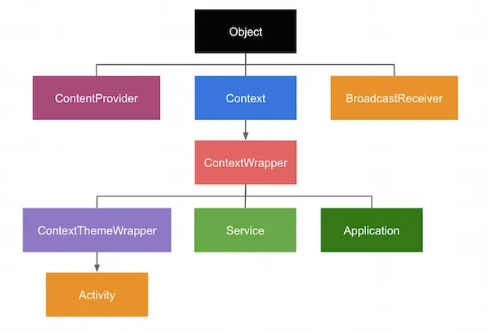
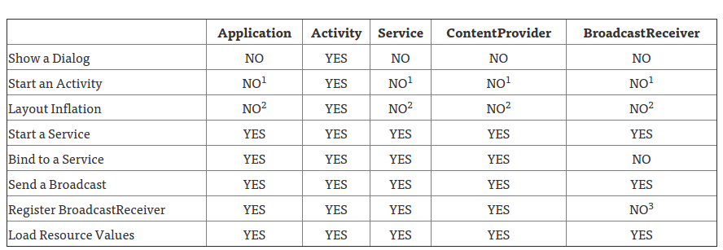

# `Context`

`Context` is the interface to global information about an application environment. This is an abstract class whose implementation is provided by the Android system. It allows access to application-specific resources and classes, as well as up-calls for application-level operations such as launching activities, broadcasting and receiving intents, etc.<sup>[1](https://developer.android.com/reference/android/content/Context#:~:text=Interface%20to%20global,receiving%20intents%2C%20etc.)</sup>

In the following picture, you can see a hierarchy of classes, where `Context` is the root class of this hierarchy. In particular, it's worth emphasizing that `Activity` is a descendant of `Context`:<sup>[2](https://stackoverflow.com/questions/3572463/what-is-context-on-android#:~:text=In%20the%20following%20picture%2C%20you%20can%20see%20a%20hierarchy%20of%20classes%2C%20where%20Context%20is%20the%20root%20class%20of%20this%20hierarchy.%20In%20particular%2C%20it%27s%20worth%20emphasizing%20that%20Activity%20is%20a%20descendant%20of%20Context.)</sup>



The primary classes that implement `Context` (through inheritance) are:
- `Application`. It provides access to application-wide resources and services and is used for global settings or shared data;
- `Activity`. It is typically used for UI-related tasks, such as starting new activities (`startActivity()`), accessing resources, and managing events;
- `Service`. A context tied to the lifecycle of a service;
- `ContextWrapper`. A base class for other context implementations that wrap an existing `Context`. It allows extending and customizing the behavior of an existing context;
- `ContextThemeWrapper`. Inherits from `ContextWrapper`. It provides a context with a specific theme, often used in activities to apply UI themes with `setTheme()`.

## [What `Context` can do?](https://stackoverflow.com/a/35189629)
The following table shows what actions can be performed with different types of Context.



1. An application CAN start an `Activity` from here, but it requires that a new task be created. This may fit specific use cases, but can create non-standard back stack behaviors in your application and is generally not recommended or considered good practice;
2. This is legal, but inflation will be done with the default theme for the system on which you are running, not what’s defined in your application;
3. Allowed if the receiver is `null`, which is used for obtaining the current value of a sticky broadcast, on Android 4.2 and above.


## [Difference between `getApplication()` and `getApplicationContext()`](https://ericyang505.github.io/android/Context.html#:~:text=Difference%20between%20getApplication()%20and%20getApplicationContext())
```
@Override
public Context getApplicationContext() {
  return (mPackageInfo != null) ?
    mPackageInfo.getApplication() : mMainThread.getApplication();
}
```

Actually both functions return application object since application itself is a context. So why android provide two functions? The reason is because `getApplication()` is only able to be used in `Activity` and `Service`. In other components like `BroadcastReceiver` is only able to use `getApplicationContext()` to get application object.

# Links
[`Context`](https://developer.android.com/reference/android/content/Context)

[Fully understand `Context` in Android](https://ericyang505.github.io/android/Context.html)

[Difference between Activity Context and Application Context](https://stackoverflow.com/questions/4128589/difference-between-activity-context-and-application-context)

[What is `Context` on Android?](https://stackoverflow.com/questions/3572463/what-is-context-on-android)

[Context and memory leaks in Android](https://medium.com/swlh/context-and-memory-leaks-in-android-82a39ed33002)

# Further reading
[Which `Context` should I use in Android?](https://medium.com/@ali.muzaffar/which-context-should-i-use-in-android-e3133d00772c)

[Android `Context` Needs Isolation](https://www.techyourchance.com/android-context-needs-isolation/)

[Using Context Theme Wrapper on Android](https://ataulm.com/2019/11/20/using-context-theme-wrapper.html)

[Activity Context vs Application Context: A Deep Dive into Android Development](https://medium.com/@mahmoud.alkateb22/activity-context-vs-application-context-a-deep-dive-into-android-development-94fc41233de7)
