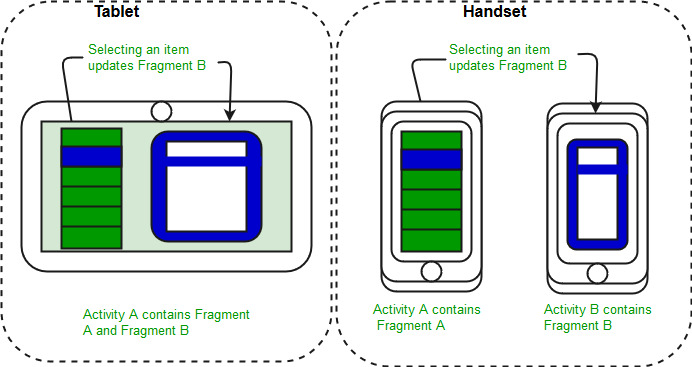
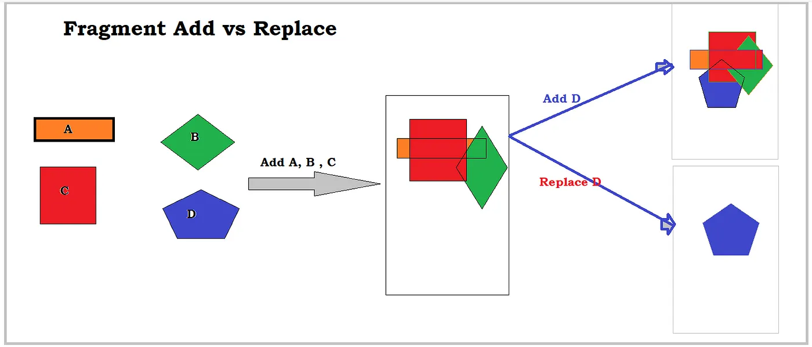

# Fragment
A `Fragment` represents a reusable portion of your app's UI. A fragment defines and manages its own layout, has its own lifecycle, and can handle its own input events. Fragments can't live on their own. They must be *hosted* by an activity or another fragment. The fragment’s view hierarchy becomes part of, or *attaches* to, the host’s view hierarchy.
<sup>[1](https://developer.android.com/guide/fragments#samples:~:text=A%20Fragment%20represents,host%E2%80%99s%20view%20hierarchy.)</sup>

## [Modularity](https://developer.android.com/guide/fragments#modularity)
Fragments introduce modularity and reusability into your activity’s UI by letting you divide the UI into discrete chunks. Activities are an ideal place to put global elements around your app's user interface, such as a navigation drawer. Conversely, fragments are better suited to define and manage the UI of a single screen or portion of a screen.

The below image shows how two UI modules defined by fragments can be combined into one activity for a tablet design but separated for a handset design.<sup>[2](https://www.geeksforgeeks.org/introduction-fragments-android/#:~:text=The%20below%20image%20shows%20how%20two%20UI%20modules%20defined%20by%20fragments%20can%20be%20combined%20into%20one%20activity%20for%20a%20tablet%20design%20but%20separated%20for%20a%20handset%20design.)</sup>



Dividing your UI into fragments makes it easier to modify your activity's appearance at runtime. While your activity is in the `STARTED` lifecycle state or higher, fragments can be added, replaced, or removed. And you can keep a record of these changes in a back stack that is managed by the activity, so that the changes can be reversed. <sup>[3](https://developer.android.com/guide/fragments#:~:text=Dividing%20your%20UI,can%20be%20reversed.)</sup>

## Understanding Fragments
Here are the important things to understand about fragments:
- A `Fragment` is a combination of an XML layout file and a java class much like an `Activity`;
- Using the support library, fragments are supported back to all relevant Android versions;
- Fragments encapsulate views and logic so that it is easier to reuse within activities;
- Fragments are standalone components that can contain views, events and logic.

Within a fragment-oriented architecture, **activities become navigational containers** that are primarily responsible for navigation to other activities, presenting fragments and passing data. <sup>[4](https://guides.codepath.com/android/creating-and-using-fragments#understanding-fragments:~:text=Understanding%20Fragments,and%20passing%20data.)</sup>

## Importance of Fragments
There are many use cases for fragments but the most common use cases include:
- **Reusing View and Logic Components** - Fragments enable re-use of parts of your screen including views and event logic over and over in different ways across many disparate activities. For example, using the same list across different data sources within an app.
- **Tablet Support** - Often within apps, the tablet version of an activity has a substantially different layout from the phone version which is different from the TV version. Fragments enable device-specific activities to reuse shared elements while also having differences.
- **Screen Orientation** - Often within apps, the portrait version of an activity has a substantially different layout from the landscape version. Fragments enable both orientations to reuse shared elements while also having differences. <sup>[5](https://guides.codepath.com/android/creating-and-using-fragments#importance-of-fragments:~:text=Importance%20of%20Fragments,orientations%20to%20reuse%20shared%20elements%20while%20also%20having%20differences.)</sup>

## [How do we use Fragments?](https://medium.com/@myofficework000/fragments-in-android-eab537b00071#:~:text=How%20do%20we%20use%20Fragments%3F)
Basically we have three ways to use fragments:
1. **Add fragment statically:** add a fragment tag inside activity and set name to the fragment and give id and ready for use it:
```
<fragment
    android:id="@+id/music_fragment"
    android:name="com.mvvm.fragmentsdemo1.SecondFragment"
    android:layout_width="wrap_content"
    android:layout_height="wrap_content"
    app:layout_constraintBottom_toBottomOf="parent"
    app:layout_constraintEnd_toEndOf="parent" />
```

2. **Add fragment dynamically:** In adding a fragment dynamically means we have to set the `FragmentManager` to begin transaction of fragment by using methods like `add()` or `replace()` and lastly we have to call commit method to initiate the transaction:
```
//dynamic way of adding fragment
supportFragmentManager
    .beginTransaction()
    .replace(R.id.senderFragment, senderFragment)
    .commit()
```

Difference between `add()` and `replace()` can be illustrated by image: 

- `add()` method keeps adding fragment on top of the previous fragment in the `FragmentContainer`;
- `replace()` method clears all the previous fragment from container and then add it in `FragmentContainer`.

3. Using [Navigational component](https://github.com/Kirchhoff-/Android-Interview-Questions/blob/master/Android/What's%20Navigation%20component.md) and set the fragment graph.

# Links
[Fragments](https://developer.android.com/guide/fragments)

[Creating and Using Fragments](https://guides.codepath.com/android/creating-and-using-fragments)

[Introduction to Fragments | Android](https://www.geeksforgeeks.org/introduction-fragments-android/)

[Fragments in Android](https://medium.com/@myofficework000/fragments-in-android-eab537b00071)

# Next questions
[Fragment Lifecycle](https://github.com/Kirchhoff-/Android-Interview-Questions/blob/master/Android/Fragment%20Lifecycle.md)

# Further Reading
[Building dynamic user interfaces in Android with fragments - Tutorial](https://www.vogella.com/tutorials/AndroidFragments/article.html)

[Advocating Against Android Fragments](https://developer.squareup.com/blog/advocating-against-android-fragments/)

[7 Common Mistakes Easily Made with Android Fragment](https://medium.com/mobile-app-development-publication/7-common-mistakes-easily-made-with-android-fragment-6fc85c44e783)

[Fragments](https://stuff.mit.edu/afs/sipb/project/android/docs/guide/components/fragments.html)
