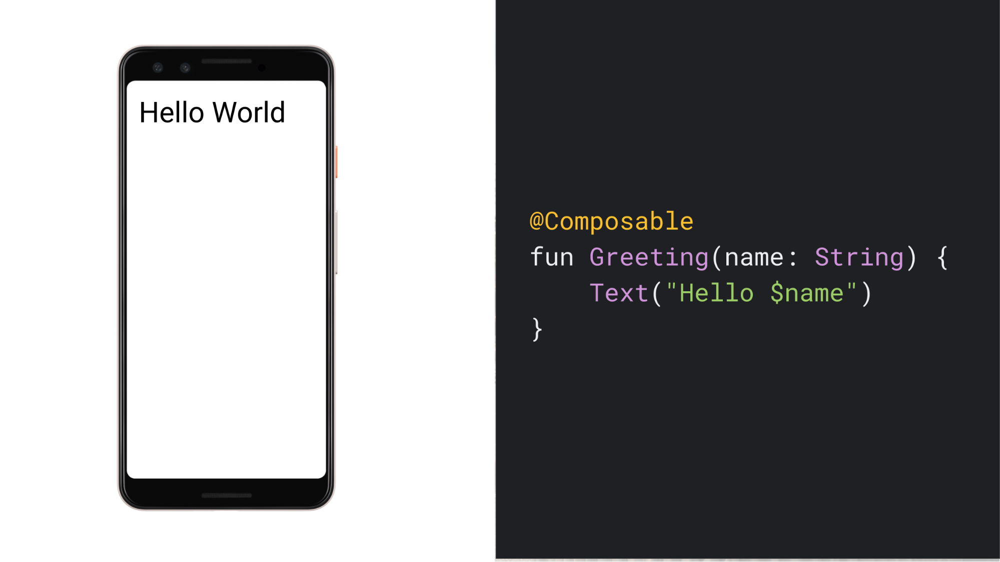

# Jetpack Compose
Jetpack Compose is a modern declarative UI Toolkit for Android. Compose makes it easier to write and maintain your app UI by providing a *declarative* API that allows you to render your app UI without imperatively mutating frontend views.

## [The declarative programming paradigm](https://developer.android.com/jetpack/compose/mental-model#paradigm)
Historically, an Android view hierarchy has been representable as a tree of UI widgets. As the state of the app changes because of things like user interactions, the UI hierarchy needs to be updated to display the current data. he most common way of updating the UI is to walk the tree using functions like `findViewById()`, and change nodes by calling methods like `button.setText(String)`, c`ontainer.addChild(View)`, or `img.setImageBitmap(Bitmap)`. These methods change the internal state of the widget.

Manipulating views manually increases the likelihood of errors. If a piece of data is rendered in multiple places, it’s easy to forget to update one of the views that shows it. It’s also easy to create illegal states, when two updates conflict in an unexpected way. For example, an update might try to set a value of a node that was just removed from the UI. In general, the software maintenance complexity grows with the number of views that require updating.

Over the last several years, the entire industry has started shifting to a declarative UI model, which greatly simplifies the engineering associated with building and updating user interfaces. The technique works by conceptually regenerating the entire screen from scratch, then applying only the necessary changes. This approach avoids the complexity of manually updating a stateful view hierarchy. Compose is a declarative UI framework.

One challenge with regenerating the entire screen is that it is potentially expensive, in terms of time, computing power, and battery usage. To mitigate this cost, Compose intelligently chooses which parts of the UI need to be redrawn at any given time. This does have some implications for how you design your UI components, as discussed in **Recomposition**.

## [A simple composable function](https://developer.android.com/jetpack/compose/mental-model#simple-example)

Using Compose, you can build your user interface by defining a set of *composable* functions that take in data and emit UI elements. A simple example is a `Greeting` widget, which takes in a `String` and emits a `Text` widget which displays a greeting message.



A few noteworthy things about this function:
- The function is annotated with the `@Composable` annotation. All Composable functions must have this annotation; this annotation informs the Compose compiler that this function is intended to convert data into UI;
- The function takes in data. Composable functions can accept parameters, which allow the app logic to describe the UI. In this case, our widget accepts a `String` so it can greet the user by name;
- The function displays text in the UI. It does so by calling the `Text()` composable function, which actually creates the text UI element. Composable functions emit UI hierarchy by calling other composable functions;
- The function doesn't return anything. Compose functions that emit UI do not need to return anything, because they describe the desired screen state instead of constructing UI widgets;
- This function is fast, [idempotent](https://en.wikipedia.org/wiki/Idempotence#Computer_science_meaning), and free of *side-effects*:
  - The function behaves the same way when called multiple times with the same argument, and it does not use other values such as global variables or calls to `random()`;
  - The function describes the UI without any side-effects, such as modifying properties or global variables.

## [Dynamic content](https://developer.android.com/jetpack/compose/mental-model#dynamic)
Because composable functions are written in Kotlin instead of XML, they can be as dynamic as any other Kotlin code. For example, suppose you want to build a UI that greets a list of users:
```
@Composable
fun Greeting(names: List<String>) {
    for (name in names) {
        Text("Hello $name")
    }
}
```

This function takes in a list of names and generates a greeting for each user. Composable functions can be quite sophisticated. You can use `if` statements to decide if you want to show a particular UI element. You can use loops. You can call helper functions. You have the full flexibility of the underlying language. This power and flexibility is one of the key advantages of Jetpack Compose.

## [Recomposition](https://developer.android.com/jetpack/compose/mental-model#recomposition)
In an imperative UI model, to change a widget, you call a setter on the widget to change its internal state. In Compose, you call the composable function again with new data. Doing so causes the function to be *recomposed*--the widgets emitted by the function are redrawn, if necessary, with new data. The Compose framework can intelligently recompose only the components that changed.

For example, consider this composable function which displays a button:
```
@Composable
fun ClickCounter(clicks: Int, onClick: () -> Unit) {
    Button(onClick = onClick) {
        Text("I've been clicked $clicks times")
    }
}
```

Every time the button is clicked, the caller updates the value of `clicks`. Compose calls the lambda with the `Text` function again to show the new value; this process is called *recomposition*. Other functions that don't depend on the value are not recomposed.

As we discussed, recomposing the entire UI tree can be computationally expensive, which uses computing power and battery life. Compose solves this problem with this *intelligent recomposition*.

Recomposition is the process of calling your composable functions again when inputs change. This happens when the function's inputs change. When Compose recomposes based on new inputs, it only calls the functions or lambdas that might have changed, and skips the rest. By skipping all functions or lambdas that don't have changed parameters, Compose can recompose efficiently.

Never depend on side-effects from executing composable functions, since a function's recomposition may be skipped. If you do, users may experience strange and unpredictable behavior in your app. A side-effect is any change that is visible to the rest of your app. For example, these actions are all dangerous side-effects:
- Writing to a property of a shared object;
- Updating an observable in `ViewModel`;
- Updating shared preferences.

Composable functions might be re-executed as often as every frame, such as when an animation is being rendered. Composable functions should be fast to avoid jank during animations. If you need to do expensive operations, such as reading from shared preferences, do it in a background coroutine and pass the value result to the composable function as a parameter.

As an example, this code creates a composable to update a value in `SharedPreferences`. The composable shouldn't read or write from shared preferences itself. Instead, this code moves the read and write to a `ViewModel` in a background coroutine. The app logic passes the current value with a callback to trigger an update.

```
@Composable
fun SharedPrefsToggle(
    text: String,
    value: Boolean,
    onValueChanged: (Boolean) -> Unit
) {
    Row {
        Text(text)
        Checkbox(checked = value, onCheckedChange = onValueChanged)
    }
}
```

### [Composable functions can execute in any order](https://developer.android.com/jetpack/compose/mental-model#any-order)
If you look at the code for a composable function, you might assume that the code is run in the order it appears. But this isn't necessarily true. If a composable function contains calls to other composable functions, those functions might run in any order. Compose has the option of recognizing that some UI elements are higher priority than others, and drawing them first.

For example, suppose you have code like this to draw three screens in a tab layout:
```
@Composable
fun ButtonRow() {
    MyFancyNavigation {
        StartScreen()
        MiddleScreen()
        EndScreen()
    }
}
```

The calls to `StartScreen`, `MiddleScreen`, and `EndScreen` might happen in any order. This means you can't, for example, have `StartScreen()` set some global variable (a side-effect) and have `MiddleScreen()` take advantage of that change. Instead, each of those functions needs to be self-contained.

### [Composable functions can run in parallel](https://developer.android.com/jetpack/compose/mental-model#parallel)
Compose can optimize recomposition by running composable functions in parallel. This lets Compose take advantage of multiple cores, and run composable functions not on the screen at a lower priority.

This optimization means a composable function might execute within a pool of background threads. If a composable function calls a function on a `ViewModel`, Compose might call that function from several threads at the same time.

To ensure your application behaves correctly, all composable functions should have no side-effects. Instead, trigger side-effects from callbacks such as `onClick` that always execute on the UI thread.

When a composable function is invoked, the invocation might occur on a different thread from the caller. That means code that modifies variables in a composable lambda should be avoided–both because such code is not thread-safe, and because it is an impermissible side-effect of the composable lambda.

Here's an example showing a composable that displays a list and its count:
```
@Composable
fun ListComposable(myList: List<String>) {
    Row(horizontalArrangement = Arrangement.SpaceBetween) {
        Column {
            for (item in myList) {
                Text("Item: $item")
            }
        }
        Text("Count: ${myList.size}")
    }
}
```

This code is side-effect free, and transforms the input list to UI. This is great code for displaying a small list. However, if the function writes to a local variable, this code will not be thread-safe or correct:
```
@Composable
@Deprecated("Example with bug")
fun ListWithBug(myList: List<String>) {
    var items = 0

    Row(horizontalArrangement = Arrangement.SpaceBetween) {
        Column {
            for (item in myList) {
                Text("Item: $item")
                items++ // Avoid! Side-effect of the column recomposing.
            }
        }
        Text("Count: $items")
    }
}
```

In this example, `items` is modified with every recomposition. That could be every frame of an animation, or when the list updates. Either way, the UI will display the wrong count. Because of this, writes like this are not supported in Compose; by prohibiting those writes, we allow the framework to change threads to execute composable lambdas.

### [Recomposition skips as much as possible](https://developer.android.com/jetpack/compose/mental-model#skips)
When portions of your UI are invalid, Compose does its best to recompose just the portions that need to be updated. This means it may skip to re-run a single Button's composable without executing any of the composables above or below it in the UI tree.

Every composable function and lambda might recompose by itself. Here's an example that demonstrates how recomposition can skip some elements when rendering a list:
```
/**
 * Display a list of names the user can click with a header
 */
@Composable
fun NamePicker(
    header: String,
    names: List<String>,
    onNameClicked: (String) -> Unit
) {
    Column {
        // this will recompose when [header] changes, but not when [names] changes
        Text(header, style = MaterialTheme.typography.h5)
        Divider()

        // LazyColumn is the Compose version of a RecyclerView.
        // The lambda passed to items() is similar to a RecyclerView.ViewHolder.
        LazyColumn {
            items(names) { name ->
                // When an item's [name] updates, the adapter for that item
                // will recompose. This will not recompose when [header] changes
                NamePickerItem(name, onNameClicked)
            }
        }
    }
}

/**
 * Display a single name the user can click.
 */
@Composable
private fun NamePickerItem(name: String, onClicked: (String) -> Unit) {
    Text(name, Modifier.clickable(onClick = { onClicked(name) }))
}
```

Each of these scopes might be the only thing to execute during a recomposition. Compose might skip to the `Column` lambda without executing any of its parents when the `header` changes. And when executing `Column`, Compose might choose to skip the `LazyColumn`'s items if `names` didn't change.

Again, executing all composable functions or lambdas should be side-effect free. When you need to perform a side-effect, trigger it from a callback.

### [Recomposition is optimistic](https://developer.android.com/jetpack/compose/mental-model#optimistic)
Recomposition starts whenever Compose thinks that the parameters of a composable might have changed. Recomposition is *optimistic*, which means Compose expects to finish recomposition before the parameters change again. If a parameter *does* change before recomposition finishes, Compose might cancel the recomposition and restart it with the new parameter.

When recomposition is canceled, Compose discards the UI tree from the recomposition. If you have any side-effects that depend on the UI being displayed, the side-effect will be applied even if composition is canceled. This can lead to inconsistent app state.

Ensure that all composable functions and lambdas are idempotent and side-effect free to handle optimistic recomposition.

### [Composable functions might run quite frequently](https://developer.android.com/jetpack/compose/mental-model#frequent)
In some cases, a composable function might run for every frame of a UI animation. If the function performs expensive operations, like reading from device storage, the function can cause UI jank.

For example, if your widget tried to read device settings, it could potentially read those settings hundreds of times a second, with disastrous effects on your app's performance.

If your composable function needs data, it should define parameters for the data. You can then move expensive work to another thread, outside of composition, and pass the data to Compose using `mutableStateOf` or `LiveData`.

# Links
[Thinking in Compose](https://developer.android.com/jetpack/compose/mental-model)

# Further Reading
[Get started with Jetpack Compose](https://developer.android.com/jetpack/compose/documentation)
