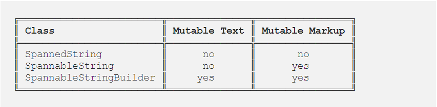
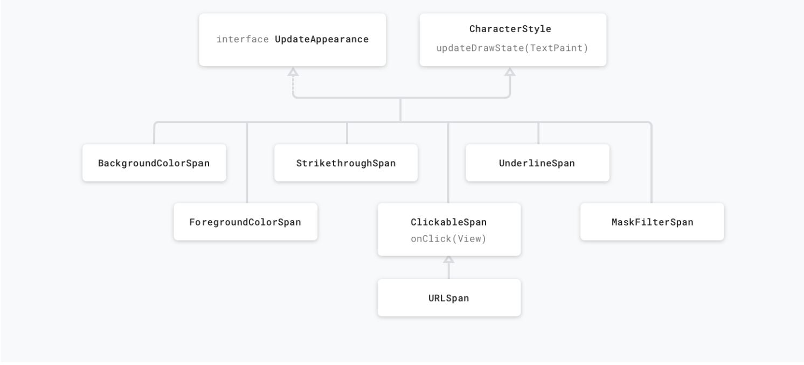
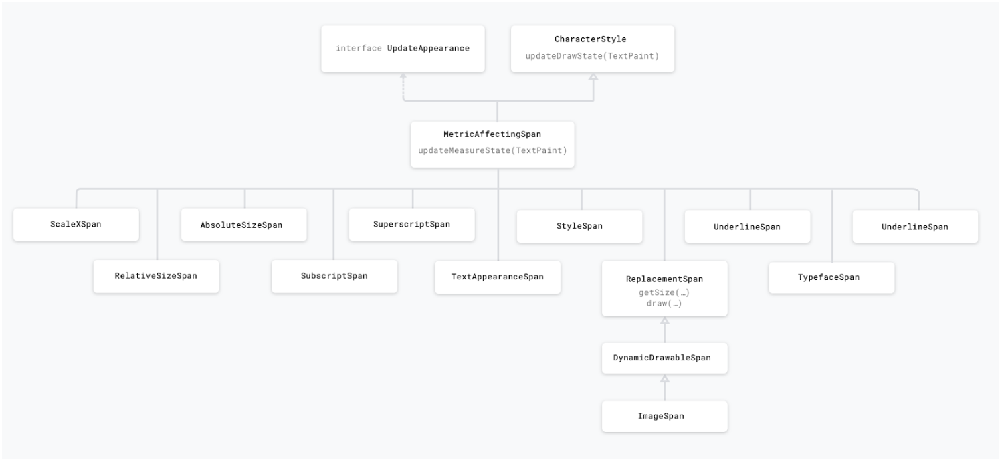
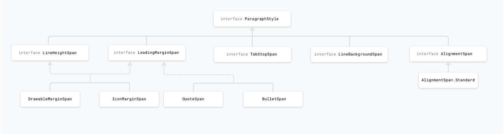

# Spannable

This is the interface for text to which markup objects can be attached and detached. It used for styling text. Can be applied to whole paragraphs or to parts of the text. Used for:
- Change the color
- Make text clickable
- Scale text size
- Draw custom points
- Change line height

## Applying Spans

When using spans, you will work with one of the following classes: `SpannedString`, `SpannableString` or `SpannableStringBuilder`. The difference between them lies in whether the text or the markup objects are mutable or immutable and in the internal structure they use: `SpannedString` and `SpannableString` use linear arrays to keep records of added spans, whereas `SpannableStringBuilder` uses an interval tree.
Which one to use:
- Just reading and not setting the text nor the spans? -> SpannedString
- Setting the text and the spans? -> SpannableStringBuilder
- Setting a small number of spans (<~10)? -> SpannableString
- Setting a larger number of spans (>~10) -> SpannableStringBuilder

## Framework spans

The Android framework defines several interfaces and abstract classes that are checked at measure and render time. These classes have methods that allow a span to access objects like the TextPaint or the Canvas.
The Android framework provides 20+ spans in the android.text.style package, subclassing the main interfaces and abstract classes. We can categorize spans in several ways:
- Based on whether span changes only appearance or also the text metric/layout
- Based on whether they affect text at character or at paragraph level

### Appearance vs metric affecting spans

The first category affects character-level text in a way that modifies their appearance: text or background colour, underline, strikethrough, etc., that triggers a redraw without causing a relayout of the text. These spans implement `UpdateAppearance` and extend `CharacterStyle`. `CharacterStyle` subclasses define how to draw text by providing access to update the `TextPaint`.

Metric affecting spans modify text metrics and layout, therefore the object that observes the span change will re-measure the text for correct layout and rendering.
For example, a span that affects the text size will require re-measure and layout, as well as re-drawing. These spans usually extend the `MetricAffectingSpan` class. This abstract class allows subclasses to define how the span affects text measurement, by providing access to the `TextPaint`. Since `MetricAffectingSpan` extends `CharacterSpan`, subclasses affect the appearance of the text at character level.

### Character vs paragraph affecting spans

A span can either affect the text at the character level, updating elements like background colour, style or size, or a the paragraph level, changing the alignment or the margin of the entire block of text. Depending on the needed styling, spans either extend `CharacterStyle` or implement `ParagraphStyle`. Spans that extend `ParagraphStyle` must be attached from the first character to the last character of a single paragraph, otherwise the span will not be displayed. On Android paragraphs are defined based on new line (`\n`) character. A `ParagraphStyle` span, like `QuoteSpan`, can only be attached from the start of a paragraph, otherwise the line and the text margin don’t appear.

## Links
https://developer.android.com/reference/android/text/Spannable  
https://medium.com/androiddevelopers/spantastic-text-styling-with-spans-17b0c16b4568  
