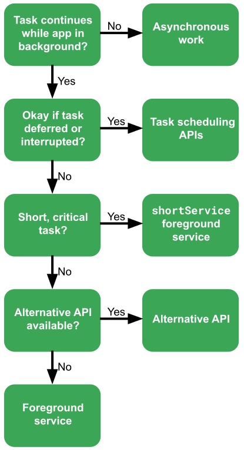
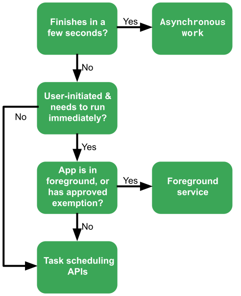

# What is background task
For the purposes of this document, we'll use the term "task" to mean an operation an app is doing outside its main workflow. To ensure alignment in understanding, we've put this into three main categories of types of tasks:[1](https://developer.android.com/develop/background-work/background-tasks#:~:text=For%20the%20purposes%20of%20this%20document%2C%20we%27ll%20use%20the%20term%20%22task%22%20to%20mean%20an%20operation%20an%20app%20is%20doing%20outside%20its%20main%20workflow.%20To%20ensure%20alignment%20in%20understanding%2C%20we%27ve%20put%20this%20into%20three%20main%20categories%20of%20types%20of%20tasks%3A%20asynchronous%20work%2C%20the%20task%20scheduling%20APIs%2C%20and%20foreground%20services.)

- [Asynchronous work](#Asynchronous-work);
- [Task scheduling APIs](#Task-scheduling-APIs);
- [Foreground services](#Foreground-services).

## [Asynchronous work](https://developer.android.com/develop/background-work/background-tasks#asynchronous-work)
In many cases, an app just needs to do concurrent operations while it's running in the foreground. For example, an app might need to do a time-consuming calculation. If it did the calculation on the UI thread, the user wouldn't be able to interact with the app until the calculation finished; this might result in an ANR error. In a case like this, the app should use an *asynchronous work* option (Common asynchronous work options include Kotlin coroutines and Java threads).

## [Task scheduling APIs](https://developer.android.com/develop/background-work/background-tasks#background-work)
The task scheduling APIs are a more flexible option when you need to do tasks that need to continue even if the user leaves the app. In most cases, the best option for running background tasks is to use `WorkManager`, though in some cases it may be appropriate to use the platform `JobScheduler` API.

`WorkManager` is a powerful library that lets you set up simple or complicated jobs as you need. You can use `WorkManager` to schedule tasks to run at specific times, or specify the conditions when the task should run. You can even set up chains of tasks, so each task runs in turn, passing its results to the next one.

Some of the most common scenarios for background tasks include:
- Fetching data from server periodically;
- Fetching sensor data (for example, step counter data);
- Getting periodic location data;
- Uploading content based on a content trigger, such as photos created by the camera.

## [Foreground services](https://developer.android.com/develop/background-work/background-tasks#foreground-services)
Foreground services offer a powerful way to run tasks immediately that ought not to be interrupted. However, foreground services can potentially put a heavy load on the device, and sometimes they have privacy and security implications. For these reasons, the system puts a lot of restrictions on how and when apps can use foreground services. For example, a foreground service has to be noticeable to the user, and in most cases apps can't launch foreground services when the apps are in the background. 

There are two methods for creating a foreground service. You can declare your own `Service` and specify that the service is a foreground service by calling `Service.startForeground()`, or you can use `WorkManager` to create a foreground service.

## [Choose the right option](https://developer.android.com/develop/background-work/background-tasks#choose-right-option)
In most scenarios, you can figure out the right APIs to use for your task by figuring out the category the task falls under.

There are two main scenarios to consider for background tasks:
- [Tasks initiated by the user](#Tasks-initiated-by-the-user);
- [Tasks in response to an event](#Tasks-in-response-to-an-event).

These two scenarios have their own decision trees.

### [Tasks initiated by the user](https://developer.android.com/develop/background-work/background-tasks#user-initiated)

If an app needs to perform background tasks, and the operation is initiated by the user while the app is visible, answer these questions to find the right approach:

[**Does the task need to continue running while the app is in the background?**](https://developer.android.com/develop/background-work/background-tasks#does_the_task_need_to_continue_running_while_the_app_is_in_the_background)

If the task does not need to continue running while the app is in the background, you should use [asynchronous work](#Asynchronous-work). The important thing to understand is that these options all stop operating if the app goes into the background. (They also stop if the app is shut down.) For example, a social media app might want to refresh its content feed, but it wouldn't need to finish the operation if the user left the screen.

[**Will there be a bad user experience if the task is deferred or interrupted?**](https://developer.android.com/develop/background-work/background-tasks#will_there_be_a_bad_user_experience_if_the_task_is_deferred_or_interrupted)

It's important to consider whether the user experience would be harmed if a task is postponed or canceled. For example, if an app needs to update its assets, the user might not notice whether the operation happens right away, or in the middle of the night while the device is recharging. In cases like this, you should use the [task scheduling APIs](#Task-scheduling-APIs) options.

[**Is it a short, critical task?**](https://developer.android.com/develop/background-work/background-tasks#is_it_a_short_critical_task)

If the task cannot be delayed and it will complete quickly, you can use a [foreground service](#Foreground-services) with the type `shortService`. These services are easier to create than other foreground services, and don't require as many permissions. However, short services must complete within three minutes.

[**Is there an alternative API just for this purpose?**](https://developer.android.com/develop/background-work/background-tasks#is_there_an_alternative_api_just_for_this_purpose)

If the task is not invisible to the user, the correct solution may be to use a [foreground service](#Foreground-services). These services run continuously once started, so they're a good choice when interrupting the task would have a bad user experience. For example, a workout-tracking app might use location sensors to let users record their jogging route on a map. You wouldn't want to do this with a background work option, because if the task got paused, the tracking would immediately stop. In a situation like this, a foreground service makes the most sense.

However, because foreground services can potentially use a lot of device resources, the system puts a lot of restrictions on when and how they can be used. In many cases, instead of using a foreground service, you can use an alternative API that handles the job for you with less trouble. For example, if your app needs to take an action when the user arrives at a certain location, your best option is to use the geofence API instead of tracking the user's location with a foreground service.

### [Tasks in response to an event](https://developer.android.com/develop/background-work/background-tasks#event-driven)

Sometimes an app needs to do background work in response to a trigger, such as:
- Broadcast messages;
- Firebase Cloud Messaging (FCM) messages;
- Alarms set by the app.

This might be an external trigger (like an FCM message), or it might be in response to an alarm set by the app itself. For example, a game might receive a FCM message telling it to update some assets.

If you can be sure that the task will finish in a few seconds, use [asynchronous work](#Asynchronous-work) to perform the task. The system will allow your app a few seconds to perform any such tasks, even if your app was in the background.

If the task will take longer than a few seconds, it may be appropriate to start a foreground service to handle the task. In fact, even if your app is currently in the background, it might be permitted to start a [foreground service](#Foreground-services), if the task was triggered by the user and it falls into one of the approved exemptions from background start restrictions. For example, if an app receives a high-priority FCM message, the app is permitted to start a foreground service even if the app is in the background.

If the task will take longer than a few seconds, use the [task scheduling APIs](#Task-scheduling-APIs).

# Links
[Background tasks overview](https://developer.android.com/develop/background-work/background-tasks)

# Next questions
[What are coroutines?](https://github.com/Kirchhoff-/Android-Interview-Questions/blob/master/Kotlin/What%20are%20coroutines.md)

[What's `WorkManager`?](https://github.com/Kirchhoff-/Android-Interview-Questions/blob/master/Android/What's%20WorkManager.md)

[What do you know about Foreground Services?](https://github.com/Kirchhoff-/Android-Interview-Questions/blob/master/Android/What%20do%20you%20know%20about%20Foreground%20Services.md)

[What is ANR?](https://github.com/Kirchhoff-/Android-Interview-Questions/blob/master/Android/What%20is%20ANR.md)
