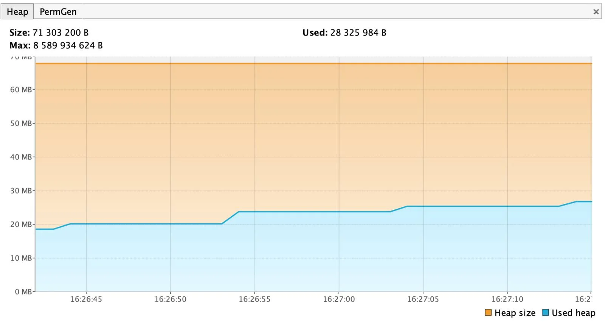

# Memory leak
A **Memory Leak** is a situation where there are objects present in the heap that are no longer used, but the garbage collector is unable to remove them from memory, and therefore, they're unnecessarily maintained.

A memory leak is bad because it blocks memory resources and degrades system performance over time. If not dealt with, the application will eventually exhaust its resources, finally terminating with a fatal `java.lang.OutOfMemoryError`. [1](https://www.baeldung.com/java-memory-leaks#:~:text=A%20Memory%20Leak%20is%20a,degrades%20system%20performance%20over%20time.)

## [What Causes Memory Leaks in Java](https://rollbar.com/blog/how-to-detect-memory-leaks-in-java-causes-types-tools/#:~:text=which%20is%20irrecoverable.-,What%20Causes%20Memory%20Leaks%20in%20Java,-In%20general%2C%20a)

In general, a Java memory leak happens when an application unintentionally (due to logical errors in code) holds on to object references that are no longer required. These unintentional object references prevent the built-in Java garbage collection mechanism from freeing up the memory consumed by these objects.

Common causes for these memory leaks are:
- Excessive session objects;
- Insertion without deletion into Collection objects;
- Unbounded caches;
- Excessive operating system page swapping;
- Un-invoked listener methods;
- Poorly written custom data structures.

## [Memory Leaks: Temporary vs Permanent](https://proandroiddev.com/everything-you-need-to-know-about-memory-leaks-in-android-d7a59faaf46a#:~:text=Memory%20Leaks%3A%20Temporary%20vs%20Permanent)

Leaks can be divided into two categories: those that occupy the memory unit until the **application terminates (permanent)** and those that occupy the memory unit until the **method terminates (temporary)**.

The first category, application terminations (permanent), is self-evident: when an app is terminated, the GC releases all of the memory that the app has used.

The second category, method terminations (temporary), requires a little more explanation; for a better understanding, let’s use an example.

Let’s say we have method X. Method X is performing a task in the background that will take five minutes to complete and we’ve given it an activity context to retrieve some string. We decided to close the activity after one minute, but the method is still running and it needs four more minutes to complete the task; during this time we are holding the activity object, which is no longer in use, and the GC will be unable to free it from the memory; once the method completes the task, the GC will run again and will be able to clear and reclaim them from memory.

## [Types of Memory Leaks](https://sematext.com/blog/java-memory-leaks/#:~:text=in%20our%20code.-,Types%20of%20Memory%20Leaks,-Let%E2%80%99s%20look%20at)

### [Static Field Holding Object Reference](https://sematext.com/blog/java-memory-leaks/#:~:text=of%20memory%20leaks.-,Static%20Field%20Holding%20Object%20Reference,-One%20of%20the)

One of the simplest examples of Java memory leak is objects referenced via the static fields that are not cleared. For example, a static field holding a collection of objects that we never clear or throw away.

A simple example of such behavior can be demonstrated with the following code:
```
public class StaticReferenceLeak {
  public static List<Integer> NUMBERS = new ArrayList<>();
  public void addBatch() {
    for (int i = 0; i < 100000; i++) {
      NUMBERS.add(i);
    }
  }
  public static void main(String[] args) throws Exception {
    for (int i = 0; i < 1000000; i++) {
        (new StaticReferenceLeak()).addBatch();
        System.gc();
        Thread.sleep(10000);
    }
  }
}
```

The `addBatch` method adds 100000 integers to the collection called `NUMBERS`. This is, of course, perfectly fine if we need that data. But in this case, we never delete it. Even though we created the StaticReferenceLeak object in the main method and don’t hold the reference to it, we can easily see that the garbage collector can’t clean up the memory. Instead, it constantly grows:



If we wouldn’t see the implementation details of the `StaticReferenceLeak` class, we would expect the memory used by the object to be released, but this is not the case because the `NUMBERS` collection is static. There would be no problem if it wouldn’t be static, so be extra careful when using static variables.

### [Unclosed Resources](https://sematext.com/blog/java-memory-leaks/#:~:text=no%20longer%20needed.-,Unclosed%20Resources,-It%20isn%E2%80%99t%20rare)

It isn’t rare to access resources located on remote servers, open files and process them and so on. Such code requires opening a stream, connection, or file inside our code. But we have to remember that we are the ones responsible not only for opening the resource but also for closing it. Otherwise, our code can leak memory, eventually leading to `OutOfMemory` error.

To illustrate the problem let’s have a look at the following example:
```
public class UnclosedResources {
  public static void main(String[] args) throws Exception {
    for (int i = 0; i < 1000000; i++) {
      URL url = new URL("http://www.google.com");
      URLConnection conn = url.openConnection();
      InputStream is = conn.getInputStream();
      // rest of the code goes here
    }
  }
}
```

Each run of the above loop results in the `URLConnection` instance being opened and referenced leading to slow exhaustion of resources – the memory.

### [Using Objects with Improper `equals()` and `hashCode()` Implementations](https://sematext.com/blog/java-memory-leaks/#:~:text=updated%20Java%20versions.-,Using%20Objects%20with%20Improper%20equals()%20and%20hashCode()%20Implementations,-Another%20common%20example)

Another common example of Java memory leak is using objects with custom `equals()` and `hashCode()` methods that are not properly implemented (or not existing at all), with collections that use hashing to check for duplicates. One example of such a collection is `HashSet`.

To illustrate that problem, let’s have a look at the following example:
```
public class HashAndEqualsNotImplemented {
  public static void main(String[] args) {
    Set<Entry> set = new HashSet<>();
    for (int i = 0; i < 1000; i++) {
      set.add(new Entry("test"));
    }
    System.out.println(set.size());
  }
}

class Entry {
  public String entry;
  public Entry(String entry) {
    this.entry = entry;
  }
}
```

Before we dig into the explanation, ask yourself a simple question: 

"What will be the number that the code will print with the `System.out.println(set.size())` call?"

If your answer is 1000 then you are right. That is because we don’t have the `equals` method properly implemented. This means that each instance of the `Entry` object added to the `HashSet` is added regardless of whether that is a duplicate from our perspective. That potentially leads to an `OutOfMemory` exception.

### [Inner Classes that Reference Outer Classes](https://sematext.com/blog/java-memory-leaks/#:~:text=in%20implementing%20them.-,Inner%20Classes%20that%20Reference%20Outer%20Classes,-A%20very%20interesting)
A very interesting case in my opinion – the case of the inner, private class keeping the reference to its parent class. Consider the following scenario:
```
public class OuterClass {
  // some large arrays of values
  private InnerClass inner;
  public void create() {
    inner = new InnerClass();
    // do something with inner and keep it
  }
  class InnerClass {
    // some logic of the inner class
  }
}
```

Assuming that the `OuterClass` contains references to a large number of objects that occupy a lot of memory, even if it will no longer be used it won’t be garbage collected. That’s because the `InnerClass` object will have an implicit reference to the `OuterClass`, which makes it ineligible for garbage collection.

# Links
[Understanding Memory Leaks in Java](https://www.baeldung.com/java-memory-leaks)

[How to Detect Memory Leaks in Java: Causes, Types, & Tools](https://rollbar.com/blog/how-to-detect-memory-leaks-in-java-causes-types-tools)

[Everything you need to know about Memory Leaks in Android](https://proandroiddev.com/everything-you-need-to-know-about-memory-leaks-in-android-d7a59faaf46a)

[Understanding Memory Leaks in Java: Common Causes & How to Detect Them](https://sematext.com/blog/java-memory-leaks/)

# Further Reading
[Hunting Java Memory Leaks](https://www.toptal.com/java/hunting-memory-leaks-in-java)

[Tutorial: Find a memory leak](https://www.jetbrains.com/help/idea/tutorial-find-a-memory-leak.html)

[Everything you need to know about Memory Leaks in Android](https://proandroiddev.com/everything-you-need-to-know-about-memory-leaks-in-android-d7a59faaf46a)

[How to get rid of memory leaks? A practical approach using Leak Canary and Android Profiler — Part 1](https://innovorder.dev/how-to-get-rid-of-memory-leaks-6aaf06451bdf)
