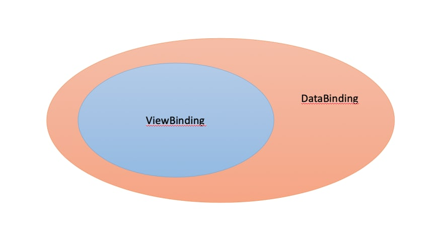

# View binding vs Data binding 
**View binding** is a feature that allows you to more easily write code that interacts with views. Once view binding is enabled in a module, it generates a *binding class* for each XML layout file present in that module. An instance of a binding class contains direct references to all views that have an ID in the corresponding layout.

In most cases, view binding replaces `findViewById`.

The **Data Binding Library** is a support library that allows you to bind UI components in your layouts to data sources in your app using a declarative format rather than programmatically. 

Binding components in the layout file lets you remove many UI framework calls in your activities, making them simpler and easier to maintain. This can also improve your app's performance and help prevent memory leaks and null pointer exceptions.

We can represent the view binding as a part of data binding library which means view binding and data binding can do the same jobs for binding views and layouts. But data binding has much more functionality then view binding. If you are using data binding primarily to replace `findViewById()` calls, than you should use view binding. 

## Conclusion
**Differences View Binding and Data Binding**:

- View Binding library is faster than Data Binding library as it is not utilising annotation processors underneath, and when it comes to compile time speed View Binding is more efficient;

- The one and only function of View Binding is to bind the views in the code. While Data Binding offers some more options like Binding Expressions, which allows us to write expressions the connect variables to the views in the layout;

- Data Binding library works with Observable Data objects, you don't have to worry about refreshing the UI when underlying data changes;

- Data Binding library provides us with Binding Adapters;

- Data Binding library provides us with Two way Data Binding, this is a technique of binding your objects to xml layouts, so that both object and layout can send data to each other.

# Links
[View Binding](https://developer.android.com/topic/libraries/view-binding)

[Data Binding Library](https://developer.android.com/topic/libraries/data-binding)

[Android : Difference between DataBinding and ViewBinding](https://stackoverflow.com/a/67722508)

# Futher reading
[Android View Binding or Data Binding? [2 easy use cases]](https://www.simplifiedcoding.net/view-binding-or-data-binding/)

# Related questions
[What do you know about View Binding?](https://github.com/Kirchhoff-/Android-Interview-Questions/blob/master/Android/What%20do%20you%20know%20about%20View%20Binding.md)

[What's data binding?](https://github.com/Kirchhoff-/Android-Interview-Questions/blob/master/Android/What's%20data%20binding.md)
