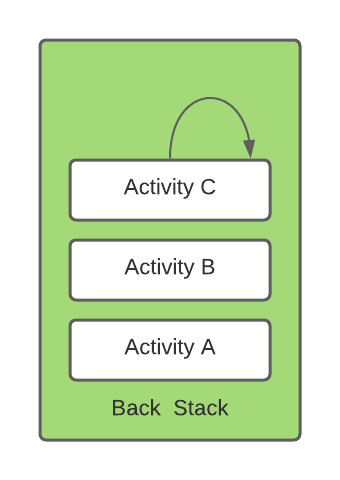
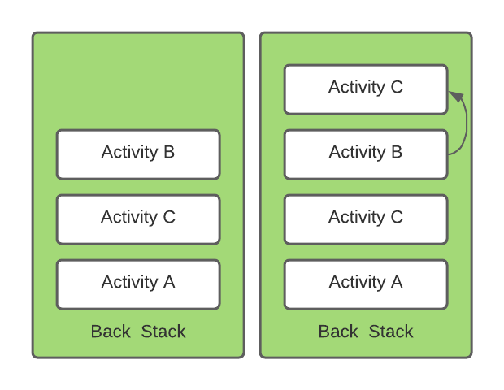
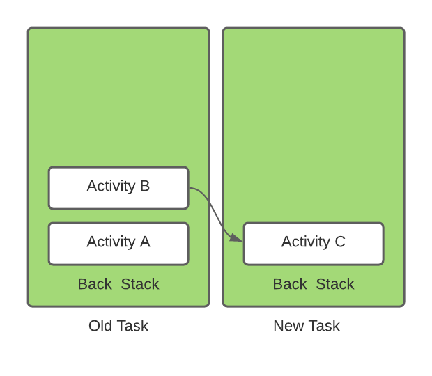
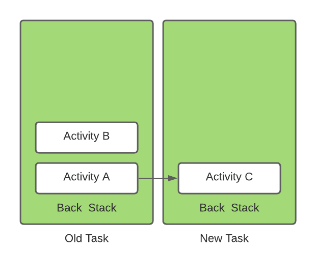
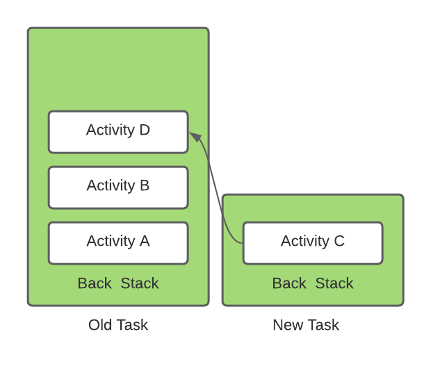

# What launch modes do you know?

When declaring an activity in your manifest file, you can specify how the activity should associate with a task. There are two ways to define the launch modes. First way is using **Android Manifest file**, and second way is using **Intent Flags**. 

There are five different launch modes you can assign to the `launchMode` attribute:

- `standard`;
- `singleTop`;
- `singleTask`;
- `singleInstance`;
- `singleInstancePerTask`.

## standard (the default mode)

Default. The system creates a new instance of the activity in the task from which it was started and routes the intent to it. The activity can be instantiated multiple times, each instance can belong to different tasks, and one task can have multiple instances.

**Example**:
Suppose you have *A*, *B*, *C* and *D* activities and your activity *B* has `<activity android:launchMode=”standard” />`. Now you again launching activity *B*:

State of Activity Stack before launch *B*:
*A* -> *B* -> *C* -> *D*

State of Activity Stack after launch *B*:
*A* -> *B* -> *C* -> *D* -> *B*

## singleTop
If an instance of the activity already exists at the top of the current task, the system routes the intent to that instance through a call to its `onNewIntent()` method, rather than creating a new instance of the activity. The activity can be instantiated multiple times, each instance can belong to different tasks, and one task can have multiple instances (but only if the activity at the top of the back stack is not an existing instance of the activity).

### Scenario 1
The `Activity` exists and it’s sitting on the top of the back stack (Assume that's current activity as well). For example, the **Activity C** exists, and it’s on the top of the back stack. The user wants to go to the same activity again. The Android system will not create new instance of the **Activity C**, instead it will use the existing **Activity C** that’s sitting on the top of the **back stack**. Hence, the **back stack** remains intact. Image below illustrates:

### Scenario 2
The `Activity` exists, and but it’s not on the top of the **back stack**. For example, **Activity C** exists, and it’s not on the top of the stack. The user wants to go to the **Activity C** from **Activity B**. Android system will create a new instance of the **Activity C**, even though **Activity C** already exists in the back stack, but it's not on the top of the back stack. Hence, the back stack is modified by adding new instance of the **Activity C**. Image below illustrates:

**Note**. When a new instance of an activity is created, the user can press or gesture Back to return to the previous activity. But when an existing instance of an activity handles a new intent, the user cannot press or gesture Back to return to the state of the activity before the new intent arrived in `onNewIntent()`.

## singleTask
The system creates the activity at the root of a new task or locates the activity on an existing task with the same affinity. If an instance of the activity already exists and is at the root of the task, the system routes the intent to existing instance through a call to its `onNewIntent()` method, rather than creating a new instance. Meanwhile all of the other activities on top of it are destroyed.

### Scenario 1
The activity does not exist, and hence the new activity with its own **task** and **back stack** will be initiated. The Activity will be the root of the **new task**. For example, we want to open **Activity C** from **Activity B**, but it does not exist in the **back stack** or separate **task**. So **new task /back stack** will be created with root activity as **Activity C**. Image illustrates below:

From this new **back stack** the **Activity C** can launch other activities. For example, from **Activity C** if the user wants to see **Activity D** which has a default launch mode, it can launch itself. Image below illustrates:

")

If the user presses the back button, **Activity D** will be popped off from the **back stack** of **new task**, hence **Activity C** will be visible. So regardless of task, back button will always take the user to previous activity.

### Scenario 2

The user wants to launch an activity which has a `singleTask` mode, and already exists with its **task** and **back stack**. For example, referring to the previous scenario where the **Activity C** exists with newly created **task** and **back stack**. Let’s say the user wants to go to the **Activity C** from **Activity A**, the android system will not create a new instance of the **Activity C** along with the **task/back stack**. Instead, it just routes it to the **Activity C**, and what ever activities that was sitting on the top of the root activity will be popped off. Image below illustrates this:

### Scenario 3
The `Activity` exists, and it’s not on a separate **task/back stack**, but its on the current **back stack**. Let’s say we have 4 Activities in our stack respectively **Activity A**, **Activity B**, **Activity C**, and **Activity D**. Let’s say that the user wants to go to **Activity A** from **Activity D**, since the **Activity A** has mode of `singleTask`, and it is exists in the root of the **back stack**. So no need to create new **task/back stack**, what would happen in this case is that the system will pop off every activity that’s sitting top of **Activity A** until it becomes top of the **back stack**. Hence, the **Activity A** is being reused instead of creating new one.

**Note**. Although the activity starts in a new task, the Back button and gesture still return the user to the previous activity.

## singleInstance
Same as `singleTask`, except that the system doesn't launch any other activities into the task holding the instance. The activity is always the single and only member of its task; any activities started by this one open in a separate task. So only that instance of the activity exists in the **task/back stack**.

For example, like the previous example we have launched the **Activity C** from the **Activity B** but in this case the **Activity C** has a mode of `singleInstance`. After creating new a **task** and **back stack** which has **Activity C**, lets say we want to launch the **Activity D** which has a default mode, the **Activity D** will be launched pushed into the old task or separate task not the newly created task by the **Activity C**. This is illustrated below:

## singleInstancePerTask
The activity can only be running as the root activity of the task, the first activity that created the task, and therefore there will only be one instance of this activity in a task. In contrast to the `singleTask` launch mode, this activity can be started in multiple instances in different tasks if the `FLAG_ACTIVITY_MULTIPLE_TASK` or `FLAG_ACTIVITY_NEW_DOCUMENT` flag is set.

**Note**. `singleTask` and `singleInstancePerTask` will remove all activities which are above the starting activity from the **task**. For example, suppose a task consists of root activity *A* with activities *B*, *C* (the task is *A* -> *B* -> *C*; *C* is on top). An intent arrives for an activity of type *A*. If A's launch mode is `singleTask` or `singleInstancePerTask`, the existing instance of *A* receives the intent through `onNewIntent()`. *B* and *C* are finished, and the task is now *A*.

# Links 
[Tasks and the back stack](https://developer.android.com/guide/components/activities/tasks-and-back-stack)

[Understand the types of Launch Modes in an Android Activity](https://mohamedyousufmo.medium.com/understand-android-activity-launch-mode-c21fcecf04b8)

[Android Activity Launch Mode](https://medium.com/android-news/android-activity-launch-mode-e0df1aa72242)

# Further reading
[Understand Android Activity's launchMode: standard, singleTop, singleTask and singleInstance](https://inthecheesefactory.com/blog/understand-android-activity-launchmode/en)
