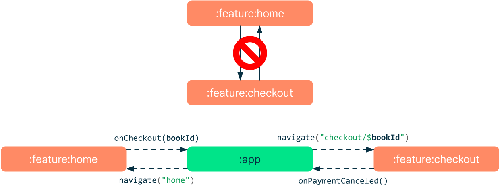
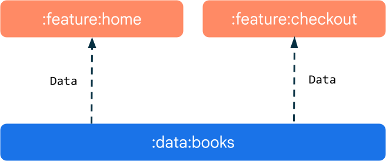
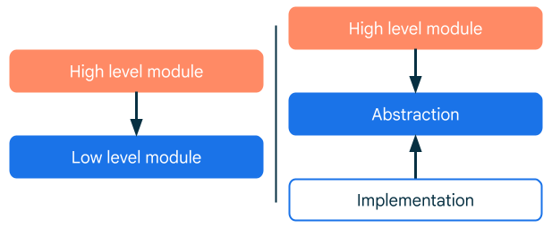

# Modularization patterns

## [High cohesion and low coupling principle](https://developer.android.com/topic/modularization/patterns#cohesion-coupling)
One way of characterizing a modular codebase would be to use the **coupling** and **cohesion** properties. Coupling measures the degree to which modules depend on each other. Cohesion, in this context, measures how the elements of a single module are functionally related. As a general rule, you should strive for low coupling and high cohesion:
- **Low coupling** means that modules should be as independent as possible from one another, so that changes to one module have zero or minimal impact on other modules. **Modules shouldn't have knowledge of the inner workings of other modules**;
- **High cohesion** means that modules should comprise a collection of code that acts as a system. They should have clearly defined responsibilities and stay within boundaries of certain domain knowledge. Consider a sample ebook application. It might be inappropriate to mix book and payment related code together in the same module as they are two different functional domains.

## [Module to module communication](https://developer.android.com/topic/modularization/patterns#communication)
Modules rarely exist in total separation and often rely on other modules and communicate with them. It’s important to keep the coupling low even when modules work together and exchange information frequently. Sometimes direct communication between two modules is either not desirable as in the case of architecture constraints. It may also be impossible, such as with cyclic dependencies.

To overcome this problem you can have a third module mediating between two other modules. The mediator module can listen for messages from both of the modules and forward them as needed. The mediator is the module that owns the navigation graph (usually an app module).

You shouldn't pass objects as navigation arguments. Instead, use simple ids that features can use to access and load desired resources from the data layer. This way, you keep the coupling low and don't violate the single source of truth principle.

In the example below, both feature modules depend on the same data module. This makes it possible to minimize the amount of data that the mediator module needs to forward and keeps the coupling between the modules low. Instead of passing objects, modules should exchange primitive IDs and load the resources from a shared data module.

## [Dependency inversion](https://developer.android.com/topic/modularization/patterns#dependency_inversion)
Dependency inversion is when you organize your code such that the abstraction is separate from a concrete implementation.

- **Abstraction**: A contract that defines how components or modules in your application interact with each other. Abstraction modules define the API of your system and contain interfaces and models;
- **Concrete implementation**: Modules that depend on the abstraction module and implement the behavior of an abstraction.

Modules that rely on the behavior defined in the abstraction module should only depend on the abstraction itself, rather than the specific implementations. 

The feature module is connected with the implementation module via Dependency Injection.The feature module doesn't directly create the required database instance. Instead, it specifies what dependencies it needs. These dependencies are then supplied externally, usually in the app module.

It is beneficial to separate your APIs from their implementations in the following cases:
- **Diverse capabilities**: If you can implement parts of your system in multiple ways, a clear API allows interchangeability of different implementations. For example, you may have a rendering system that uses OpenGL or Vulkan, or a billing system that works with Play or your in-house billing API;
- **Multiple applications**: If you're developing multiple applications with shared capabilities for different platforms, you can define common APIs and develop specific implementations per platform;
- **Independent teams**: The separation allows different developers or teams to work on different parts of the codebase simultaneously. Developers should focus on understanding the API contracts and using them correctly. They don't need to worry about the implementation details of other modules;
- **Large codebase**: When the codebase is large or complex, separating the API from the implementation makes the code more manageable. It lets you break the codebase down into more granular, understandable, and maintainable units.

## [Keep your configuration consistent](https://developer.android.com/topic/modularization/patterns#consistent-configuration)
Every module introduces configuration overhead. If the number of your modules reaches a certain threshold, managing consistent configuration becomes a challenge. For example, it’s important that modules use dependencies of the same version. If you need to update a large number of modules just to bump a dependency version, it is not only an effort but also a room for potential mistakes. To solve this problem, you can use one of the gradle’s tools to centralize your configuration:
- [Version catalogs](https://docs.gradle.org/current/userguide/platforms.html) are a type safe list of dependencies generated by Gradle during sync. It’s a central place to declare all your dependencies and is available to all the modules in a project;
- Use [convention plugins](https://docs.gradle.org/current/samples/sample_convention_plugins.html) to share build logic between modules.

## [Expose as little as possible](https://developer.android.com/topic/modularization/patterns#expose-little)
The public interface of a module should be minimal and expose only the essentials. It shouldn't leak any implementation details outside. Scope everything to the smallest extent possible. Use Kotlin’s `private` or `internal` visibility scope to make the declarations module-private. When declaring dependencies in your module, prefer `implementation` over `api`. The latter exposes transitive dependencies to the consumers of your module. Using implementation may improve build time since it reduces the number of modules that need to be rebuilt.

## [Prefer Kotlin & Java modules](https://developer.android.com/topic/modularization/patterns#prefer-kotlin)
There are three essential types of modules that Android studio supports:
- **App modules** are an entry point to your application. They can contain source code, resources, assets and an `AndroidManifest.xml`. The output of an app module is an Android App Bundle (AAB) or an Android Application Package (APK);
- [**Library modules**](https://developer.android.com/studio/projects/android-library) have the same content as the app modules. They are used by other Android modules as a dependency. The output of a library module is an Android Archive (AAR) are structurally identical to app modules but they are compiled to an Android Archive (AAR) file which can later be used by other modules as a dependency. A library module makes it possible to encapsulate and reuse the same logic and resources across many app modules.
- **Kotlin and Java** libraries don't contain any Android resources, assets, or manifest files.

Since Android modules come with overhead, preferably, you'd want to use the Kotlin or Java kind as much as possible.

# Links
[Common modularization patterns](https://developer.android.com/topic/modularization/patterns)

# Next question
[What do you know about Version catalog?](https://github.com/Kirchhoff-/Android-Interview-Questions/blob/master/Android/What%20do%20you%20know%20about%20Version%20catalog.md)

[What do you know about Play Feature Delivery?](https://github.com/Kirchhoff-/Android-Interview-Questions/blob/master/Android/What%20do%20you%20know%20about%20Play%20Feature%20Delivery.md)

[What do you know about App Bundles?](https://github.com/Kirchhoff-/Android-Interview-Questions/blob/master/Android/What%20do%20you%20know%20about%20App%20Bundles.md)
