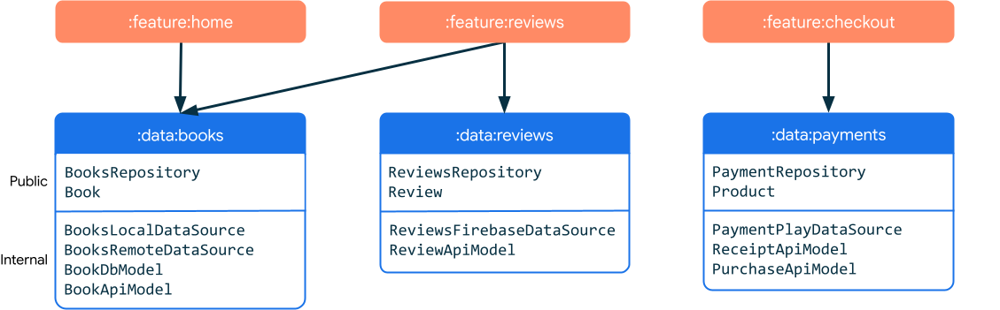
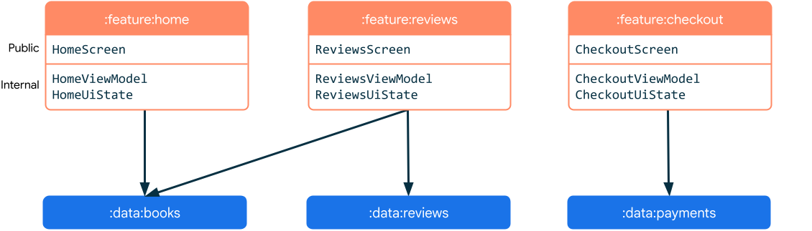
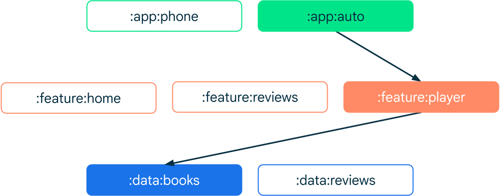
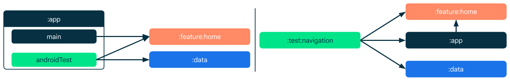

# Modules types

## [Data modules](https://developer.android.com/topic/modularization/patterns#data-modules)
A data module usually contains a repository, data sources and model classes. The three primary responsibilities of a data module are:
- **Encapsulate all data and business logic of a certain domain**: Each data module should be responsible for handling data that represents a certain domain. It can handle many types of data as long as they are related;
- **Expose the repository as an external API**: The public API of a data module should be a repository as they are responsible for exposing the data to the rest of the app;
- **Hide all implementation details and data sources from the outside**: Data sources should only be accessible by repositories from the same module. They remain hidden to the outside. You can enforce this by using Kotlin’s `private` or `internal` visibility keyword.

## [Feature modules](https://developer.android.com/topic/modularization/patterns#feature-modules)
A feature is an isolated part of an app's functionality that usually corresponds to a screen or series of closely related screens, like a sign up or checkout flow.

Features are associated with screens or destinations in your app. Therefore, they're likely to have an associated UI and `ViewModel` to handle their logic and state. A single feature doesn't have to be limited to a single view or navigation destination. **Feature modules depend on data modules**.

## [App modules](https://developer.android.com/topic/modularization/patterns#app-modules)
App modules are an entry point to the application. They depend on feature modules and usually provide root navigation. A single app module can be compiled to a number of different binaries thanks to build variants.

If your app targets multiple device types, such as auto, wear or TV, define an app module per each. This helps separate platform specific dependencies.

## [Common modules](https://developer.android.com/topic/modularization/patterns#common-modules)
Common modules, also known as core modules, contain code that other modules frequently use. They reduce redundancy and don't represent any specific layer in an app's architecture. The following are examples of common modules:
- **UI module**: If you use custom UI elements or elaborate branding in your app, you should consider encapsulating your widget collection into a module for all the features to reuse. This could help make your UI consistent across different features. For example, if your theming is centralized, you can avoid a painful refactor when a rebrand happens;
- **Analytics module**: Tracking is often dictated by business requirements with little consideration to the software architecture. Analytics trackers are often used in many unrelated components. If that's the case for you, it might be a good idea to have a dedicated analytics module;
- **Network module**: When many modules require a network connection, you might consider having a module dedicated to providing a http client. It is especially useful when your client requires custom configuration;
- **Utility module**: Utilities, also known as helpers, are usually small pieces of code that are reused across the application. Examples of utilities include testing helpers, a currency formatting function, email validator or a custom operator.

## [Test modules](https://developer.android.com/topic/modularization/patterns#test-modules)
Test modules are Android modules that are used for testing purposes only. The modules contain test code, test resources, and test dependencies that are only required for running tests and are not needed during the application's runtime. Test modules are created to separate test-specific code from the main application, making the module code easier to manage and maintain.

### [Use cases for test modules](https://developer.android.com/topic/modularization/patterns#use_cases_for_test_modules)
The following examples showcase situations where implementing test modules can be particularly beneficial:
- **Shared test code**: If you have multiple modules in your project and some of the test code is applicable to more than one module, you can create a test module to share the code. This can help reduce duplication and make your test code easier to maintain. Shared test code can include utility classes or functions, such as custom assertions or matchers, as well as test data, such as simulated JSON responses;
- **Cleaner Build Configurations**: Test modules allow you to have cleaner build configurations, as they can have their own `build.gradle` file. You don't have to clutter your app module's `build.gradle` file with configurations that are only relevant for tests.
- **Integration Tests**: Test modules can be used to store integration tests that are used to test interactions between different parts of your app, including user interface, business logic, network requests, and database queries;
- **Large-scale applications**: Test modules are particularly useful for large-scale applications with complex codebases and multiple modules. In such cases, test modules can help improve code organization and maintainability.

# Links
[Types of modules](https://developer.android.com/topic/modularization/patterns#types-of-modules)

# Next questions
[What modularization patterns do you know?](https://github.com/Kirchhoff-/Android-Interview-Questions/blob/master/Android/What%20modularization%20patterns%20do%20you%20know.md)
