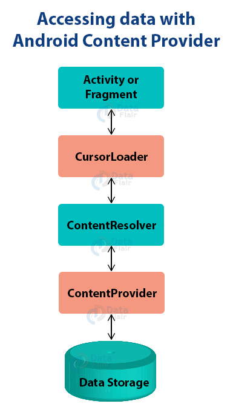

# Content Provider

A content provider manages access to a central repository of data. You implement a provider as one or more classes in an Android application, along with elements in the manifest file. One of your classes implements a subclass `ContentProvider`, which is the interface between your provider and other applications. Although content providers are meant to make data available to other applications, you may of course have activities in your application that allow the user to query and modify the data managed by your provider.

You need to build a content provider if you want to provide one or more of the following features:
- You want to offer complex data or files to other applications.
- You want to allow users to copy complex data from your app into other apps.
- You want to provide custom search suggestions using the search framework.
- You want to expose your application data to widgets.
- You want to implement the `AbstractThreadedSyncAdapter`, `CursorAdapter`, or `CursorLoader` classes.

You don't need a provider to use databases or other types of persistent storage if the use is entirely within your own application and you don’t need any of the features listed above.

To understand how it works, consider the following diagram:

## Content URIs

Content URIs are the uniform resource identifiers that identify the data in the content providers. A content URI includes two things: *Authority* that is the symbolic name of the Provider and a *Path* that is a name that points towards the data. Every content provider methods have an argument which is URI. URIs for content providers look like this:

`content://<authority>/<path>/<optional_id>`

- **content://** – It’s always present, and is the scheme portion of the URI.
- **authority** – It is the unique name of the content provider, like photos, contacts. It’s a string that can identify the whole content provider.
- **path** – It is often used to identify some or the other data of the provider. The path is mostly used to identify individual tables.
- **optional_id** – id is used to access a single particular record of a file. We use this only in cases where we need to access only a particular record and not the complete file. It’s a numeric identifier to access a particular row of the data table.

## Links
https://developer.android.com/guide/topics/providers/content-provider-creating  
https://medium.com/@saranyaan2710/content-provider-in-android-basics-d219cf42574d  
https://data-flair.training/blogs/content-provider-in-android/  
