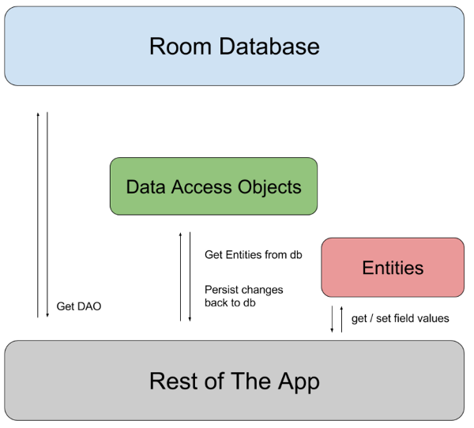

# Room

The Room persistence library provides an abstraction layer over SQLite to allow for more robust database access while harnessing the full power of SQLite.

The library helps you create a cache of your app's data on a device that's running your app. This cache, which serves as your app's single source of truth, allows users to view a consistent copy of key information within your app, regardless of whether users have an internet connection.

To use Room in your app, add the following dependencies to your app's `build.gradle` file:

```
dependencies {
  def room_version = "2.2.5"

  implementation "androidx.room:room-runtime:$room_version"
  annotationProcessor "androidx.room:room-compiler:$room_version" // For Kotlin use kapt instead of annotationProcessor

  // optional - Kotlin Extensions and Coroutines support for Room
  implementation "androidx.room:room-ktx:$room_version"

  // optional - RxJava support for Room
  implementation "androidx.room:room-rxjava2:$room_version"

  // optional - Guava support for Room, including Optional and ListenableFuture
  implementation "androidx.room:room-guava:$room_version"

  // Test helpers
  testImplementation "androidx.room:room-testing:$room_version"
}
```

## Components of Room DB


The three major components of Room are:
- **Database**: It represents the DB, it is an object that holds a connection to the SQLite DB and all the operations are executed through it. It is annotated with `@Database`.
- **Entity**: Represents a table within the Room Database. It should be annotated with `@Entity`.
- **DAO**: An interface that contains the methods to access the Database. It is annotated with `@Dao`.


## [Sample implementation](https://developer.android.com/training/data-storage/room#sample-implementation)

This section presents an example implementation of a Room database with a single data entity and a single DAO.


### [Data entity](https://developer.android.com/training/data-storage/room#data-entity)
The following code defines a `User` data entity. Each instance of `User` represents a row in a user table in the app's database.

```
@Entity
data class User(
    @PrimaryKey val uid: Int,
    @ColumnInfo(name = "first_name") val firstName: String?,
    @ColumnInfo(name = "last_name") val lastName: String?
)
```

### [Data access object (DAO)](https://developer.android.com/training/data-storage/room#dao)
The following code defines a DAO called `UserDao`. `UserDao` provides the methods that the rest of the app uses to interact with data in the `user` table.

```
@Dao
interface UserDao {
    @Query("SELECT * FROM user")
    fun getAll(): List<User>

    @Query("SELECT * FROM user WHERE uid IN (:userIds)")
    fun loadAllByIds(userIds: IntArray): List<User>

    @Query("SELECT * FROM user WHERE first_name LIKE :first AND " +
           "last_name LIKE :last LIMIT 1")
    fun findByName(first: String, last: String): User

    @Insert
    fun insertAll(vararg users: User)

    @Delete
    fun delete(user: User)
}
```

### [Database](https://developer.android.com/training/data-storage/room#database)
The following code defines an `AppDatabase` class to hold the database. `AppDatabase` defines the database configuration and serves as the app's main access point to the persisted data. The database class must satisfy the following conditions:
- The class must be annotated with a `@Database` annotation that includes an `entities` array that lists all of the data entities associated with the database;
- The class must be an abstract class that extends `RoomDatabase`;
- For each DAO class that is associated with the database, the database class must define an abstract method that has zero arguments and returns an instance of the DAO class.

```
@Database(entities = arrayOf(User::class), version = 1)
abstract class AppDatabase : RoomDatabase() {
    abstract fun userDao(): UserDao
}
```

### [Usage](https://developer.android.com/training/data-storage/room#usage)
After you have defined the data entity, the DAO, and the database object, you can use the following code to create an instance of the database:
```
val db = Room.databaseBuilder(
            applicationContext,
            AppDatabase::class.java, "database-name"
        ).build()
```

You can then use the abstract methods from the `AppDatabase` to get an instance of the DAO. In turn, you can use the methods from the DAO instance to interact with the database:
```
val userDao = db.userDao()
val users: List<User> = userDao.getAll()
```

## Configuring Compiler Options

Room has the following annotation processor options:

- `room.schemaLocation`: Configures and enables exporting database schemas into JSON files in the given directory.
- `room.incremental`: Enables Gradle incremental annotation proccesor.
- `room.expandProjection`: Configures Room to rewrite queries such that their top star projection is expanded to only contain the columns defined in the DAO method return type.

# Links  
[Save data in a local database using Room](https://developer.android.com/topic/libraries/architecture/room)

[Using Room Database | Android Jetpack](https://medium.com/mindorks/using-room-database-android-jetpack-675a89a0e942)

[Room — Kotlin, Android Architecture Components](https://medium.com/mindorks/room-kotlin-android-architecture-components-71cad5a1bb35)

[7 Steps To Room](https://medium.com/androiddevelopers/7-steps-to-room-27a5fe5f99b2)

# Further reading
[Accessing data using Room DAOs](https://developer.android.com/training/data-storage/room/accessing-data)

[Defining data using Room entities](https://developer.android.com/training/data-storage/room/defining-data)