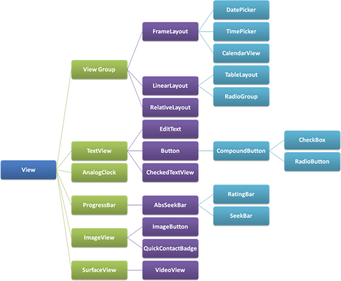

# ViewGroup

A `ViewGroup` is a special view that can contain other views (called children.) The view group is the base class for layouts and views containers. This class also defines the `ViewGroup.LayoutParams` class which serves as the base class for layouts parameters.

ViewGroups is invisible container in which other Views can be placed.  The class `ViewGroup` extends the class `View`
Popular ViewGroups: 
- LineraLayout
- RelativeLayout
- RelativeLayout
- MotionLayout
- ConstraintLayout

`View` represents the basic building block for user interface components. A View occupies a rectangular area on the screen and is responsible for drawing and event handling.

Popular Views:
- TextView
- ImageView
- EditText
- Button
- SeekBar

Summary: 

`View`:
- `View` objects are the basic building blocks of User Interface(UI) elements in Android.
- `View` is a simple rectangle box which responds to the user's actions.
- `View` refers to the android.view.View class, which is the base class of all UI classes.

`ViewGroup`: 
- `ViewGroup` is the invisible container. It holds `View` and `ViewGroup`
- `ViewGroup` is the base class for Layouts.

## Links  
https://developer.android.com/reference/android/view/View  
https://developer.android.com/reference/android/view/ViewGroup  
https://stackoverflow.com/questions/27352476/difference-between-view-and-viewgroup-in-android  
https://proandroiddev.com/the-life-cycle-of-a-view-in-android-6a2c4665b95e  
