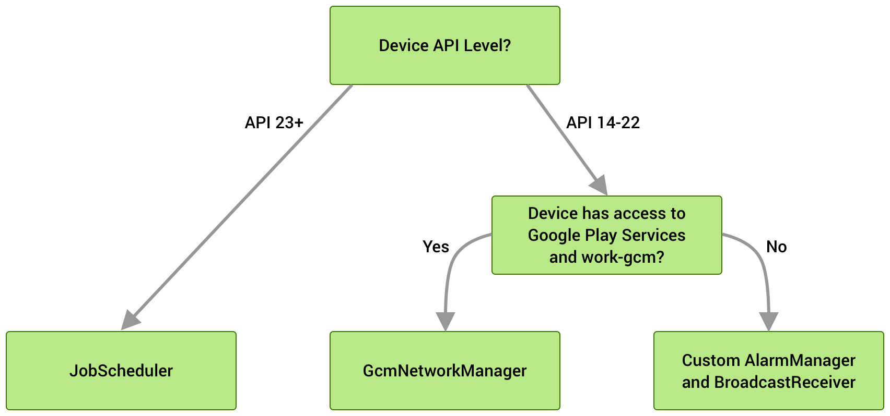

# WorkManager
WorkManager is an API that makes it easy to schedule deferrable, asynchronous tasks that are expected to run even if the app exits or the device restarts. The WorkManager API is a suitable and recommended replacement for all previous Android background scheduling APIs, including *FirebaseJobDispatcher*, *GcmNetworkManager*, and *Job Scheduler*. WorkManager incorporates the features of its predecessors in a modern, consistent API that works back to API level 14 while also being conscious of battery life.

WorkManager handles background work that needs to run when various constraints are met, regardless of whether the application process is alive or not. Background work can be started when the app is in the background, when the app is in the foreground, or when the app starts in the foreground but goes to the background. Regardless of what the application is doing, background work should continue to execute, or be restarted if Android kills its process.

Under the hood WorkManager uses an underlying job dispatching service based on the following criteria:


For using WorkManager we have to add dependency in app/build.gradle file.
```
implementation "android.arch.work:work-runtime:1.0.0"
```

## Features
WorkManager has a number of other key benefits, including:

**Work Constraints**. Declaratively define the optimal conditions for your work to run using Work Constraints. (For example, run only when the device is Wi-Fi, when the device idle, or when it has sufficient storage space, etc.)

**Robust Scheduling**. WorkManager allows you to schedule work to run one- time or repeatedly using flexible scheduling windows. Work can be tagged and named as well, allowing you to schedule unique, replaceable, work and monitor or cancel groups of work together. Scheduled work is stored in an internally managed SQLite database and WorkManager takes care of ensuring that this work persists and is rescheduled across device reboots. In addition, WorkManager adheres to power-saving features and best practices like Doze mode, so you don’t have to worry about it.

**Flexible Retry Policy**. WorkManager offers flexible retry policies, including a configurable exponential backoff policy.

**Work Chaining**. For complex related work, chain individual work tasks together using a fluent, natural, interface that allows you to control which pieces run sequentially and which run in parallel.
```
WorkManager.getInstance(...)`
   .beginWith(listOf(workA,workB))
   .then(workC)
   .enqueue()
```
For each work task, you can define input and output data for that work. When chaining work together, WorkManager automatically passes output data from one work task to the next.

**Built-In Treading Interoperability**. WorkManager integrates seamlessly with RxJava and Coroutines and provides the flexibility to plug in your own asynchronous APIs.

## How it works
`Worker` - It specifies what task to perform, The WorkManager API include an abstract worker class and You need to extends this class and perform the work.

`WorkRequest` - represents an individual task that is to be performed. Now this `WorkRequest`, you can add values details for the work. Such as constraint or you can also add data while creating the request. `WorkRequest` can be of two types:
- `OneTimeWorkRequest` - That means you requesting for non-repetitive work.
- `PeriodicWorkRequest` - This class is used for creating a request for repetitive work

`WorkManager` - class in enqueues and manages all the work request. Pass work request object to this `WorkManager` to enqueue the task.

`WorkInfo` - contains the information about a particular task, The work manager provides `LiveData` for each of the work request objects, We can observe this and get the current status of the task.

Step for implementation WorkManager to Schedule Tasks:
- Create a base class of `Worker`
- Create `WorkRequest`
- Enqueue the request with `WorkManager`.
- Fetch the particular task status

## Links
https://developer.android.com/topic/libraries/architecture/workmanager  
https://medium.com/androiddevelopers/workmanager-basics-beba51e94048  
https://medium.com/androiddevelopers/introducing-workmanager-2083bcfc4712  
https://androidwave.com/android-workmanager-tutorial/  
