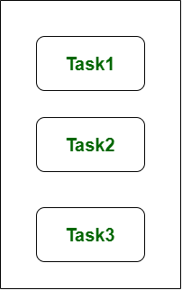
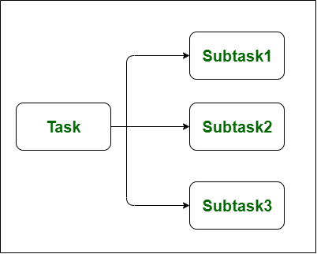

# Concurrency vs Parallelism

**Concurrency** means that an application is making progress on more than one task at the same time (concurrently). Concurrency is a approach that is used for decreasing the response time of the system by using the single processing unit. Concurrency is that the illusion of parallelism, however in actual the chunks of a task aren’t parallelly processed, but inside the application, there are more than one task is being processed at a time. It does not completely finish one task before it begins the next.

Concurrency is achieved through the interleaving operation of processes on the central processing unit(CPU) or in other words by the context switching, that’s rationale it’s like parallel processing. It increases the amount of work finished at a time.

**Parallelism** Parallelism means that an application splits its tasks up into smaller subtasks which can be processed in parallel, for instance on multiple CPUs at the exact same time. It is used for increasing the throughput and computational speed of the system by using the multiple processors. It is the technique that do lot of things simultaneously.

Parallelism leads to overlapping of central processing unit and input-output tasks in one process with the central processing unit and input-output tasks of another process. Whereas in concurrency the speed is increased by overlapping the input-output activities of one process with CPU process of another process.

To get more idea about the distinction between concurrency and parallelism, consider the following points −
- *Concurrent but not parallel*: An application can be concurrent but not parallel means that it processes more than one task at the same time but the tasks are not broken down into subtasks.
- *Parallel but not concurrent*: An application can be parallel but not concurrent means that it only works on one task at a time and the tasks broken down into subtasks can be processed in parallel.
- *Neither parallel nor concurrent*: An application can be neither parallel nor concurrent. This means that it works on only one task at a time and the task is never broken into subtasks.
- *Both parallel and concurrent*: An application can be both parallel and concurrent means that it both works on multiple tasks at a time and the task is broken into subtasks for executing them in parallel.

| Concurrency | Parallelism |
|---|---|
| Is the task of running and managing the multiple computations at the same time  | Is the task of running multiple computations simultaneously  |
| Achieved through the interleaving operation of processes on the central processing unit(CPU) or in other words by the context switching  | Achieved by through multiple central processing units(CPUs)  |
| Increases the amount of work finished at a time  | Improves the throughput and computational speed of the system  |
| Deals lot of things simultaneously  | Do lot of things simultaneously |
| Non-deterministic control flow approach  | Deterministic control flow approach  |

## Links
https://medium.com/@itIsMadhavan/concurrency-vs-parallelism-a-brief-review-b337c8dac350  
https://www.geeksforgeeks.org/difference-between-concurrency-and-parallelism/  
https://www.tutorialspoint.com/concurrency_in_python/concurrency_in_python_concurrency_vs_parallelism.htm  
https://blog.usejournal.com/lets-understand-the-difference-between-concurrency-and-parallelism-80be6c61ad24  
https://howtodoinjava.com/java/multi-threading/concurrency-vs-parallelism/
