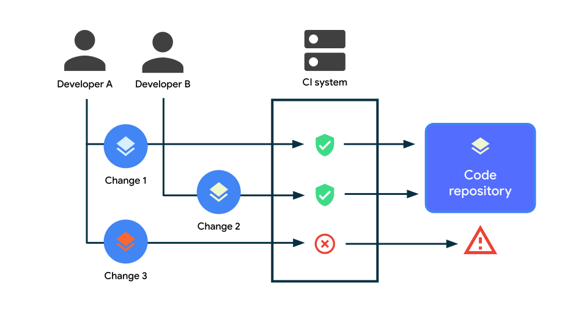

# Continuous Integration
Continuous Integration (CI) is a software development practice where developers frequently merge their code changes into a central repository, after which automated builds and tests run.

You can set up a basic CI system to prevent new changes that would break the build after merging in. You can program a more advanced CI system to automatically test the app and make sure it behaves as expected in different environments, such as API levels, screen sizes, and platforms.[1](https://developer.android.com/training/testing/continuous-integration#:~:text=bookmark_border-,Continuous%20Integration,-(CI)%20is%20a)

## [CI common practices](https://www.techtarget.com/searchsoftwarequality/definition/continuous-integration#:~:text=CI-,common%20practices,-According%20to%20Paul)
According to Paul Duvall, co-author of *Continuous Integration: Improving Software Quality and Reducing Risk*, best practices of CI include the following:
- Frequent code commits;
- Developer test categorization;
- A dedicated integration build machine;
- Continuous feedback mechanisms;
- Staging builds.

CI releases can occur at any frequency, depending on the organization running the project. Generally, organizations that adopt CI release software more frequently than those using other software development processes. Each significant change kicks off a build. A development team incorporates CI for several reasons, including to receive constant feedback on the status of the software. CI detects deficiencies early in development, which makes them less disruptive, less complex and easier to resolve than later in the SDLC.

## [Types of CI automation](https://developer.android.com/training/testing/continuous-integration/automation)
The following are some typical forms of automation that you might like to use in your CI system.

### [Basic jobs](https://developer.android.com/training/testing/continuous-integration/automation#basic)
- **Build**: By building a project from scratch, you make sure that the new changes compile correctly and that all libraries and tools are compatible with each other;
- **Lint or style checks**: This is an optional but recommended step. When you enforce style rules and perform static analysis, code reviews can be more concise and focused;
- **Local, or host-side tests**: They run on the local machine that performs the build. On Android this is usually the JVM, so they're fast and reliable. They include Robolectric tests as well.

### [Instrumented tests](https://developer.android.com/training/testing/continuous-integration/automation#instrumented-tests)
Tests that run on emulators or physical devices require some provisioning, waiting for devices to boot or be connected and other operations that add complexity.

There are multiple options to run instrumented tests on CI:
- [Gradle Managed Devices](https://developer.android.com/studio/test/gradle-managed-devices) can be used to define the devices to use (for example "Pixel 2 emulator on API 27") and it handles device provisioning;
- Most CI systems come with a third-party plugin (also called "action", "integration" or "step") to handle Android emulators;
- Delegate instrumented tests to a device farm such as [Firebase Test Lab](https://firebase.google.com/docs/test-lab). Device farms are used for their high reliability and they can run on emulators or physical devices.

### [Performance regression tests](https://developer.android.com/training/testing/continuous-integration/automation#performance-regression)
To monitor app performance we recommend using the [benchmark libraries](https://developer.android.com/topic/performance/benchmarking/benchmarking-overview). Automation of performance tests during development requires physical devices to ensure consistent and realistic test results.

Running benchmarks can take a long time, especially when you have high coverage of code and user journeys that you are benchmarking. Instead of running all benchmarks for every merged feature or commit, consider executing them as part of a regularly scheduled maintenance build, such as a nightly build.

### [Test coverage regression checks](https://developer.android.com/training/testing/continuous-integration/automation#test-coverage)
[Test coverage](https://developer.android.com/studio/test/test-in-android-studio#view_test_coverage) is a metric that can help you and your team decide if tests sufficiently cover a change. However, it shouldn't be the only indicator. It is common practice to set up a regression check that fails or shows a warning when the coverage goes down relative to the base branch.

**Note**. The coverage generated by an instrumentation test is different from that of a unit test as bigger tests typically make fewer assertions per line of tested code and their goal is different. Consider keeping two separate coverage metrics.

## [Cache and CI run times](https://developer.android.com/training/testing/continuous-integration/features#cache)
CI systems use a build cache to speed up the process. In its simplest form, they save all the Gradle cache files after a successful build and restore them before a new one. This relies on [Gradle's build cache](https://docs.gradle.org/current/userguide/build_cache.html) feature and should be enabled in your project.

Some ways to improve run times and reliability include:
- **Modules**: Detecting which modules are affected by a change and only building and testing those;
- **Skip caches**: If the build includes scripts that a developer has modified, ignore the build caches. It's safer to build from scratch;
- **Shard tests**: Especially instrumented tests, it can be helpful to shard tests across multiple devices. This is supported by the Android runner, Gradle Managed Devices and Firebase Test Lab;
- **Shard builds**: You can shard the build across multiple server instances;
- **Remote cache**: You can also use [Gradle's remote cache](https://docs.gradle.org/current/userguide/build_cache.html).

## [Benefits of CI](https://developer.android.com/training/testing/continuous-integration#benefits-ci)
The advantages of CI include:
- **Improved quality of software**: CI can help to improve the quality of software by identifying and fixing problems early on. This can help to reduce the number of bugs in software releases and improve the overall user experience;
- **Reduced risk of broken builds**: When you automate your build process with CI you can better avoid broken builds by resolving issues earlier in the process;
- **Increased confidence in releases**: CI can help to ensure that each release is stable and ready for production. By running automated tests, CI can identify any potential problems before you release them to the public;
- **Improved communication and collaboration**: By providing a central place for developers to share code and test results, CI can help to make it easier for developers and other team members to work together and track progress;
- **Increased productivity**: CI can help to increase developer productivity by automating tasks that would otherwise be time-consuming and error-prone.

# Links
[Continuous Integration basics](https://developer.android.com/training/testing/continuous-integration)

[CI features](https://developer.android.com/training/testing/continuous-integration/features)

[Types of CI automation](https://developer.android.com/training/testing/continuous-integration/automation)

[continuous integration (CI)](https://www.techtarget.com/searchsoftwarequality/definition/continuous-integration)

# Further reading
[CI/CD for absolute beginners](https://medium.com/mop-developers/ci-cd-for-absolute-beginners-1dd37715001)

[What is Continuous Integration and Why it is Important?](https://www.simplilearn.com/tutorials/devops-tutorial/continuous-integration)

[Continuous integration](https://circleci.com/continuous-integration/)

[What Is Continuous Integration and Why Do You Need It?](https://code-maze.com/what-is-continuous-integration/)

[Continuous Integration (CI) Explained](https://semaphoreci.com/continuous-integration)
