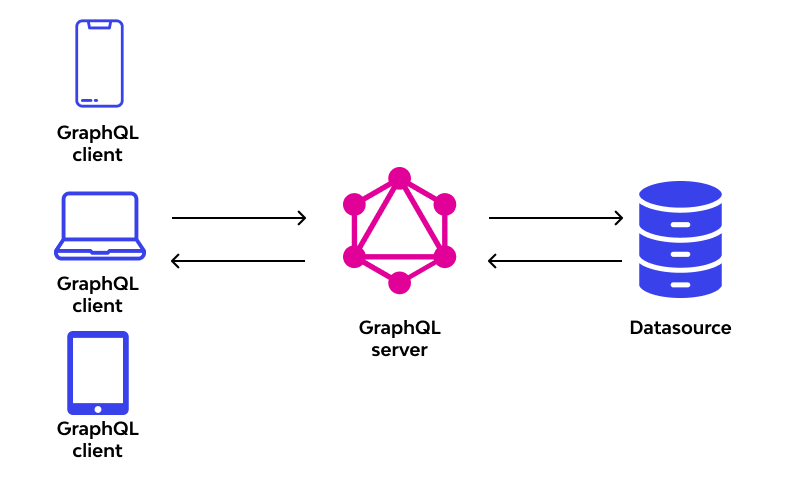

# GraphQL
GraphQL is an open source query language that describes how a client should request information through an API. In a broad sense, GraphQL is a syntax developers can use to ask for specific data and return that data from multiple sources. Once the client defines the structure of the data needed, the server returns data using the identical structure.<sup>[1](https://www.techtarget.com/searchapparchitecture/definition/GraphQL#:~:text=GraphQL%20is%20an,the%20identical%20structure.)</sup>



## [How Does It Work?](https://www.wallarm.com/what/what-is-graphql-definition-with-example)
- **Designing of GraphQL schema**. Created on the server, the base of this schema would be the data on which the app’s UI will be built. For instance, if building the job board is the aim, modeling Job, Company, and Location type would be the first aim;
- **Connecting the resolvers to available data sources**. Once the schema is ready, it’s time to write resolve functions for each type. This is done to connect the data to the graph. In the above example of building a job board, fetching Job data can be done from any external API while getting Location data would be possible from Google Maps API;
- **Write query for the things you want**. Lastly, you start writing your query. You can specify the details that you need to fetch. It works to the point. At this stage, using a GraphQL client library such as Apollo Client is highly suggested as it makes query writing an effortless task.

### [Schemas, fields, types, and resolvers](https://konghq.com/blog/learning-center/graphql#:~:text=Schemas%2C%20fields%2C%20types%2C%20and%20resolvers)

A GraphQL schema describes the data clients can request from the GraphQL API. It encompasses all the possible data that the client may want the query to return. Ideally, this schema will be represented in the form of a Schema Definition Language (SDL) to make it more readable.

The schema comprises object *types* that define what kind of objects the queries will be able to access and the fields within those objects. For example, the snippet below shows the schema of a GraphQL query.
```
`type query {
    teacher
    students {
      name
    }
  }
}`
```

You can see that the schema has two fields, teacher and students.

If an application wanted to access the names of the students and their teachers from a traditional REST API, it would run a query against the API URL, and the API might return the teacher name, number of students in the class, the class subject, the student names, and student ages.

In other words, the client would have more data than it needed. However, if this schema was defined at the GraphQL service and the application ran the query, then the application would get only what it wanted: the students’ and their teacher’s names. The output may look something like this:
```
`{
   "data": {
     "teacher”: "Joe Bloggs",
     "students": [
       {
         "name": "Jane Doe"
       },
       {
         "name": "Joe Smith"
       },
       …
    ]
  }
}`
```

Each field within the object type will have a type of its own. A field’s type can be another object type or a scalar type like String, ID, Boolean, Int, or Float.

For example, the schema for the class object can be defined like this:
```
`type class {
  teacher: String
  student: [StudentName]
}

type StudentName{
  name: String
}`
```

Each field in the schema will then be attached to a resolver. A resolver is a function that fetches the data for that field for GraphQL queries. The GraphQL query engine compares every query against the schema during runtime to validate the query. If the query is valid, then the query engine runs each field’s resolver to fetch the data for that field.

### [GraphQL operations](https://konghq.com/blog/learning-center/graphql#:~:text=for%20that%20field.-,GraphQL%20operations,-As%20we%20keep)
A GraphQL client can request one of three types of operations: a *query*, *mutation* and *subscription*:
- **GraphQL query**. A GraphQL query is similar to a REST API’s GET method. This is what we have been talking about so far—this operation accesses data;
- **GraphQL mutation**. A mutation is a request to add or modify data. This is similar to the REST API’s POST, PUT, PATCH, or DELETE methods;
- **GraphQL subscriptions**. GraphQL subscriptions represent a powerful mechanism to receive real-time data from servers even without requesting it. With this tool, clients can receive notifications about changes or deletions in the database, eventually receiving a stream of updates regarding their related queries’ statuses. The way it works is by allowing the subscribing client to choose what events they are interested in and specify how data should be sent every time that event happens. Unlike GraphQL queries or mutation requests that rely on short-lived HTTP connections with servers, subscription requires clients to establish long-running bi-directional communication channels via WebSocket.

Here's a quick chart to show you the GraphQL analogs of typical REST-ish terms:<sup>[2](https://hasura.io/learn/graphql/android/intro-to-graphql/#:~:text=Here%27s%20a%20quick%20chart%20to%20show%20you%20the%20GraphQL%20analogs%20of%20typical%20REST%2Dish%20terms%3A)</sup>

| Requirement  | `REST`  | `GraphQL`  |
|---|---|---|
| Fetching data objects	  |  GET  | query |
| Writing data	  | POST   | mutation |
| Updating/deleting data	  | PUT/PATCH/DELETE	   | mutation |
| Watching/subscribing to data  |  -  | subscription |

## [GraphQL benefits](https://hasura.io/learn/graphql/android/intro-to-graphql/#:~:text=to%20work%20with!-,GraphQL%20benefits,-Avoid%20over%2Dfetching)
- **Avoid over-fetching**: You avoid fetching more data than you need because you can specify the exact fields you need;
- **Prevent multiple API calls**: In case you need more data, you can also avoid making multiple calls to your API;
- **Lesser communication with API developers**: Sometimes to fetch the exact data you need, especially if you need to fetch more data and want to avoid multiple API calls, you will need to ask your API developers to build a new API. With GraphQL, your work is independent of the API team! This allows you to work faster on your app;
- **Self-documenting**: Every GraphQL API conforms to a "schema" which is the graph data model and what kinds of queries a client can make. This allows the community to build lots of cool tools to explore & visualise your API or create IDE plugins that autocomplete your GraphQL queries and even do "codegen". 

# Links
[GraphQL](https://www.techtarget.com/searchapparchitecture/definition/GraphQL)

[GraphQL protocol](https://www.wallarm.com/what/what-is-graphql-definition-with-example)

[Intro to GraphQL](https://hasura.io/learn/graphql/android/intro-to-graphql/)

[What is GraphQL?](https://konghq.com/blog/learning-center/graphql)

# Further reading
[GraphQL](https://graphql.org/)

[What is GraphQL? GraphQL introduction](https://www.apollographql.com/blog/what-is-graphql-introduction)

[apollo-kotlin](https://github.com/apollographql/apollo-kotlin)

[GraphQL with Android](https://heartbeat.comet.ml/graphql-with-android-b44eb3812c3d)
