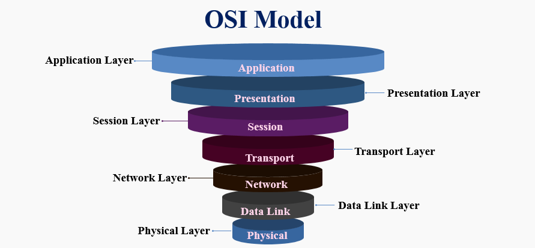

# OSI model
The **Open Systems Interconnection model (OSI model)** is a conceptual model that describes the universal standard of communication functions of a telecommunication system or computing system, without any regard to the system's underlying internal technology and specific protocol suites. Therefore, the objective is the interoperability of all diverse communication systems containing standard communication protocols, through the encapsulation and de-encapsulation of data, for all networked communication.

The model partitions the flow of data in a communication system into seven abstraction layers, to describe networked communication from the physical implementation of transmitting bits across a communications medium to the highest-level representation of data of a distributed application. Each intermediate layer serves a class of functionality to the layer above it and is served by the layer below it. Classes of functionality are realized in all software development through all and any standardized communication protocols.

## Layers of OSI model

- **Physical Layer**. The Physical layer is the first layer of the OSI Model. The physical layer works for the sending of individual bits from one node to another node. This layer is actually responsible for the connection between two devices. Whatever data comes to this layer is converted in binary format, i.e. 0’s and 1’s. After converting it, send data to the Data-link layer.
- **Data Link Layer**. The data link layer has the responsibility of moving frames from one node to the other node. This layer makes sure that data received or transferred should be error-free. It also ensures security by attaching some bits at the starting and end of the frame.
- **Network Layer**. The network layer has a duty to deliver the individual packets from the source node to the destination node. It actually sends data from one network to another. It makes use of different routing algorithms to send data. The network layer carries an IP address at the header.
- **Transport Layer**. The transport layer has the responsibility to deliver the message from one process to another. It takes data from the network layer and transmits data to the application layer. In this layer, the main thing is acknowledgement. Acknowledgement is the process of data transmission over the network successfully. This layer resides on the operating system of the device. It works with the system calls.
- **Session Layer**. As the name suggests, this layer manages sessions between end-user application processes.
- **Presentation Layer**. This layer is also called a Translation layer. This layer is used to present data to the application.
- **Application Layer**. The Application layer is the last and seventh layer of the OSI Model. This layer is the abstraction layer. Which handles sharing protocols over the computer network with OSI and TCP/IP

## Advantages of OSI Model
**The OSI model helps users and operators of computer networks:**
- Determine the required hardware and software to build their network;
- Understand and communicate the process followed by components communicating across a network;
- Perform troubleshooting, by identifying which network layer is causing an issue and focusing efforts on that layer.

**The OSI model helps network device manufacturers and networking software vendors:**
- Create devices and software that can communicate with products from any other vendor, allowing open interoperability;
- Define which parts of the network their products should work with;
- Communicate to users at which network layers their product operates – for example, only at the application layer, or across the stack.

# Links 
[OSI model](https://en.wikipedia.org/wiki/OSI_model)

[What Is the OSI Model](https://www.imperva.com/learn/application-security/osi-model/)

[What is OSI Model?](https://www.educba.com/what-is-osi-model/)

# Further reading
[Layers of OSI Model](https://www.geeksforgeeks.org/layers-of-osi-model/)

[What is the OSI Model?](https://www.cloudflare.com/learning/ddos/glossary/open-systems-interconnection-model-osi/)

[OSI Model](https://www.javatpoint.com/osi-model)
