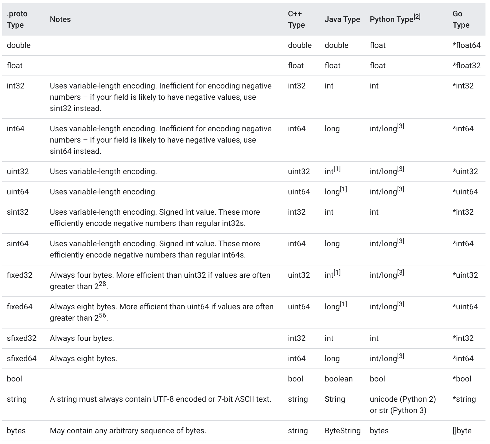

# Protocol Buffers
**Protocol Buffers (Protobuf)** is a free and open-source cross-platform data format used to serialize structured data. It is useful in developing programs to communicate with each other over a network or for storing data. The method involves an interface description language that describes the structure of some data and a program that generates source code from that description for generating or parsing a stream of bytes that represents the structured data.

The design goals for Protocol Buffers emphasized simplicity and performance. In particular, it was designed to be smaller and faster than XML.

Data structures (called *messages*) and services are described in a proto definition file (`.proto`) and compiled with `protoc`. This compilation generates code that can be invoked by a sender or recipient of these data structures. For example, `example.pb.cc` and `example.pb.h` are generated from `example.proto`. They define C++ classes for each message and service in `example.proto`.

Canonically, messages are serialized into a binary wire format which is compact, forward- and backward-compatible, but not self-describing (that is, there is no way to tell the names, meaning, or full datatypes of fields without an external specification). There is no defined way to include or refer to such an external specification (schema) within a Protocol Buffers file. The officially supported implementation includes an ASCII serialization format,[6] but this format—though self-describing—loses the forward- and backward-compatibility behavior, and is thus not a good choice for applications other than debugging.

## [Defining A Message Type](https://developers.google.com/protocol-buffers/docs/overview#simple)

First let's look at a very simple example. Let's say you want to define a search request message format, where each search request has a query string, the particular page of results you are interested in, and a number of results per page. Here's the `.proto` file you use to define the message type.

```
message SearchRequest {
  required string query = 1;
  optional int32 page_number = 2;
  optional int32 result_per_page = 3;
}
```

The SearchRequest message definition specifies three fields (name/value pairs), one for each piece of data that you want to include in this type of message. Each field has a name and a type.

## [Assigning Field Numbers](https://developers.google.com/protocol-buffers/docs/overview#assigning_field_numbers)

Each field in the message definition has a unique number. These numbers are used to identify your fields in the message binary format, and should not be changed once your message type is in use. Field numbers in the range 1 through 15 take one byte to encode, including the field number and the field's type (you can find out more about this in Protocol Buffer Encoding). Field numbers in the range 16 through 2047 take two bytes. So you should reserve the field numbers 1 through 15 for very frequently occurring message elements. Remember to leave some room for frequently occurring elements that might be added in the future.

## [Specifying Field Rules](https://developers.google.com/protocol-buffers/docs/overview#specifying_field_rules)

You specify that message fields are one of the following:
- `required`: a well-formed message must have exactly one of this field.
- `optional`: a well-formed message can have zero or one of this field (but not more than one).
- `repeated`: this field can be repeated any number of times (including zero) in a well-formed message. The order of the repeated values will be preserved.

For historical reasons, `repeated` fields of scalar numeric types aren't encoded as efficiently as they could be. New code should use the special option [packed = true] to get a more efficient encoding. For example:

```
repeated int32 samples = 4 [packed = true];
```

**Required Is Forever** You should be very careful about marking fields as `required`. If at some point you wish to stop writing or sending a required field, it will be problematic to change the field to an optional field – old readers will consider messages without this field to be incomplete and may reject or drop them unintentionally. You should consider writing application-specific custom validation routines for your buffers instead. Some engineers at Google have come to the conclusion that using `required` does more harm than good; they prefer to use only `optional` and `repeated`. However, this view is not universal.

## [Reserved Fields](https://developers.google.com/protocol-buffers/docs/overview#reserved)
If you update a message type by entirely removing a field, or commenting it out, future users can reuse the field number when making their own updates to the type. This can cause severe issues if they later load old versions of the same `.proto`, including data corruption, privacy bugs, and so on. One way to make sure this doesn't happen is to specify that the field numbers (and/or names, which can also cause issues for JSON serialization) of your deleted fields are `reserved`. The protocol buffer compiler will complain if any future users try to use these field identifiers.

```
message Foo {
  reserved 2, 15, 9 to 11;
  reserved "foo", "bar";
}
```

Reserved field number ranges are inclusive (`9 to 11` is the same as `9, 10, 11`). Note that you can't mix field names and field numbers in the same `reserved` statement.

## [Scalar Value Types](https://developers.google.com/protocol-buffers/docs/overview#scalar)
A scalar message field can have one of the following types – the table shows the type specified in the `.proto` file, and the corresponding type in the automatically generated class:



## [Optional Fields And Default Values](https://developers.google.com/protocol-buffers/docs/overview#optional)

As mentioned above, elements in a message description can be labeled `optional`. A well-formed message may or may not contain an optional element. When a message is parsed, if it does not contain an optional element, the corresponding field in the parsed object is set to the default value for that field. The default value can be specified as part of the message description. For example, let's say you want to provide a default value of 10 for a `SearchRequest`'s `result_per_page` value.

```
optional int32 result_per_page = 3 [default = 10];
```

If the default value is not specified for an optional element, a type-specific default value is used instead: for strings, the default value is the empty string. For bytes, the default value is the empty byte string. For bools, the default value is false. For numeric types, the default value is zero. For enums, the default value is the first value listed in the enum's type definition. This means care must be taken when adding a value to the beginning of an enum value list. 

# Links
[Protocol Buffers](https://en.wikipedia.org/wiki/Protocol_Buffers)

[Protocol Buffers Language Guide](https://developers.google.com/protocol-buffers/docs/overview)

# Further reading
[Protocol Buffers](https://developers.google.com/protocol-buffers)
