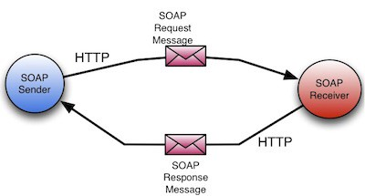
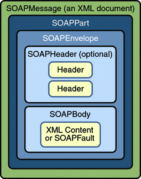

# SOAP
**SOAP** (formerly an acronym for **Simple Object Access Protocol**) is a messaging protocol specification for exchanging structured information in the implementation of web services in computer networks. Its purpose is to provide extensibility, neutrality, verbosity and independence. It uses XML Information Set for its message format, and relies on application layer protocols, most often Hypertext Transfer Protocol (HTTP), although some legacy systems communicate over Simple Mail Transfer Protocol (SMTP), for message negotiation and transmission.

SOAP allows developers to invoke processes running on disparate operating systems (such as Windows, macOS, and Linux) to authenticate, authorize, and communicate using Extensible Markup Language (XML). Since Web protocols like HTTP are installed and running on all operating systems, SOAP allows clients to invoke web services and receive responses independent of language and platforms.



## Characteristics
SOAP provides the Messaging Protocol layer of a web services protocol stack for web services. It is an XML-based protocol consisting of three parts:
- an envelope, which defines the message structure and how to process it;
- a set of encoding rules for expressing instances of application-defined datatypes;
- a convention for representing procedure calls and responses.

SOAP has three major characteristics:
- *extensibility* (security and WS-Addressing are among the extensions under development);
- *neutrality* (SOAP can operate over any protocol such as HTTP, SMTP, TCP, UDP);
- *independence* (SOAP allows for any programming model).

As an example of what SOAP procedures can do, an application can send a SOAP request to a server that has web services enabled—such as a real-estate price database—with the parameters for a search. The server then returns a SOAP response (an XML-formatted document with the resulting data), e.g., prices, location, features. Since the generated data comes in a standardized machine-parsable format, the requesting application can then integrate it directly.

The SOAP architecture consists of several layers of specifications for:
- message format;
- Message Exchange Patterns (MEP);
- underlying transport protocol bindings;
- message processing models;
- protocol extensibility.

## SOAP Message Structure

A SOAP message is an XML document that consists of four elements with specific functions for each one.



- **Envelope** is the root element XML document representing the message. It defines the framework for how the message should be handled and by whom.
- **Header**(optional) determines the specifics, extra requirements for the message, e.g. authentication.
- **Body** includes the request or response.
- **Fault**(optional) shows all data about any errors that could emerge throughout the API request and response.

**Example message (encapsulated in HTTP)**
```
POST /InStock HTTP/1.1
Host: www.example.org
Content-Type: application/soap+xml; charset=utf-8
Content-Length: 299
SOAPAction: "http://www.w3.org/2003/05/soap-envelope"

<?xml version="1.0"?>
<soap:Envelope xmlns:soap="http://www.w3.org/2003/05/soap-envelope" xmlns:m="http://www.example.org">
  <soap:Header>
  </soap:Header>
  <soap:Body>
    <m:GetStockPrice>
      <m:StockName>T</m:StockName>
    </m:GetStockPrice>
  </soap:Body>
</soap:Envelope>
```

## Conclusion
**Advantages**:
- SOAP's neutrality characteristic explicitly makes it suitable for use with any transport protocol. Implementations often use HTTP as a transport protocol, but other popular transport protocols can be used. For example, SOAP can also be used over SMTP, JMS and message queues.
- SOAP, when combined with HTTP post/response exchanges, tunnels easily through existing firewalls and proxies, and consequently doesn't require modifying the widespread computing and communication infrastructures that exist for processing HTTP post/response exchanges.
- SOAP has available to it all the facilities of XML, including easy internationalization and extensibility with XML Namespaces.

**Disadvantages**:
- When using standard implementation and the default SOAP/HTTP binding, the XML infoset is serialized as XML. To improve performance for the special case of XML with embedded binary objects, the Message Transmission Optimization Mechanism was introduced.
- When relying on HTTP as a transport protocol and not using Web Services Addressing or an Enterprise Service Bus, the roles of the interacting parties are fixed. Only one party (the client) can use the services of the other.
- SOAP is less "simple" than the name would suggest. The verbosity of the protocol, slow parsing speed of XML, and lack of a standardized interaction model led to the dominance of services using the HTTP protocol more directly. 

**Points to note**:
- SOAP is a communication protocol designed to communicate via Internet;
- SOAP can extend HTTP for XML messaging;
- SOAP provides data transport for Web services;
- SOAP can exchange complete documents or call a remote procedure;
- SOAP can be used for broadcasting a message;
- SOAP is platform- and language-independent;
- SOAP is the XML way of defining what information is sent and how;
- SOAP enables client applications to easily connect to remote services and invoke remote methods.

# Links
https://en.wikipedia.org/wiki/SOAP  
https://www.tutorialspoint.com/soap/what_is_soap.htm  
https://medium.com/@deryacortuk17/soap-web-services-2fb7e921eb1e
