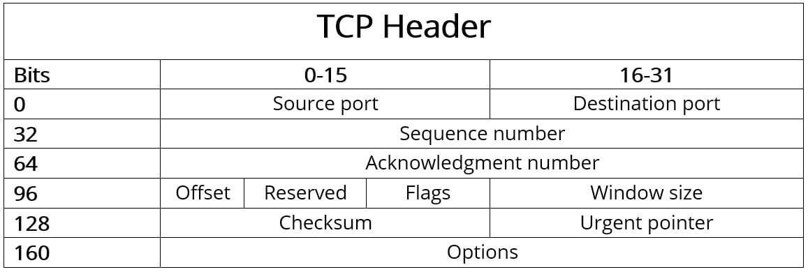

# TCP
The **Transmission Control Protocol (TCP)** is one of the main protocols of the Internet protocol suite.  It originated in the initial network implementation in which it complemented the Internet Protocol (IP). Therefore, the entire suite is commonly referred to as *TCP/IP*. TCP provides reliable, ordered, and error-checked delivery of a stream of octets (bytes) between applications running on hosts communicating via an IP network. Major internet applications such as the World Wide Web, email, remote administration, and file transfer rely on TCP, which is part of the Transport Layer of the TCP/IP suite. SSL/TLS often runs on top of TCP.

TCP is connection-oriented, and a connection between client and server is established before data can be sent. The server must be listening (passive open) for connection requests from clients before a connection is established. Three-way handshake (active open), retransmission, and error-detection adds to reliability but lengthens latency.

## The four layers of the TCP/IP model
TCP/IP is a datalink protocol that is used on the internet. Its model is split into four distinct layers. Used together, they can also be referred to as a suite of protocols.

- **Datalink layer**. The datalink layer (also called the link layer, network interface layer, or physical layer) is what handles the physical parts of sending and receiving data using the Ethernet cable, wireless network, network interface card, device driver in the computer, and so on.
- **Internet layer**. The internet layer (also called the network layer) controls the movement of packets around the network.
- **Transport layer**. The transport layer is what provides a reliable data connection between two devices. It divides the data in packets, acknowledges the packets that it has received from the other device, and makes sure that the other device acknowledges the packets it receives.
- **Application layer**. The application layer is the group of applications that require network communication. This is what the user typically interacts with, such as email and messaging. Because the lower layers handle the details of communication, the applications don’t need to concern themselves with this.

## What is the structure of the TCP header?
Typically, the header of a TCP packet contains the data required for connection and data transmission with the Transmission Control Protocol. This **header data** (which contains control information) precedes the payload to be transferred and is **typically 20 bytes (160 bits) in size**. It is followed by up to 40 bytes (320 bits) of additional information, which is optional and not used in all packets.

The detailed structure of the **TCP header** is as follows:

The individual components or fields of the header of the TCP protocol have the following meaning:
- **Source port** (16 bits): Identifies the port number of the sender;
- **Destination port** (16 bits): Identifies the port number of receiver;
- **Sequence number** (32 bits): The sequence number specifies the first byte of attached payload data or is sent when the connection is established or terminated. It is also used for validating and sorting the segments after transmission;
- **Acknowledgment number** (32 bits): This field contains the next sequence number that the sender is expecting. An ACK flag (in the “Flags” field) is a precondition for validity;
- **Offset** (4 bits): The “Offset” field specifies the length of the TCP header in 32-bit words to highlight the starting point of the payload data. This starting point varies from segment to segment due to the variable “Options” field;
- **Reserved** (6 bits): Reserved for future use according to RFC 793 and not yet in use. This field must always be set to 0;
- **Flags** (6 bits): The six possible single bits in the “Flags” field enable various TCP actions for organizing communication and data processing. The following flags are either set or not set for these actions:
    - **URG**: The "Urgent" flag signals to the TCP application that the payload data must be processed immediately up to the set Urgent pointer (see above).
    - **ACK**: In combination with the acknowledgment number, the ACK flag acknowledges the receipt of TCP packets. If the flag is not set, the confirmation number is also invalid.
    - **PSH**: The "Push" flag ensures that a TCP segment is immediately pushed through without first being sent to the buffer of the sender and receiver.
    - **RST**: If there is an error during transmission, a TCP packet with the RST flag set can be used to reset the connection.
    - **SYN**: Messages that have SYN flag set represent the first step of the three-way handshake, meaning they initiate the connection.
    - **FIN**: The "Finish" flag signals to the other party that a sender is ending the transmission.    
- **Window size** (16 bits): This field specifies the number of bytes that the sender is willing to receive;
- **Checksum** (16 bits): The Transmission Control Protocol can reliably detect transmission errors. The checksum calculated from the header, the payload data and the pseudo-header is used for this purpose;
- **Urgent pointer** (16 bits): The urgent pointer indicates the position of the first byte after the payload data that is to be processed urgently. As a result, this field is only valid and relevant if the URG flag is set;
- **Options** (0 - 320 bits): Use the Options field if you want to include TCP functions that don’t belong in the general header, for example if you want to define the maximum segment size. The length of the options must always be a multiple of 32, otherwise zero-bit padding is required.

## Establishing a TCP connection: the three-way handshake
Establishing a TCP connection requires that both the client and server participate in what is known as a three-way handshake. The process can be broken down as follows:
- A client sends the server a SYN packet — a connection request from its source port to a server’s destination port;
- The server responds with a SYN/ACK packet, acknowledging the receipt of the connection request;
- The client receives the SYN/ACK packet and responds with an ACK packet of its own.

After the connection is established, TCP works by breaking down transmitted data into segments, each of which is packaged into a datagram and sent to its destination.

## Summary
- TCP is **connection-oriented** and enables two-way communication between two endpoints after the **three-way handshake**;
- TCP is **reliable** because the protocol ensures that all data is fully transmitted and can be assembled by the receiver in the correct order;
- TCP allows data to be sent in individual segments of up to **1,500 bytes** (including headers) in size;
- TCP is positioned at the transport layer (layer 4) of the OSI model;
- TCP is usually used in conjunction with the **Internet Protocol** (IP) and is commonly known as the TCP/IP protocol stack;
- The **TCP header** has a default size of 20 bytes. Up to 40 bytes of additional options can be added.

# Links
[Transmission Control Protocol](https://en.wikipedia.org/wiki/Transmission_Control_Protocol)  
[What is TCP/IP and How Does it Work?](https://www.avast.com/c-what-is-tcp-ip)  
[TCP (Transmission Control Protocol) – The transmission protocol explained](https://www.ionos.com/digitalguide/server/know-how/introduction-to-tcp/)  
[Transmission control protocol (TCP)](https://www.imperva.com/learn/ddos/tcp-transmission-control-protocol/)

# Next questions
[What is the difference between TCP and UDP?](https://github.com/Kirchhoff-/Android-Interview-Questions/blob/master/General/What%20is%20the%20difference%20between%20TCP%20and%20UDP.md)
