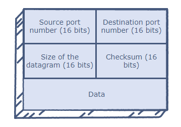

# UDP
UDP (**User Datagram Protocol**) is a communications protocol that is primarily used for establishing low-latency and loss-tolerating connections between applications on the internet. It speeds up transmissions by enabling the transfer of data before an agreement is provided by the receiving party. As a result, UDP is beneficial in time-sensitive communications, including voice over Internet Protocol (VoIP), domain name system (DNS) lookup, and video or audio playback. UDP is an alternative to Transmission Control Protocol (TCP).

UDP uses a simple connectionless communication model with a minimum of protocol mechanisms. UDP provides checksums for data integrity, and port numbers for addressing different functions at the source and destination of the datagram. It has no handshaking dialogues, and thus exposes the user's program to any unreliability of the underlying network; there is no guarantee of delivery, ordering, or duplicate protection.

UDP is suitable for purposes where error checking and correction are either not necessary or are performed in the application; UDP avoids the overhead of such processing in the protocol stack. Time-sensitive applications often use UDP because dropping packets is preferable to waiting for packets delayed due to retransmission, which may not be an option in a real-time system.

## UDP datagram

A UDP datagram consists of a datagram header and a data section. The UDP datagram header consists of 4 fields, each of which is 2 bytes (16 bits). The data section follows the header and is the payload data carried for the application.

The use of the checksum and source port fields is optional in IPv4 (pink background in table). In IPv6 only the source port field is optional.

- **Source port number**. This field identifies the sender's port, when used, and should be assumed to be the port to reply to if needed. If not used, it should be zero. If the source host is the client, the port number is likely to be an ephemeral port number. If the source host is the server, the port number is likely to be a well-known port number.

- **Destination port number**. This field identifies the receiver's port and is required. Similar to source port number, if the client is the destination host then the port number will likely be an ephemeral port number and if the destination host is the server then the port number will likely be a well-known port number.

- **Length**. This field specifies the length in bytes of the UDP header and UDP data. The minimum length is 8 bytes, the length of the header.

- **Checksum**. The checksum field may be used for error-checking of the header and data. This field is optional in IPv4, and mandatory in IPv6. The field carries all-zeros if unused.

## Conclusion
UDP has a number of benefits for different types of applications, including:
- **No retransmission delays** - UDP is suitable for time-sensitive applications that can’t afford retransmission delays for dropped packets. Examples include Voice over IP (VoIP), online games, and media streaming;
- **Speed** - UDP’s speed makes it useful for query-response protocols such as DNS, in which data packets are small and transactional;
- **Suitable for broadcasts** - UDP’s lack of end-to-end communication makes it suitable for broadcasts, in which transmitted data packets are addressed as receivable by all devices on the internet. UDP broadcasts can be received by large numbers of clients without server-side overhead.

At the same time, UDP’s lack of connection requirements and data verification can create a number of issues when transmitting packets. These include:
- No guaranteed ordering of packets;
- No verification of the readiness of the computer receiving the message;
- No protection against duplicate packets;
- No guarantee the destination will receive all transmitted bytes. UDP, however, does provide a checksum to verify individual packet integrity.

# Links
https://en.wikipedia.org/wiki/User_Datagram_Protocol  
https://searchnetworking.techtarget.com/definition/UDP-User-Datagram-Protocol  
https://www.educative.io/edpresso/what-is-udp  
https://www.imperva.com/learn/ddos/udp-user-datagram-protocol/

# Next questions
[What is the difference between TCP and UDP?](https://github.com/Kirchhoff-/Android-Interview-Questions/blob/master/General/What%20is%20the%20difference%20between%20TCP%20and%20UDP.md)
