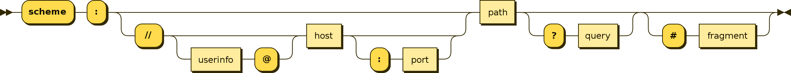

# URI
A **Uniform Resource Identifier (URI)** is a unique sequence of characters that identifies a logical or physical resource used by web technologies. URIs may be used to identify anything, including real-world objects, such as people and places, concepts, or information resources such as web pages and books. Some URIs provide a means of locating and retrieving information resources on a network (either on the Internet or on another private network, such as a computer filesystem or an Intranet), these are Uniform Resource Locators (URLs).

## Syntax
Each URI begins with a scheme name that refers to a specification for assigning identifiers within that scheme. As such, the URI syntax is a federated and extensible naming system wherein each scheme's specification may further restrict the syntax and semantics of identifiers using that scheme. The URI generic syntax is a superset of the syntax of all URI schemes.

The *URI generic syntax* consists of a hierarchical sequence of five *components*:
```
URI = scheme:[//authority]path[?query][#fragment]
```

where the authority component divides into three *subcomponents*:
```
authority = [userinfo@]host[:port]
```

This is represented in a syntax diagram as:


The URI comprises:
- A non-empty **scheme** component followed by a colon (`:`), consisting of a sequence of characters beginning with a letter and followed by any combination of letters, digits, plus (`+`), period (`.`), or hyphen (`-`). Although schemes are case-insensitive, the canonical form is lowercase and documents that specify schemes must do so with lowercase letters. Examples of popular schemes include `http`, `https`, `ftp`, `mailto`, `file`, `data`, and `irc`.

- An optional **authority** component preceded by two slashes (`//`), comprising:
	- An optional **userinfo** subcomponent that may consist of a user name and an optional password preceded by a colon (`:`), followed by an at symbol (`@`). Use of the format `username:password` in the userinfo subcomponent is deprecated for security reasons.
	- A **host** subcomponent, consisting of either a registered name (including but not limited to a hostname), or an IP address. IPv4 addresses must be in dot-decimal notation, and IPv6 addresses must be enclosed in brackets (`[]`).

- A **path** component, consisting of a sequence of path segments separated by a slash (`/`). A path is always defined for a URI, though the defined path may be empty (zero length). A segment may also be empty, resulting in two consecutive slashes (`//`) in the path component. A path component may resemble or map exactly to a file system path, but does not always imply a relation to one.

- An optional **query** component preceded by a question mark (`?`), containing a query string of non-hierarchical data. Its syntax is not well defined, but by convention is most often a sequence of attribute–value pairs separated by a delimiter.

- An optional **fragment** component preceded by a hash (`#`). The fragment contains a fragment identifier providing direction to a secondary resource, such as a section heading in an article identified by the remainder of the URI. 

## [java.net.URI](https://developer.android.com/reference/java/net/URI)
Class `java.net.URI` represents a Uniform Resource Identifier (URI) reference. This class provides constructors for creating URI instances from their components or by parsing their string forms, methods for accessing the various components of an instance, and methods for normalizing, resolving, and relativizing URI instances. Instances of this class are immutable.

### [URI syntax and components](https://developer.android.com/reference/java/net/URI#uri-syntax-and-components)
At the highest level a URI reference (hereinafter simply "URI") in string form has the syntax

```
[scheme:]scheme-specific-part[#fragment]
```

where square brackets [...] delineate optional components and the characters `:` and `#` stand for themselves.

An *absolute* URI specifies a scheme; a URI that is not absolute is said to be *relative*. URIs are also classified according to whether they are *opaque* or *hierarchical*.

An *opaque* URI is an absolute URI whose scheme-specific part does not begin with a slash character (`/`). Opaque URIs are not subject to further parsing. Some examples of opaque URIs are:

```
mailto:java-net@java.sun.com	
news:comp.lang.java	
urn:isbn:096139210x
```

A *hierarchical* URI is either an absolute URI whose scheme-specific part begins with a slash character, or a relative URI, that is, a URI that does not specify a scheme. Some examples of hierarchical URIs are:
```
http://java.sun.com/j2se/1.3/
docs/guide/collections/designfaq.html#28
../../../demo/jfc/SwingSet2/src/SwingSet2.java
file:///~/calendar
```

A hierarchical URI is subject to further parsing according to the syntax:
```
[scheme:][//authority][path][?query][#fragment]
```

where the characters `:`, `/`, `?`, and `#` stand for themselves. The scheme-specific part of a hierarchical URI consists of the characters between the scheme and fragment components.

The authority component of a hierarchical URI is, if specified, either *server-based* or *registry-based*. A server-based authority parses according to the familiar syntax:
```
[user-info@]host[:port]
```

where the characters `@` and `:` stand for themselves. Nearly all URI schemes currently in use are server-based. An authority component that does not parse in this way is considered to be registry-based.

The path component of a hierarchical URI is itself said to be absolute if it begins with a slash character (`/`); otherwise it is relative. The path of a hierarchical URI that is either absolute or specifies an authority is always absolute.

All told, then, a URI instance has the following nine components:

| Component | Type |
|---|---|
| scheme | String |
| scheme-specific-part | String |
| authority | String |
| user-info | String |
| host | String |
| port | int |
| path | String |
| query | String |
| fragment | String |

In a given instance any particular component is either *undefined* or *defined* with a distinct value. Undefined string components are represented by `null`, while undefined integer components are represented by `-1`. A string component may be defined to have the empty string as its value; this is not equivalent to that component being undefined.

Whether a particular component is or is not defined in an instance depends upon the type of the URI being represented. An absolute URI has a scheme component. An opaque URI has a scheme, a scheme-specific part, and possibly a fragment, but has no other components. A hierarchical URI always has a path (though it may be empty) and a scheme-specific-part (which at least contains the path), and may have any of the other components. If the authority component is present and is server-based then the host component will be defined and the user-information and port components may be defined.

### [Operations on URI instances](https://developer.android.com/reference/java/net/URI#operations-on-uri-instances)

The key operations supported by this class are those of *normalization*, *resolution*, and *relativization*.

*Normalization* is the process of removing unnecessary `.` and `..` segments from the path component of a hierarchical URI. Each `.` segment is simply removed. A `..` segment is removed only if it is preceded by a non - `..` segment. Normalization has no effect upon opaque URIs.

*Resolution* is the process of resolving one URI against another, base URI. The resulting URI is constructed from components of both URIs in the manner specified by RFC 2396, taking components from the base URI for those not specified in the original. For hierarchical URIs, the path of the original is resolved against the path of the base and then normalized. The result, for example, of resolving:

```
docs/guide/collections/designfaq.html#28. (1)
```

against the base URI ``http://java.sun.com/j2se/1.3/`` is the result URI:

```
http://java.sun.com/j2se/1.3/docs/guide/collections/designfaq.html#28
```

Resolving the relative URI:
```
../../../demo/jfc/SwingSet2/src/SwingSet2.java (2)
```

against this result yields, in turn:
```
http://java.sun.com/j2se/1.3/demo/jfc/SwingSet2/src/SwingSet2.java
```

Resolution of both absolute and relative URIs, and of both absolute and relative paths in the case of hierarchical URIs, is supported. Resolving the URI `file:///~calendar` against any other URI simply yields the original URI, since it is absolute. Resolving the relative URI (2) above against the relative base URI (1) yields the normalized, but still relative, URI

```
demo/jfc/SwingSet2/src/SwingSet2.java
```

*Relativization*, finally, is the inverse of resolution: For any two normalized URIs `u` and `v`:
```
u.relativize(u.resolve(v)).equals(v)  and
u.resolve(u.relativize(v)).equals(v)  .
```

This operation is often useful when constructing a document containing URIs that must be made relative to the base URI of the document wherever possible. For example, relativizing the URI:
```
http://java.sun.com/j2se/1.3/docs/guide/index.html
```

against the base URI:
```
http://java.sun.com/j2se/1.3
```

yields the relative URI `docs/guide/index.html`.


# Links
[Uniform Resource Identifier](https://en.wikipedia.org/wiki/Uniform_Resource_Identifier)

[URI](https://developer.android.com/reference/java/net/URI)

# Next questions
[What do you know about URL?](https://github.com/Kirchhoff-/Android-Interview-Questions/blob/master/General/What%20do%20you%20know%20about%20URL.md)