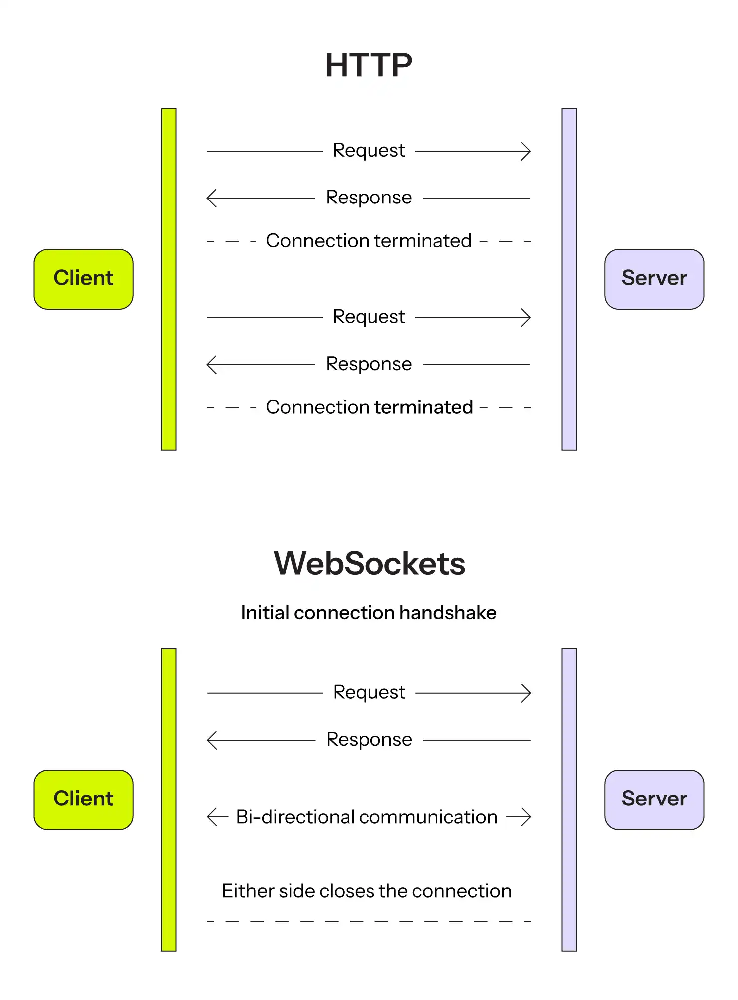

# WebSocket
WebSocket is a computer communications protocol that enables simultaneous, bidirectional communication over a single Transmission Control Protocol (TCP) connection. Unlike traditional protocols, WebSocket is *stateful*, meaning the connection between the client and server remains active until explicitly terminated by either party. Once the connection is closed, it is permanently severed on both ends.<sup>[1](https://www.binance.com/uk-UA/academy/articles/what-is-websocket-and-how-does-it-work#:~:text=WebSocket%20is%20a%20computer,severed%20on%20both%20ends.)</sup>

## How does WebSocket work?

To understand WebSocket, let's first look at how HTTP communication works. With HTTP, every interaction requires a separate request-response cycle:

```text
Client -> Request
Server -> Response

Client -> Request
Server -> Response
```

This approach works well for most applications, but it becomes inefficient when real-time updates are required. For example, imagine a chat application where the client has to constantly ask:

```text
Any new messages?
No.

Any new messages?
No.

Any new messages?
No.
```

WebSocket solves this problem by establishing a long-lived connection between the client and the server.

After an initial HTTP handshake, the connection remains open, allowing both sides to exchange messages at any time without creating additional HTTP requests. 

Here's a diagram comparing the HTTP and WebSockets connection timeline:<sup>[2](https://upsun.com/blog/introduction-to-websockets/#:~:text=Here%27s%20a%20diagram%20comparing%20the%20HTTP%20and%20WebSockets%20connection%20timeline%3A)</sup>



### Connection flow

1. The client sends an HTTP request asking to upgrade the connection.
2. The server responds with `101 Switching Protocols`.
3. A WebSocket connection is established.
4. The client and server can send messages independently.
5. The connection remains open until either side closes it.

## When should you use WebSocket?

WebSocket is most useful when an application requires real-time communication between the client and the server.

Common use cases include:

* **Chat and messaging**
  * Instant messaging applications
  * Team communication tools
  * Customer support chats
* **Live updates and monitoring**
  * Server health dashboards
  * IoT device monitoring
  * Real-time analytics
* **Interactive applications**
  * Multiplayer games
  * Live polls and voting systems
  * Collaborative whiteboards
* **Collaborative tools**
  * Document editors
  * Design collaboration platforms
  * Pair programming tools
* **Notifications and alerts**
  * Social media notifications
  * Status updates for long-running operations
  * Emergency alert systems

As a rule of thumb, WebSocket is a good choice whenever the server needs to push updates to clients immediately instead of waiting for them to send another HTTP request.

## Android example

One of the most common ways to work with WebSocket on Android is through the OkHttp library.

```kotlin
val request = Request.Builder()
    .url("wss://example.com/chat")
    .build()

val listener = object : WebSocketListener() {

    override fun onOpen(
        webSocket: WebSocket,
        response: Response
    ) {
        webSocket.send("Hello from Android!")
    }

    override fun onMessage(
        webSocket: WebSocket,
        text: String
    ) {
        println("Received: $text")
    }

    override fun onFailure(
        webSocket: WebSocket,
        t: Throwable,
        response: Response?
    ) {
        println("Error: ${t.message}")
    }
}

okHttpClient.newWebSocket(
    request,
    listener
)
```

In a real Android application, WebSocket events are typically exposed through a `Repository` and delivered to the UI using `Flow`, `StateFlow`, or RxJava.

```text
WebSocket
    ↓
Repository
    ↓
Flow / RxJava
    ↓
ViewModel
    ↓
    UI
```

## Pros and Cons

**Pros**:
* Real-time communication between the client and the server;
* Lower latency compared to polling-based solutions;
* Reduced network overhead after the connection is established;
* Supports bidirectional communication;
* Well suited for applications that require instant updates.

## Cons:
* More complex than traditional HTTP communication;
* Requires connection lifecycle management;
* Reconnection logic may be challenging on unstable mobile networks;
* Persistent connections consume additional battery and memory resources;
* Not necessary for most request-response scenarios.

# Links
[What Is WebSocket and How Does It Work?](https://www.binance.com/uk-UA/academy/articles/what-is-websocket-and-how-does-it-work)

[Introduction to WebSockets](https://upsun.com/blog/introduction-to-websockets/)

# Further reading
[WebSocket Protocol: RFC 6455 Handshake, Frames & More](https://websocket.org/guides/websocket-protocol/)

[What is WebSocket?](https://www.vergecloud.com/blog/what-is-a-websocket/)

[How WebSocket Works](https://medium.com/@loayahmed304/websocket-operation-d21bc3a362b4)
