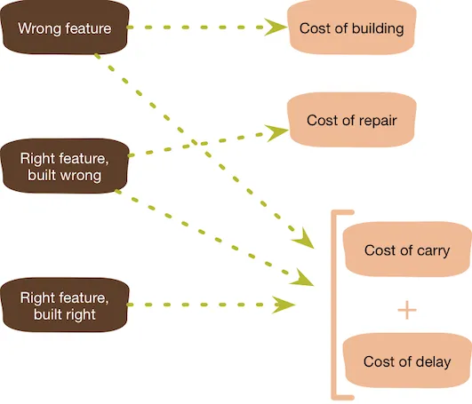

# YAGNI, KISS, DRY

## YAGNI principle (You Aren't Gonna Need It)
YAGNI principle ("You Aren't Gonna Need It") is a practice in software development which states that features should only be added when required. As a part of the extreme programming (XP) philosophy, YAGNI trims away excess and inefficiency in development to facilitate the desired increased frequency of releases.

The principle helps developers avoid wasted effort on features that are assumed to be needed at some point. The idea is that this assumption often ends up being incorrect. Even if a feature ends up being desired, it still may turn out that the implementation is not necessary. The argument is for developers to not waste time on creating extraneous elements that may not be necessary and can hinder or slow the development process.[1](https://www.techtarget.com/whatis/definition/You-arent-gonna-need-it#:~:text=YAGNI%20principle%20\(%22You,the%20development%20process.)

Whatever the outcome, you will incur a series of costs that can be either avoided or deferred:[2](https://betterprogramming.pub/yagni-you-aint-gonna-need-it-f9a178cd8e1#:~:text=https%3A//xkcd.com-,Involved%20Costs,-Whatever%20the%20outcome)

Here’s a quick breakdown:
- Cost of building — All the effort spent on analyzing, programming, and testing a feature;
- Cost of delay — The lost opportunity to build and release another feature now;
- Cost of carry — The complexity added by the feature to the code, making the software harder to modify and debug;
- Cost of repair — The effort spent on modifying a feature because it is not exactly what you need now.

## KISS (Keep it Simple, Stupid)
Keep it simple, stupid (KISS) is a design principle which states that designs and/or systems should be as simple as possible. Wherever possible, complexity should be avoided in a system—as simplicity guarantees the greatest levels of user acceptance and interaction.[3](https://www.interaction-design.org/literature/topics/keep-it-simple-stupid#:~:text=Keep%20it%20simple%2C%20stupid%20(KISS)%20is%20a%20design%20principle%20which%20states%20that%20designs%20and/or%20systems%20should%20be%20as%20simple%20as%20possible.%20Wherever%20possible%2C%20complexity%20should%20be%20avoided%20in%20a%20system%E2%80%94as%20simplicity%20guarantees%20the%20greatest%20levels%20of%20user%20acceptance%20and%20interaction)

Simple and easy-to-understand code is easier to maintain and debug. That is a fact. Therefore, the ultimate goal for any software developer should be to strive for simplicity.

That said, coming up with simple solutions can be more challenging than just hacking something that works. When looking at a fleshed-out, simple solution to a problem in hindsight, the way to go always looks so obvious. But finding the most simple solution when you’re just trying to create something often tends to be more difficult.

The easiest way to practice sticking to the KISS principle is by using simple APIs and method implementations. When implementing a single function, it is often tempting to use new cool language features or to find especially “smart” solutions to the problem at hand. That’s all great – but readability and understandability should always be a primary focus when writing code.[4](https://symflower.com/en/company/blog/2023/programming-principle-kiss/#:~:text=Simple%20and%20easy,when%20writing%20code.)

The KISS principle also exists in other variations with the same meaning. Examples are “Keep it short and simple” and “Keep it simple and straightforward.” Though both phrases technically introduce an “A” into the acronym, they both deliver the same message as “Keep it simple, stupid.” The objective of any process is to deliver the simplest possible outcome. As such, the KISS principle speaks to flowing with the intuition of any new user, easing in nuances with care.[5](https://www.interaction-design.org/literature/topics/keep-it-simple-stupid#:~:text=The%20KISS%20principle%20also,in%20nuances%20with%20care.)

## DRY (Don’t Repeat Yourself)
DRY, which stands for ‘don’t repeat yourself,’ is a principle of software development that aims at reducing the repetition of patterns and code duplication in favor of abstractions and avoiding redundancy.[6](https://www.digitalocean.com/community/tutorials/what-is-dry-development#:~:text=DRY%2C%20which%20stands%20for%20%E2%80%98don%E2%80%99t%20repeat%20yourself%2C%E2%80%99%20is%20a%20principle%20of%20software%20development%20that%20aims%20at%20reducing%20the%20repetition%20of%20patterns%20and%20code%20duplication%20in%20favor%20of%20abstractions%20and%20avoiding%20redundancy.)

DRY encapsulates a simple idea: avoid duplication. It’s the art of writing code in such a way that every piece of knowledge or logic is expressed in just one place. By adhering to DRY, you ensure that your codebase remains efficient, consistent. Also we can say less error-prone because each non-repeated functional unit can, precisely, be *unit-tested*.

Here are key scenarios where DRY shines and can make your code better:
- **Repetitive Logic**: Whenever you find yourself writing the same logic, obviously for a second time or a slight variation of it that can be refactored into one. That’s a DRY opportunity. Create an intermediary reusable function or method to encapsulate that logic, promoting code consistency and making maintenance a breeze;
- **Configuration Management**: Managing configuration settings like API endpoints or database credentials in one central location not only adheres to DRY but also simplifies updates and reduces the chance of inconsistencies;
- **Constants and Magic Numbers**: Replace hardcoded values scattered throughout your code with named constants. This not only enhances readability but also facilitates changes by modifying one central constant. Better, these central constants can be taken from environment variables making your code safer while keeping it flexible;
- **Cross-Function Duplication**: If you have multiple functions or methods that perform similar tasks, consider consolidating the common logic into a single function and calling it from wherever needed;
- **Testing**: In your test suites, the DRY principle shine. If you avoided duplicating functions you will fill the benefits when coding its unit tests. You’ll notice it reduces test maintenance efforts, ensures consistent test conditions and provides regression detection.[7](https://medium.com/@sebastiansastre/the-dry-principle-reducing-redundancy-for-clean-code-46b777769ff#:~:text=DRY%20encapsulates%20a,provides%20regression%20detection.)

# Links
[YAGNI principle (You Aren't Gonna Need It)](https://www.techtarget.com/whatis/definition/You-arent-gonna-need-it)

[YAGNI: You Ain’t Gonna Need It](https://betterprogramming.pub/yagni-you-aint-gonna-need-it-f9a178cd8e1)

[Keep It Simple, Stupid (KISS)](https://www.interaction-design.org/literature/topics/keep-it-simple-stupid)

[Programming principle "KISS": Keep it simple, stupid!](https://symflower.com/en/company/blog/2023/programming-principle-kiss/)

[What is DRY Development?](https://www.digitalocean.com/community/tutorials/what-is-dry-development)

[The DRY Principle: Reducing Redundancy for Clean Code](https://medium.com/@sebastiansastre/the-dry-principle-reducing-redundancy-for-clean-code-46b777769ff)

# Further reading
[Yagni](https://martinfowler.com/bliki/Yagni.html)

[The KISS Principle in Software Development – Everything You Need to Know](https://www.unthinkable.co/blog/the-kiss-principle-in-software-development-everything-you-need-to-know/)

[DRY: The Unspoken Parts](https://betterprogramming.pub/dry-the-unspoken-parts-9483056d0306)
