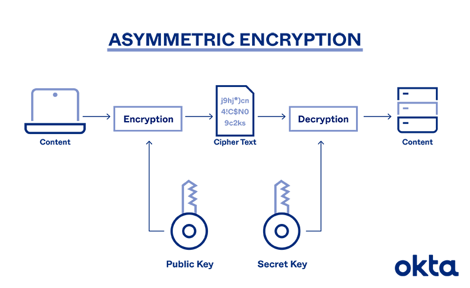

# Asymmetric Key Encryption
Asymmetric cryptography, also known as public-key cryptography, is a process that uses a pair of related keys - one public key and one private key - to encrypt and decrypt a message and protect it from unauthorized access or use.

A public key is a cryptographic key that can be used by any person to encrypt a message so that it can only be decrypted by the intended recipient with their private key. A private key - also known as a secret key - is shared only with key's initiator.[1](https://www.techtarget.com/searchsecurity/definition/asymmetric-cryptography#:~:text=Asymmetric%20cryptography%2C%20also,with%20key%27s%20initiator.)

Asymmetric cryptography typically gets used when increased security is the priority over speed and when identity verification is required, as the latter is not something symmetric cryptography supports. Some of the most common use cases for asymmetric cryptography include:[2](https://www.keyfactor.com/blog/symmetric-vs-asymmetric-encryption/#:~:text=Asymmetric%20cryptography%20typically%20gets%20used%20when%20increased%20security%20is%20the%20priority%20over%20speed%20and%20when%20identity%20verification%20is%20required%2C%20as%20the%20latter%20is%20not%20something%20symmetric%20cryptography%20supports.%20Some%20of%20the%20most%20common%20use%20cases%20for%20asymmetric%20cryptography%20include%3A%C2%A0) 
- **Digital signatures**: Confirming identity for someone to sign a document;
- **Blockchain**: Confirming identity to authorize transactions for cryptocurrency;
- **Public key infrastructure (PKI)**: Governing encryption keys through the issuance and management of digital certificates.

## [How Does Asymmetric Cryptography Work?](https://www.okta.com/identity-101/asymmetric-encryption/#:~:text=How%20Does%20Asymmetric%20Cryptography%20Work%3F)

Sensitive messages move through a process of encryption and decryption with public and private keys. 

An algorithm starts the process. A mathematical function generates a key pair. Each key is different, but they are related to one another mathematically. 

Imagine that someone wants to send an encrypted message to another person. The process looks like this:
- **Registration**: The user and the sender have connected with an official entity that generated both public and private keys;
- **Lookup**: The sender scours a public-key directory for the recipient's public key information;
- **Encrypt**: The sender creates a message, encrypts it with the recipient's public key, and sends it;
- **Decode**: The recipient uses the private key to unscramble the message;
- **Reply**: If the recipient wants to respond, the process moves in reverse.  

## [What are the benefits and disadvantages of asymmetric cryptography?](https://www.techtarget.com/searchsecurity/definition/asymmetric-cryptography#:~:text=What%20are%20the%20benefits%20and%20disadvantages%20of%20asymmetric%20cryptography%3F)
The benefits of asymmetric cryptography include:
- The key distribution problem is eliminated because there's no need for exchanging keys;
- Security is increased since the private keys don't ever have to be transmitted or revealed to anyone;
- The use of digital signatures is enabled so that a recipient can verify that a message comes from a particular sender;
- It allows for nonrepudiation so the sender can't deny sending a message.

Disadvantages of asymmetric cryptography include:
- It's a slow process compared to symmetric cryptography. Therefore, it's not appropriate for decrypting bulk messages;
- If an individual loses his private key, he can't decrypt the messages he receives;
- Because public keys aren't authenticated, no one can ensure a public key belongs to the person specified. Consequently, users must verify that their public keys belong to them;
- If a malicious actor identifies a person's private key, the attacker can read that individual's messages.

# Links
[asymmetric cryptography (public key cryptography)](https://www.techtarget.com/searchsecurity/definition/asymmetric-cryptography)

[Asymmetric Encryption: Definition, Architecture, Usage](https://www.okta.com/identity-101/asymmetric-encryption/)

[When to Use Symmetric Encryption vs. Asymmetric Encryption](https://www.keyfactor.com/blog/symmetric-vs-asymmetric-encryption/)

# Further reading
[All You Need to Know About Asymmetric Encryption](https://www.simplilearn.com/tutorials/cryptography-tutorial/asymmetric-encryption)

[Asymmetric Key Ciphers](https://cryptobook.nakov.com/asymmetric-key-ciphers)
