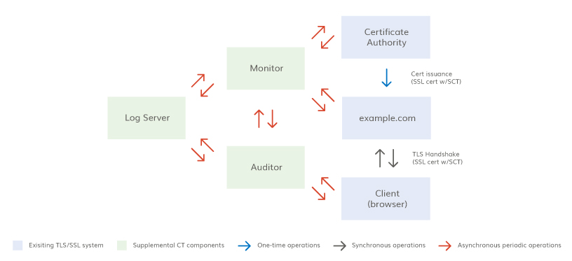

# Certificate transparency
**Certificate Transparency (CT)** is an Internet security standard for monitoring and auditing the issuance of digital certificates.

The security of HTTPS depends on the trust that certificates are only given out by the certificate authority that was requested by the owner of some website or IT infrastructure. Certificate Transparency has the potential to expose certificates that were given out without them being requested by the genuine owner, such as malicious certificates by a compromised certificate authority.[1](https://en.wikipedia.org/wiki/Certificate_Transparency#:~:text=Certificate%20Transparency%20(CT)%20is%20an%20Internet%20security%20standard%20for%20monitoring%20and%20auditing%20the%20issuance)

## [What are the Benefits of Certificate Transparency?](https://www.digicert.com/faq/certificate-transparency/what-is-certificate-transparency#:~:text=What%20are%20the%20Benefits%20of%20Certificate%20Transparency%3F)
- **Earlier Detection**: CT helps detect unauthorized certificates in a few hours instead of days, weeks, or months. Domain owners can identify any certificates issued without express approval or outside their domain policy;
- **Faster Mitigation**: Using CT helps users identify which certificates require revocation, allowing them to quickly communicate with the issuing CA and shortening the process for revoking a certificate;
- **Better Insight**: CT gives public insight into the SSL/TLS system, giving anyone the ability to observe and verify the system’s health and integrity. Users can also see differences in issuance processes between CAs;
- **Stronger Security**: By providing transparency into the certificate issuance process and informing users about issued certificates, CT strengthens the chain of trust and makes online browsing safer for all everyone.

## [What is the Goal of Certificate Transparency?](https://www.digicert.com/faq/certificate-transparency/what-is-certificate-transparency#:~:text=What%20is%20the%20Goal%20of%20Certificate%20Transparency%3F)
The success of Certificate Transparency (CT) relies on support from many different parties, including Certificate Authorities (CAs), browsers, brand owners, and independent companies running public CT logs.

The end goal of CT is twofold. First, CAs log all TLS/SSL Certificates in multiple, publicly available CT logs run by independent companies, allowing browsers to provide trust only to certificates that have been logged. Second, domain owners and interested parties can monitor these CT logs to detect certificates that were either misissued by the CA or not actually authorized by the organization.

DigiCert supports additional certificate verification and believes that higher validation standards are necessary to ensure that each certificate issued has been authorized by the organization that owns the domain or brand. While CT only provides this confirmation after issuance is complete, we see CT logging as a key component in TLS/SSL certificate validation and as a compliment to the requester verification already required by the C/AB Forum Baseline Requirements.

## [Certificate Transparency Components](https://www.digicert.com/faq/certificate-transparency/how-does-certificate-transparency-work#:~:text=Certificate%20Transparency%20Components)
The CT system has four components: 
- CA;
- Certificate log;
- Certificate monitor;
- Certificate auditor.

Below is a diagram with a likely configuration of these components:

**Certificate Authority**. 
CT works within the existing publicly-trusted CA system. With CT, CAs can include evidence of certificate issuance in a public log and browsers can check for these SCTs during the handshake. Logging certificates is evidence of the CA’s proper operation and gives insight on CA operations;

**Certificate Log**. 
Ideally, certificate logs will maintain a record of all SSL Certificates issued; although the initial rollout is limited to EV certificates. Multiple independent logs are required for several reasons:
- Multiple logs allow for a backup in the case of a log failure;
- Independent logs mean that if one log or log operator is compromised, certificates can still be validated;
- Independent logs mean a single government action cannot remove evidence of issuance from all logs;
- Multiple independent logs mean a CA and log operator can’t collude to obfuscate an embarrassing misissuance.

All logs are:
- Append only - Certificates can only be added to a log; they can’t be deleted, modified, or retroactively inserted;
- Cryptographically assured - Logs use a cryptographic mechanism called a Merkle Tree Hash to prevent tampering;
- Publicly auditable - Anyone can query a log and look for misissued or rogue certificates. All certificate logs must publicly advertise their URLs and public key.

**Certificate Monitor**.
A certificate monitor is anyone who watches the certificate logs for suspicious activity, like large brand owners or CAs.

Monitors can fetch information from the logs by using an HTTP GET command. Each customer may act as their own log monitoring service or may delegate this to another party. DigiCert plans to provide log monitoring services for its customers.

**Certificate Auditor**.
Certificate auditors check the logs to verify that the log is consistent with other logs, that new entries have been added, and that the log has not been corrupted by someone retroactively inserting, deleting, or modifying a certificate.

Auditing will likely be an automated process that is built into browsers. However, auditors could be a standalone service or could be a secondary function of a monitor.

## How does Certificate Transparency Work?
Certificate Transparency (CT) works within the existing Certificate Authority (CA) infrastructure as a way to provide post-issuance validation of an entity’s authorization for the issuance of SSL Certificates.

The certificate issuance process is next:
1. Server operator purchases certificate from CA;
2. CA validates server operator;
3. CA creates a precertificate;
4. CA logs the precertificate with the log server, which returns a signed certificate timestamp (SCT);
5. CA issues SSL Certificate;
6. SSL Certificate may include signed certificate timestamp (SCT);
7. Browser validates SSL Certificate during the TLS handshake;
8. Browser validates the SCT provided during the TLS handshake, either through OCSP stapling, through a TLS extension, or from information embedded in the certificate;
9. Browser makes connection with the server;
10. SSL Certificate encrypts all data as it is passed from the browser to the server.

There are three possible ways to deliver the SCT during the TLS handshake. A diagram of this process for one of the SCT delivery methods is:

# Links
[Certificate Transparency](https://en.wikipedia.org/wiki/Certificate_Transparency)

[WHAT IS CERTIFICATE TRANSPARENCY?](https://www.digicert.com/faq/certificate-transparency/what-is-certificate-transparency)

[HOW DOES CERTIFICATE TRANSPARENCY WORK?](https://www.digicert.com/faq/certificate-transparency/how-does-certificate-transparency-work)

# Further reading
[How CT fits into the wider Web PKI ecosystem](https://certificate.transparency.dev/howctworks/)

[How to Securely Implement TLS Certificate Checking in Android Apps](https://www.guardsquare.com/blog/how-to-securely-implement-tls-certificate-checking-in-android-apps)
