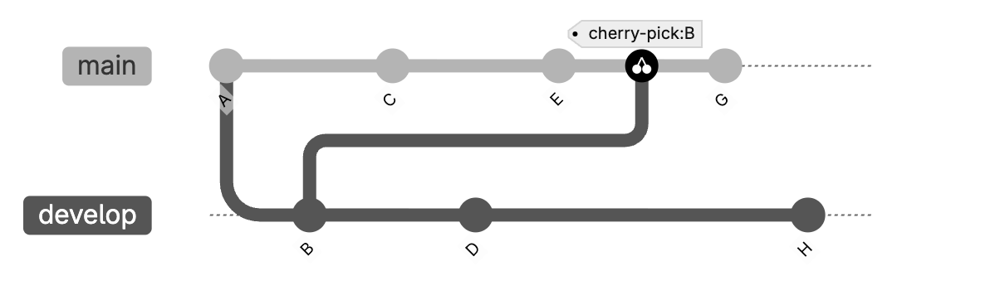

# `git cherry-pick`
`сherry-pick` allows you to apply a specific commit from one branch to another without merging the entire branch.

*Cherry-picking* is taking a single commit from one branch and adding it as the latest commit on another branch. The rest of the commits in the source branch are not added to the target. Cherry-pick a commit when you need the contents in a single commit, but not the contents of the entire branch.<sup>[1](https://docs.gitlab.com/user/project/merge_requests/cherry_pick_changes/#:~:text=cherry%2Dpicking%20is%20taking%20a%20single%20commit%20from%20one%20branch%20and%20adding%20it%20as%20the%20latest%20commit%20on%20another%20branch.%20The%20rest%20of%20the%20commits%20in%20the%20source%20branch%20are%20not%20added%20to%20the%20target.%20Cherry%2Dpick%20a%20commit%20when%20you%20need%20the%20contents%20in%20a%20single%20commit%2C%20but%20not%20the%20contents%20of%20the%20entire%20branch.)</sup>

In this example, a Git repository has two branches: `develop` and `main`. Commit `B` is cherry-picked from the `develop` branch after commit `E` in the `main` branch. Commit `G` is added after the cherry-pick:<sup>[2](https://docs.gitlab.com/user/project/merge_requests/cherry_pick_changes/#:~:text=In%20this%20example%2C%20a%20Git%20repository%20has%20two%20branches%3A%20develop%20and%20main.%20Commit%20B%20is%20cherry%2Dpicked%20from%20the%20develop%20branch%20after%20commit%20E%20in%20the%20main%20branch.%20Commit%20G%20is%20added%20after%20the%20cherry%2Dpick%3A)</sup>


When you cherry-pick a commit, Git:<sup>[3](https://docs.gitlab.com/topics/git/cherry_pick/#:~:text=When%20you%20cherry,commit%20remains%20unchanged.\))</sup>
- Creates a new commit with the same changes on your current branch;
- Preserves the original commit message and author information;
- Generates a new commit SHA. (The original commit remains unchanged.)

## Common commands
Below are common `git cherry-pick` commands with a brief explanation of each:

Applies a specific commit from another branch to the current branch:
```
git cherry-pick <commit-hash>
```

Applies a range of commits (from `A` to `B`) to the current branch:
```
git cherry-pick A..B
```

Continues the `cherry-pick` process after resolving conflicts:
```
git cherry-pick --continue
```

Cancels the `cherry-pick` operation and restores the previous state:
```
git cherry-pick --abort
```

## When to use
Cherry-picks help when you want to:<sup>[4](https://docs.gitlab.com/topics/git/cherry_pick/#:~:text=Cherry%2Dpicks%20help,the%20upstream%20repository.)</sup>
- Backport a bug fix to older release branches without bringing in new features;
- Reuse work from branches that can never merge;
- Backport small features to a previous release, without including experimental changes;
- Apply an emergency production fix (hotfix) to a development branch;
- Copy changes from a fork to the upstream repository.

## Pitfalls
Cherry-pick can be useful, but it comes with several downsides:
- Duplicates commits in history (same changes, different SHA);
- Can make commit history harder to understand and debug;
- May introduce conflicts if the branches have diverged;
- Can lead to inconsistencies if the same change is cherry-picked multiple times;
- Overuse can result in a messy and fragmented Git history.

## When not to use
- When you need the full branch history;
- When changes are tightly coupled with other commits;
- When maintaining a clean and linear history is important.

## `cherry-pick` vs `merge` vs `rebase`
- `merge` brings all changes from one branch into another;
- `rebase` rewrites history by moving commits;
- `cherry-pick` applies specific commits without merging the entire branch.

# Links
[Cherry-pick changes](https://docs.gitlab.com/user/project/merge_requests/cherry_pick_changes/)

[Cherry-pick changes with Git](https://docs.gitlab.com/topics/git/cherry_pick/)

# Further reading
[git-cherry-pick docs](https://git-scm.com/docs/git-cherry-pick)

[What does cherry-picking a commit with Git mean?](https://stackoverflow.com/questions/9339429/what-does-cherry-picking-a-commit-with-git-mean)

[Git Cherry Pick: Getting the Exact Commit You Want](https://www.cloudbees.com/blog/git-cherry-pick-getting-the-exact-commit-you-want)
