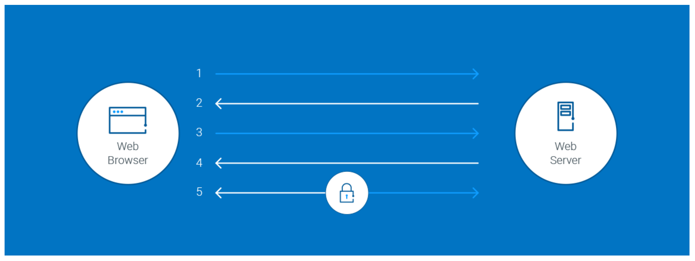

# SSL certificates
An SSL certificate is a bit of code on your web server that provides security for online communications. When a web browser contacts your secured website, the SSL certificate enables an encrypted connection. It’s kind of like sealing a letter in an envelope before sending it through the mail.[1](https://www.thawte.com/resources/getting-started/ssl-faq/#:~:text=An%20SSL%20certificate%20is%20a%20bit%20of%20code%20on%20your%20web%20server%20that%20provides%20security%20for%20online%20communications.%20When%20a%20web%20browser%20contacts%20your%20secured%20website%2C%20the%20SSL%20certificate%20enables%20an%20encrypted%20connection.%20It%E2%80%99s%20kind%20of%20like%20sealing%20a%20letter%20in%20an%20envelope%20before%20sending%20it%20through%20the%20mail.) Typically, SSL is used to secure credit card transactions, data transfer and logins, and more recently is becoming the norm when securing browsing of social media sites.[2](https://www.globalsign.com/en/ssl-information-center/what-is-an-ssl-certificate#:~:text=Typically%2C%20SSL%20is%20used%20to%20secure%20credit%20card%20transactions%2C%20data%20transfer%20and%20logins%2C%20and%20more%20recently%20is%20becoming%20the%20norm%20when%20securing%20browsing%20of%20social%20media%20sites.)

SSL Certificates bind together:
- A domain name, server name or hostname;
- An organizational identity (i.e. company name) and location.

An organization needs to install the SSL certificate onto its web server to initiate a secure session with browsers. Once a secure connection is established, all web traffic between the web server and the web browser will be secure.

When a certificate is successfully installed on your server, the application protocol (also known as HTTP) will change to HTTPS, where the ‘S’ stands for ‘secure’.[3](https://www.globalsign.com/en/ssl-information-center/what-is-an-ssl-certificate#:~:text=An%20organization%20needs,stands%20for%20%E2%80%98secure%E2%80%99.)

## [How does the SSL certificate create a secure connection?](https://www.digicert.com/what-is-an-ssl-certificate#:~:text=HOW%20DOES%20THE%20SSL%20CERTIFICATE%20CREATE%20A%20SECURE%20CONNECTION%3F)
When a browser attempts to access a website that is secured by SSL, the browser and the web server establish an SSL connection using a process called an “SSL Handshake” (see diagram below). Note that the SSL Handshake is invisible to the user and happens instantaneously.

Essentially, three keys are used to set up the SSL connection: the public, private, and session keys. Anything encrypted with the public key can only be decrypted with the private key, and vice versa.
Because encrypting and decrypting with private and public key takes a lot of processing power, they are only used during the SSL Handshake to create a symmetric session key. After the secure connection is made, the session key is used to encrypt all transmitted data.

- **Browser** connects to a web server (website) secured with SSL (https). Browser requests that the server identify itself;
- **Server** sends a copy of its SSL Certificate, including the server’s public key;
- **Browser** checks the certificate root against a list of trusted CAs and that the certificate is unexpired, unrevoked, and that its common name is valid for the website that it is connecting to. If the browser trusts the certificate, it creates, encrypts, and sends back a symmetric session key using the server’s public key;
- **Server** decrypts the symmetric session key using its private key and sends back an acknowledgement encrypted with the session key to start the encrypted session;
- **Server** and Browser now encrypt all transmitted data with the session key.

## [Why Do I Need an SSL Certificate?](https://www.globalsign.com/en/ssl-information-center/what-is-an-ssl-certificate#:~:text=Why%20Do%20I%20Need%20an%20SSL%20Certificate%3F)
SSL Certificates protect your sensitive information such as credit card information, usernames, passwords etc. They also:
- Keep data secure between servers;
- Increase your Google Rankings;
- Build/Enhance customer trust;
- Improve conversion rates.

## [Types of SSL certificates](https://www.namecheap.com/support/knowledgebase/article.aspx/786/33/what-is-an-ssl-certificate-and-what-is-it-used-for/#:~:text=2.%20Types%20of%20SSL%20certificates)
SSL certificates can be divided into 3 validation groups:
- **Domain Validation Certificates**. Requires a certificate applicant to prove his/her control over the domain name only. The issued certificate contains a domain name that was supplied to the Certification Authority within the certificate request;
- **Organization Validation Certificates**. Requires a certificate applicant to prove that his/her company is a registered and legally accountable business, and to pass domain validation. The issued certificate contains a domain and company name of the certificate applicant;
- **Extended Validation Certificates**. Includes validation requirements of two validation types mentioned above and additional requirements. The issued certificate contains a domain and company name of the certificate applicant.

# Links
[SSL FAQ](https://www.thawte.com/resources/getting-started/ssl-faq/)

[What is an SSL Certificate?](https://www.globalsign.com/en/ssl-information-center/what-is-an-ssl-certificate)

[What is an SSL certificate and what is it used for?](https://www.namecheap.com/support/knowledgebase/article.aspx/786/33/what-is-an-ssl-certificate-and-what-is-it-used-for/)

[WHAT IS AN SSL CERTIFICATE?](https://www.digicert.com/what-is-an-ssl-certificate)

# Further reading
[A Beginner's Guide to SSL: What It is & Why It Makes Your Website More Secure](https://blog.hubspot.com/marketing/what-is-ssl)

[Secure Sockets Layer certificate (SSL certificate)](https://www.techtarget.com/searchsecurity/definition/SSL-certificate-Secure-Sockets-Layer-certificate)

[What Is An SSL Certificate? Definition and Types](https://www.fortinet.com/resources/cyberglossary/ssl-certificate)
