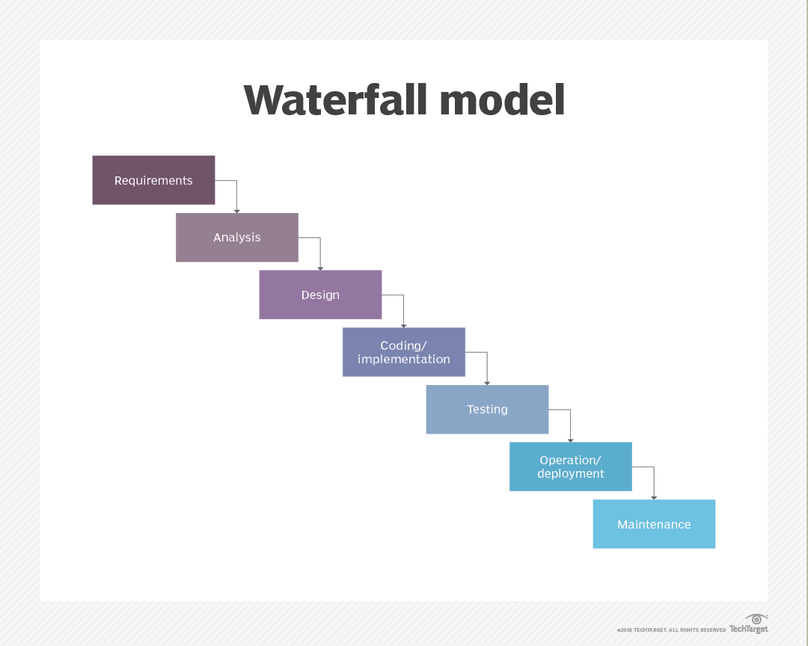

# Waterfall methodology

The Waterfall methodology — also known as the Waterfall model — is a sequential development process that flows like a waterfall through all phases of a project (analysis, design, development, and testing, for example), with each phase completely wrapping up before the next phase begins.

It is said that the Waterfall methodology follows the adage to “measure twice, cut once.” The success of the Waterfall method depends on the amount and quality of the work done on the front end, documenting everything in advance, including the user interface, user stories, and all the features’ variations and outcomes.

With the majority of the research done upfront, estimates of the time needed for each requirement are more accurate, and this can provide a more predictable release date.[1](https://business.adobe.com/blog/basics/waterfall#:~:text=The%20Waterfall%20methodology%20%E2%80%94%20also,more%20predictable%20release%20date.) 

## [Phases of the waterfall model](https://www.techtarget.com/searchsoftwarequality/definition/waterfall-model#:~:text=Phases%20of%20the%20waterfall%20model)

When used for a software development process, the waterfall methodology has seven stages:
- **Requirements**. Potential requirements, deadlines and guidelines for the project are analyzed and placed into a formal requirements document, also called a functional specification. This stage of development defines and plans the project without mentioning specific processes;
- **Analysis**. The system specifications are analyzed to generate product models and business logic to guide production. This is also when financial and technical resources are audited for feasibility;
- **Design**. A design specification document is created to outline technical design requirements, such as the programming language, hardware, data sources, architecture and services;
- **Coding and implementation**. The source code is developed using the models, logic and requirement specifications designated in the prior phases. Typically, the system is coded in smaller components, or units, before being put together;
- **Testing**. This is when quality assurance, unit, system and beta tests identify issues that must be resolved. This may cause a forced repeat of the coding stage for debugging. If the system passes integration and testing, the waterfall continues forward;
- **Operation and deployment**. The product or application is deemed fully functional and is deployed to a live environment;
- **Maintenance**. Corrective, adaptive and perfective maintenance is carried out indefinitely to improve, update and enhance the product and its functionality. This could include releasing patch updates and new versions.

Before moving to the next phase in the waterfall process, there's usually a review and sign off to ensure all defined goals have been met. For example, developers would ensure each unit of technology is properly integrated in the implementation phase before moving to the testing phase.

## [Benefits of Waterfall methodology](https://www.atlassian.com/agile/project-management/waterfall-methodology#:~:text=and%20starting%20over.-,Benefits%20of%20Waterfall%20methodology,-The%20benefits%20of)
A few benefits of Waterfall planning include:
- **Clear project structure**: Waterfall leaves little room for confusion because of rigorous planning. There is a clear end goal in sight that you're working toward;
- **Set costs**: The rigorous planning ensures that the time and cost of the project are known upfront;
- **Easier tracking**: Assessing progress is faster because there is less cross-functional work. You can even manage the entirety of the project in a Gantt chart, which you can find in Jira;
- **A replicable process**: If a project succeeds, you can use the process again for another project with similar requirements;
- **Comprehensive project documentation**: The Waterfall methodology provides you with a blueprint and a historical project record so you can have a comprehensive overview of a project;
- **Improved risk management**: The abundance of upfront planning reduces risk. It allows developers to catch design problems before writing any code;
- **Enhanced responsibility and accountability**: Teams take responsibility within each process phase. Each phase has a clear set of goals, milestones, and timelines;
- **More precise execution for a non-expert workforce**: Waterfall allows less-experienced team members to plug into the process;
- **Fewer delays because of additional requirements**: Since your team knows the needs upfront, there isn't a chance for additional asks from stakeholders or customers.

## [Limitations of Waterfall methodology](https://www.atlassian.com/agile/project-management/waterfall-methodology#:~:text=Limitations%20of%20Waterfall%20methodology)
Limitations of Waterfall planning:
- **Longer delivery times**: The delivery of the final product could take longer than usual because of the inflexible step-by-step process, unlike in an iterative process like Agile or Lean;
- **Limited flexibility for innovation**: Any unexpected occurrence can spell doom for a project with this model. One issue could move the project two steps back;
- **Limited opportunities for client feedback**: Once the requirement phase is complete, the project is out of the hands of the client;
- **Tons of feature requests**: Because clients have little say during the project's execution, there can be a lot of change requests after launch, such as addition of new features to the existing code. This can create further maintenance issues and prolong the launch;
- **Deadline creep**: If there's a significant issue in one phase, everything grinds to a halt. Nothing can move forward until the team addresses the problem. It may even require you to go back to a previous phase to address the issue.

# Links
[Waterfall Methodology: A Complete Guide](https://business.adobe.com/blog/basics/waterfall)

[waterfall model](https://www.techtarget.com/searchsoftwarequality/definition/waterfall-model)

[Waterfall Methodology: A Comprehensive Guide](https://www.atlassian.com/agile/project-management/waterfall-methodology)

# Next questions
[What is Agile?](https://github.com/Kirchhoff-/Android-Interview-Questions/blob/master/General/What%20is%20Agile.md)

[What is Scrum?](https://github.com/Kirchhoff-/Android-Interview-Questions/blob/master/General/What%20is%20Scrum.md)

# Further reading
[Waterfall model](https://en.wikipedia.org/wiki/Waterfall_model)

[Guide to waterfall methodology: Free template and examples](https://asana.com/ru/resources/waterfall-project-management-methodology)

[A complete guide to the Waterfall methodology](https://monday.com/blog/project-management/waterfall-methodology/)
