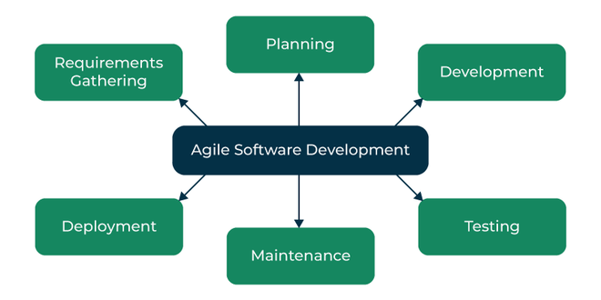

# Agile
Agile software development methodologies often called Agile, preach flexibility and pragmatism in the application delivery process. This iterative software development approach delivers value to users in small increments rather than through a single large launch. Agile teams evaluate requirements and results continuously, which leads to the efficient implementation of change.

Using Agile gives teams the ability to create value in the face of a dynamic market and fast-paced competition while maintaining speed and efficiency. Creating a pan-org collaborative work culture is a crucial tenet of Agile as it drives teams to work together with a deep understanding of individual roles within the system.[1](https://www.spiceworks.com/tech/devops/articles/what-is-agile-software-development/#:~:text=Agile%20software%20development%20methodologies%20often,individual%20roles%20within%20the%20system.)

The core values of Agile are embodied in the Agile Manifesto, which was created by a group of software development personnel in 2001. This manifesto outlines four key concepts that encourage lightweight development, outlined below[2](https://www.spiceworks.com/tech/devops/articles/what-is-agile-software-development/#:~:text=The%20core%20values,quickly%20and%20easily.):
- **Prioritize people over tools & processes**. While the latter is undoubtedly essential, meaningful individual interactions are a vital driver of the software development process and help create an effective response to business needs;
- **Well-built application comes before in-depth documentation**. Agile doesn’t completely do away with documentation but focuses on giving the development team only the information they need to meet their goal, such as user stories;
- **Replace contract negotiations between the project manager and client with frequent collaboration**. The product can take shape according to the customer’s vision more effectively if they’re involved throughout the development process rather than just at the start and end;
- **Respond to change swiftly & effectively**. Agile dismisses the notion of change as an undesired expense. Instead, it values change and encourages short iterations to allow for modifications to be made quickly and easily.

Apart from these core values, the Agile Manifesto outlines 12 principles for development teams to improve their functioning:[3](https://www.spiceworks.com/tech/devops/articles/what-is-agile-software-development/#:~:text=Apart%20from%20these,strive%20for%20excellence.):
1. Divide large tasks into smaller pieces for quick completion;
2. Focus on customer satisfaction through the speedy and continuous delivery of value;
3. Ensure the creation of processes that drive sustainable efforts;
4. Accept changing requirements, even if introduced at a later phase in project;
5. Welcome change as a means to achieve a competitive advantage;
6. Give motivated team members the work environment and trust required to complete requirements quickly;
7. Acknowledge that self-organized teams deliver the best work;
8. Measure progress based on work completed;
9. Complete work at a consistent pace;
10. Ensure regular collaboration between project and business teams throughout the project duration;
11. Regularly reflect on how one can adjust team behavior to enhance effectiveness;
12. Finally, constantly strive for excellence.

## [The Agile Software Development Process](https://www.geeksforgeeks.org/software-engineering-agile-software-development/#:~:text=make%20adjustments%20accordingly.-,The%20Agile%20Software%20Development%20Process,-Agile%20Software%20Development)

- **Requirements Gathering**: The customer’s requirements for the software are gathered and prioritized;
- **Planning**: The development team creates a plan for delivering the software, including the features that will be delivered in each iteration;
- **Development**: The development team works to build the software, using frequent and rapid iterations;
- **Testing**: The software is thoroughly tested to ensure that it meets the customer’s requirements and is of high quality;
- **Deployment**: The software is deployed and put into use;
- **Maintenance**: The software is maintained to ensure that it continues to meet the customer’s needs and expectations.

## [Agile software delivery life cycle](https://circleci.com/topics/agile/#:~:text=focused%20software%20development.-,Agile%20software%20delivery%20life%20cycle,-Initiation)
Agile focuses on breaking work into smaller, manageable increments and adapting to changing requirements. Here’s a step-by-step overview of the key stages of the Agile software delivery life cycle and how they come together to create efficient and customer-focused software development:
- **Initiation**. Define the project scope, objectives, and the initial backlog of work;
- **Planning**. Collaboratively create a prioritized list of tasks, known as the product backlog, considering customer and stakeholder input;
- **Sprint Planning**. Select a subset of tasks from the product backlog to work on in a sprint, with input from the team, customers, and stakeholders;
- **Execution**. Develop the selected tasks during the sprint, with daily stand-up meetings to monitor progress;
- **Review**. Demonstrate the completed work to stakeholders and customers to gather their feedback;
- **Retrospective**. Reflect on the sprint's process and customer/stakeholder feedback to identify improvements for the next iteration;
- **Repeat**. Continue to plan, execute, review, and iterate in subsequent sprints, integrating ongoing feedback and input from customers and stakeholders.

The Agile software delivery life cycle usually occurs in sprints, which are short, time-bound cycles lasting two to four weeks. During these sprints, the team focuses on specific tasks or user stories, allowing for constant adaptation and maintaining a customer-centric focus. Daily stand-up meetings keep everyone aligned and help resolve issues in real-time, while retrospectives held at the end of each sprint enable continuous improvement by reflecting on past successes and challenges.

This approach ensures that Agile is committed to delivering high-quality software while remaining responsive to change.

## [Benefits of Agile software development](https://www.outsystems.com/tech-hub/app-dev/what-is-agile-software-development/#benefits:~:text=easy%20or%20familiar.-,Benefits%20of%20Agile%20software%20development,-Traditional%20software%20development)
Traditional software development used a “waterfall” approach where teams would define everything at the start of a project, then build it, then give it to customers. The problem with that approach, especially in today’s fast-moving, digital world, is that by the time customers receive the product, tastes and technology often change making products obsolete.

In contrast to the waterfall approach, agile software development methods aim to define the specific software requirements weeks or days before it is built rather than defining everything ahead of time.

Here are some of the **benefits of embracing Agile development**:
- **Faster time to market**. Agile methodologies rely on shorter development cycles, frequently integrating customer feedback. By continuously testing, releasing, and iterating, agile software development provides a more efficient approach that reduces time to market. This helps developers improve revenue and gain a competitive advantage by getting a product to market before their competitors do;
- **Increased efficiency**. Agile software development is known for its streamlined and efficient process. Development teams work collaboratively, with more significant involvement from stakeholders across the process. Agile works best when the development team and the stakeholders, with varying skills, communicate together throughout the project. This frequent collaboration helps to catch and address potential issues early on in the development cycle. This results in a more efficient process with fewer errors and better quality;
- **Cost-effective**: Agile methodology has a reputation for being cost-effective. With agile software development, teams break down projects into smaller pieces, allowing for more granular budgeting, planning, and testing of each component. With a more focused and continuous approach to project planning, teams can deliver product features and functions more efficiently, avoiding waste and increasing their return on investment (ROI);
- **Improved quality**. Agile software development prioritizes testing and iteration. Every feature or component is tested immediately after it is developed, ensuring that no issues go unnoticed or unaddressed. Teams can quickly identify issues, allowing them to resolve these problems as quickly as possible. Developers can identify problems earlier in the agile development cycle, where they can be fixed more efficiently than if they were left undetected until the product's release. This results in better quality products and more satisfied end-users;
- **Adaptability and flexibility**. Agile software development involves frequent reassessment and adjustment. As part of an agile approach, teams can revisit what they are developing and re-prioritize where necessary. Iterations take place frequently, allowing for changes to be made when needed, even if the product is close to completion. This flexibility ensures that the development process is always aligned with the product goals and expectations of customers.

## [What are the disadvantages of Agile Development?](https://www.simplilearn.com/tutorials/agile-scrum-tutorial/what-is-agile#:~:text=Disadvantages%20of%20Agile%20Software%20Development%20Life%20Cycle)
The disadvantages of the Agile software development process are listed as follows: 
- Agile development is linked with lesser documentation and a higher focus on codes;
- Agile software development depends on continuous iteration and feedback from customers, leading to difficult estimation of timelines, outcomes, and budgets of projects;
- Understanding the quantity and intensity of effort required for project completion is challenging at an early stage of the Agile software development lifecycle; 
- Dependency on the customer leads to wrong progress in the project if the team encounters ambiguity; 
- It is difficult for new programmers to adapt to the workplace environment as the senior programmers make most decisions; 
- Higher flexibility and adaptability can also lead to scope creep and lack of control over project scope; 
- The swiftness of Agile development with high intensity, more number of sprints, and close deadlines lead to mental exhaustion and increased pressure on team members, further leading to burnout; 
- Agile development lacks the structure compared to other methodologies, which results in oversight and poor governance.

# Links
[What Is Agile Software Development? Life Cycle, Methodology, and Examples](https://www.spiceworks.com/tech/devops/articles/what-is-agile-software-development/)

[Agile Software Development – Software Engineering](https://www.geeksforgeeks.org/software-engineering-agile-software-development/)

[Agile methodology: A guide to adaptive software delivery](https://circleci.com/topics/agile/)

[Understanding Agile software development](https://www.outsystems.com/tech-hub/app-dev/what-is-agile-software-development/)

[What is Agile? Understanding Agile Methodology and Principles in Software Development](https://www.simplilearn.com/tutorials/agile-scrum-tutorial/what-is-agile)

# Next questions
[What is Scrum?](https://github.com/Kirchhoff-/Android-Interview-Questions/blob/master/General/What%20is%20Scrum.md)

# Further reading
[Agile software development](https://en.wikipedia.org/wiki/Agile_software_development)

[Agile Guide](https://www.wrike.com/agile-guide/)

[Agile Software Development Methodology: Definition, Types, Workflows](https://www.cleveroad.com/blog/agile-software-development/)
