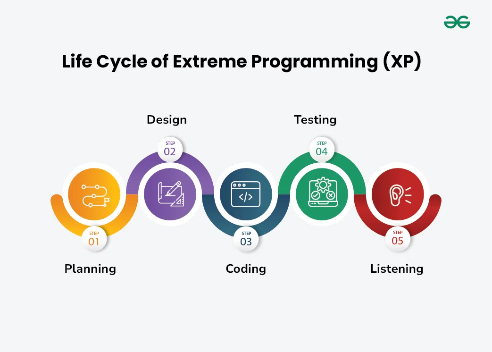

# Extreme Programming (XP)
**Extreme programming** is a software development methodology that’s part of what’s collectively known as agile methodologies. XP is built upon values, principles, and practices, and its goal is to allow small to mid-sized teams to produce high-quality software and adapt to evolving and changing requirements.

What sets XP apart from the other agile methodologies is that XP emphasizes the technical aspects of software development. Extreme programming is precise about how engineers work since following engineering practices allows teams to deliver high-quality code at a sustainable pace.

Extreme programming is, in a nutshell, about good practices taken to an extreme. Since pair-programming is good, let’s do it all of the time. Since testing early is good, let’s test before the production code is even written.[1](https://www.nimblework.com/agile/extreme-programming-xp/#:~:text=Extreme%20programming%20is,is%20even%20written.)

## [Key principles and values](https://www.coscreen.co/blog/what-is-extreme-programming/#:~:text=Extreme%20Programming%20relies%20on%20key%20principles%20and%20values)
- **Communication**: The XP methodology places great emphasis on communication between the developers, customers, and other stakeholders. The team should work closely together, and the customer should be involved throughout the development process. This helps to ensure that everyone is on the same page and that the product meets the customer's expectations;
- **Simplicity**: XP emphasizes the importance of keeping the design and implementation of the system as simple as possible. This includes avoiding unnecessary features and functionality. By keeping the system simple, the team can focus on delivering the core functionality that the customer needs;
- **Feedback**: Feedback is essential to the XP methodology. The team should receive feedback on their work as soon as possible, so they can make any necessary changes quickly. This helps to ensure that the product is on track and that any issues are addressed early on;
- **Courage**: XP requires courage from the team members to make difficult decisions and take risks. This includes being willing to admit when things are not working and making changes to the development process as needed. This helps to ensure that the team is focused on delivering the best possible product, even if it means making difficult decisions;
- **Respect**: Respect is a core value of XP. Team members should respect each other's opinions and ideas, as well as the customer's needs and preferences. This helps to create a positive and productive work environment where everyone feels valued and appreciated;
- **Iteration**: XP involves breaking down the development process into small, manageable iterations. Each iteration should deliver a working piece of software that can be tested and evaluated. This helps to ensure that the product is developed in an iterative and incremental manner, which can help to reduce risk and improve the overall quality of the product;
- **Testing**: XP places great emphasis on testing throughout the development process. Tests are written before the code, and code is only considered complete once it has passed all of the relevant tests. This helps to ensure that the product is thoroughly tested and that any issues are identified and addressed early on;
- **Pair programming**: XP encourages pair programming, where two developers work together on the same code. This can help to improve code quality and reduce the number of bugs. By working together, developers can catch issues early on and collaborate to find the best possible solutions.

## [Life Cycle of Extreme Programming (XP)](https://www.geeksforgeeks.org/software-engineering-extreme-programming-xp/#:~:text=risks%20are%20considerable.-,Life%20Cycle%20of%20Extreme%20Programming%20(XP),-The%20Extreme%20Programming)
The Extreme Programming Life Cycle consist of five phases:

- **Planning**: The first stage of Extreme Programming is planning. During this phase, clients define their needs in concise descriptions known as user stories. The team calculates the effort required for each story and schedules releases according to priority and effort;
- **Design**: The team creates only the essential design needed for current user stories, using a common analogy or story to help everyone understand the overall system architecture and keep the design straightforward and clear;
- **Coding**: Extreme Programming (XP) promotes pair programming i.e. wo developers work together at one workstation, enhancing code quality and knowledge sharing. They write tests before coding to ensure functionality from the start (TDD), and frequently integrate their code into a shared repository with automated tests to catch issues early;
- **Testing**: Extreme Programming (XP) gives more importance to testing that consist of both unit tests and acceptance test. Unit tests, which are automated, check if specific features work correctly. Acceptance tests, conducted by customers, ensure that the overall system meets initial requirements. This continuous testing ensures the software’s quality and alignment with customer needs;
- **Listening**: In the listening phase regular feedback from customers to ensure the product meets their needs and to adapt to any changes.

## [When should you use extreme programming?](https://asana.com/ru/resources/extreme-programming-xp#:~:text=When%20should%20you%20use%20extreme%20programming%3F)
Because extreme programming focuses on software development, it's typically only used by engineering teams. Even in software teams, it only works in certain settings. To get the most value out of extreme programming, it’s best to use it when you: 
- **Manage a smaller team**. Because of its highly collaborative nature, XP works best on smaller teams of under 10 people;
- **Are in constant contact with your customers**. XP incorporates customer requirements throughout the development process, and even relies on them for testing and approval;
- **Have an adaptable team that can embrace change (without hard feelings)**. By its very nature, extreme programming will often require your whole team to toss out their hard work. There are also rules that allow other team members to make changes at any time, which doesn’t work if your team members might take that personally;
- **Are well versed in the technical aspects of coding**. XP isn’t for beginners. You need to be able to work and make changes quickly.

## [Pros Of Extreme Programming](https://www.arounda.agency/blog/pros-and-cons-of-extreme-programming#:~:text=extreme%20programming%20(XP)%3F%E2%80%99-,Pros%20Of%20Extreme%20Programming,-The%20extreme%20programming)
- **Robust software**. Continuous testing and test-driven development result in clean code that works now;
- **Fast development**. Thanks to the fast pace of incremental change, continuous integration, and deployment, extreme programming last several months, whereas the usual approach would require years;
- **Low cost of change**. Rapid feedback and rapid change cost less than major updates;
- **Error avoidance**. Pair programming ensures fewer mistakes, fewer rewrites, and stable program units;
- **Lean product**. Thanks to the YADNI and DRY rules as well as the system metaphor technique, the software is easy to maintain and enhance. The code is clear and readable all the time;
- **Desired Product**. ХР is tailored to the customer’s requirements. That is why the end product meets all the demands;
- **Teams` well-being**. The vital premise for the XP work is that team has to be motivated and rested. That is why the work is limited to a 40-hour week.

## [Cons Of Extreme Programming](https://www.arounda.agency/blog/pros-and-cons-of-extreme-programming#:~:text=40%2Dhour%20week.-,Cons%20Of%20Extreme%20Programming,-The%20main%20disadvantages)
- **Lots of effort**. XP requires lots of persistence, creativity, and lean thinking to adjust the system to the client’s needs day by day;  
- **Customer must participate**. According to the XP framework, at least one client representative must work with the team permanently. Very often, customer has no interest and time to do so;
- **Relatively high costs**. Pair programming means double salary and can be problematic for smaller teams with a limited budget. XP teams necessarily include a tracker and a coach, which increases expenses;
- **Time for meetings**. In extreme programming, meetings occur very often. There are daily stand-ups that last up to 15 minutes, longer end-of-the-week meetings, the Planning Game at the beginning of each development phase, etc. Communicating face to face rather than writing messages or documentation is advisable. Altogether meetings require additional time and nerve;
- **Location restriction**. XP projects imply that the customer participates in the development regularly and meets the team face-to-face. This is hard to implement when the customer has a distant location;
- **Stress**. There is a lot of stress and pressure due to tight deadlines when the code has to be designed and tested today, not tomorrow. Indeed, this is why the programming is called ‘extreme‘.

# Links
[What Is Extreme Programming (XP)? It's Values, Principles, And Practices](https://www.nimblework.com/agile/extreme-programming-xp/)

[What is Extreme Programming?](https://www.coscreen.co/blog/what-is-extreme-programming/)

[What is Extreme Programming (XP)?](https://www.geeksforgeeks.org/software-engineering-extreme-programming-xp/)

[Extreme programming (XP) gets results, but is it right for you?](https://asana.com/ru/resources/extreme-programming-xp)

[Pros and Cons of Extreme Programming](https://www.arounda.agency/blog/pros-and-cons-of-extreme-programming)

# Further reading
[Extreme programming](https://en.wikipedia.org/wiki/Extreme_programming)

[Extreme Programming](https://www.agilealliance.org/glossary/xp/)
