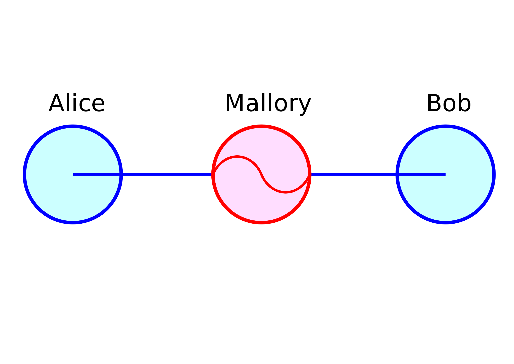

# Man in the middle attack
**Man-in-the-middle (MITM)** attack is a cyberattack where the attacker secretly relays and possibly alters the communications between two parties who believe that they are directly communicating with each other. One example of a MITM attack is active eavesdropping, in which the attacker makes independent connections with the victims and relays messages between them to make them believe they are talking directly to each other over a private connection, when in fact the entire conversation is controlled by the attacker. The attacker must be able to intercept all relevant messages passing between the two victims and inject new ones. As it aims to circumvent mutual authentication, a MITM attack can succeed only when the attacker impersonates each endpoint sufficiently well to satisfy their expectations. 

## Example

Suppose Alice wishes to communicate with Bob. Meanwhile, Mallory wishes to intercept the conversation to eavesdrop and optionally to deliver a false message to Bob.

First, Alice asks Bob for his public key. If Bob sends his public key to Alice, but Mallory is able to intercept it, an MITM attack can begin. Mallory sends Alice a forged message that appears to originate from Bob, but instead includes Mallory's public key.

Alice, believing this public key to be Bob's, encrypts her message with Mallory's key and sends the enciphered message back to Bob. Mallory again intercepts, deciphers the message using her private key, possibly alters it if she wants, and re-enciphers it using the public key she intercepted from Bob when he originally tried to send it to Alice. When Bob receives the newly enciphered message, he believes it came from Alice.

1. Alice sends a message to Bob, which is intercepted by Mallory:
	Alice "Hi Bob, it's Alice. Give me your key." →     Mallory     Bob
2. Mallory relays this message to Bob; Bob cannot tell it is not really from Alice:
	Alice     Mallory "Hi Bob, it's Alice. Give me your key." →     Bob
3. Bob responds with his encryption key:
	Alice     Mallory     ← [Bob's key] Bob
4. Mallory replaces Bob's key with her own, and relays this to Alice, claiming that it is Bob's key:
	Alice     ← [Mallory's key] Mallory     Bob
5. Alice encrypts a message with what she believes to be Bob's key, thinking that only Bob can read it:
	Alice "Meet me at the bus stop!" [encrypted with Mallory's key] →     Mallory     Bob
6. However, because it was actually encrypted with Mallory's key, Mallory can decrypt it, read it, modify it (if desired), re-encrypt with Bob's key, and forward it to Bob:
	Alice     Mallory "Meet me at the van down by the river!" [encrypted with Bob's key] →     Bob
7. Bob thinks that this message is a secure communication from Alice.

# Links
[Man-in-the-middle attack](https://en.wikipedia.org/wiki/Man-in-the-middle_attack)

# Further reading
[What is a man-in-the-middle attack?](https://us.norton.com/internetsecurity-wifi-what-is-a-man-in-the-middle-attack.html)

[What Is MITM (Man-In-The-Middle) Attack?](https://www.wallarm.com/what/what-is-mitm-man-in-the-middle-attack)

[What is a Man-in-the-Middle Attack: Detection and Prevention Tips](https://www.varonis.com/blog/man-in-the-middle-attack/)
