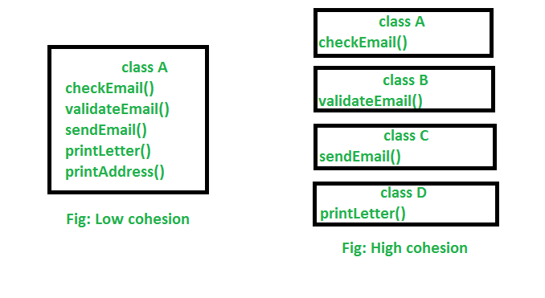

# Cohesion
Cohesion refers to the degree to which the elements inside a module belong together. In one sense, it is a measure of the strength of relationship between the methods and data of a class and some unifying purpose or concept served by that class. In another sense, it is a measure of the strength of relationship between the class's methods and data themselves.

Cohesion is an ordinal type of measurement and is usually described as “high cohesion” or “low cohesion”. Modules with high cohesion tend to be preferable, because high cohesion is associated with several desirable traits of software including robustness, reliability, reusability, and understandability. In contrast, low cohesion is associated with undesirable traits such as being difficult to maintain, test, reuse, or even understand.

In object-oriented programming, if the methods that serve a class tend to be similar in many aspects, then the class is said to have high cohesion. In a highly cohesive system, code readability and reusability is increased, while complexity is kept manageable.

Example: 
```
public class Person {
     private int     age;
     private String  name;

     // getter, setter properties.

     // method
     public void readInfor();

     public void writeInfor();
}
```

The `Person` class has low cohesion, simply because Person’s responsibilities is relevant to save information about people. It do not relate to functionalities about read/write to file. So, to reduce low cohension, we should separate the implementation about read/write file into other class such as File. 

```
public class Person {
     private int     age;
     private String  name;
     
     // getter, setter properties.
}

public class File {
     // method
     public void readInfor();

     public void writeInfor();
}
```
Here classes only responds for small amount of functionality and dont broken single responsibility principle. This is example of high cohesion.

## Conclusion



Cohesion is increased if:
- The functionalities embedded in a class, accessed through its methods, have much in common;
- Methods carry out a small number of related activities, by avoiding coarsely grained or unrelated sets of data;
- Related methods are in the same source file or otherwise grouped together; for example, in separate files but in the same sub-directory/folder.

Advantages of high cohesion (or "strong cohesion") are:
- Reduced module complexity (they are simpler, having fewer operations);
- Increased system maintainability, because logical changes in the domain affect fewer modules, and because changes in one module require fewer changes in other modules;
- Increased module reusability, because application developers will find the component they need more easily among the cohesive set of operations provided by the module.

## Links
https://en.wikipedia.org/wiki/Cohesion_(computer_science)  
https://www.geeksforgeeks.org/cohesion-in-java/  
https://ducmanhphan.github.io/2019-03-23-Coupling-and-Cohension-in-OOP
