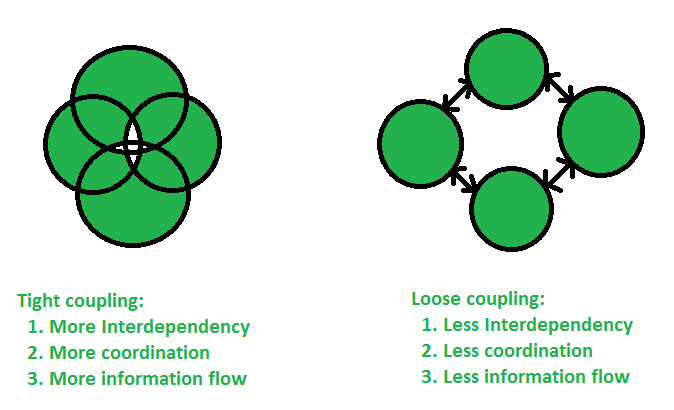

# Coupling
Coupling is the degree of interdependence between software modules; a measure of how closely connected two routines or modules are; the strength of the relationships between modules.

Coupling is usually contrasted with cohesion. Low coupling often correlates with high cohesion, and vice versa. Low coupling is often a sign of a well-structured computer system and a good design, and when combined with high cohesion, supports the general goals of high readability and maintainability.

There are two types of coupling:
- **Tight coupling** - When an object creates the object to be used, then it is a tight coupling situation. As the main object creates the object itself, this object can not be changed from outside world easily marked it as tightly coupled objects.
- **Loose coupling** - When an object gets the object to be used from the outside, then it is a loose coupling situation. As the main object is merely using the object, this object can be changed from the outside world easily marked it as loosely coupled objects.

Example

**Tight Coupling**
```
public class Tester {
   public static void main(String args[]) {
      A a = new A();

      //a.display() will print A and B
      //this implementation can not be changed dynamically
      //being tight coupling
      a.display();
   }
}

class A {
   B b;
   public A() {
      //b is tightly coupled to A
      b = new B();
   }

   public void display() {
      System.out.println("A");
      b.display();
   }
}

class B {    
   public B(){}
   public void display() {
      System.out.println("B");
   }
}
```

Output:
```
A
B
```

**Loose Coupling**
```
import java.io.IOException;

public class Tester {
   public static void main(String args[]) throws IOException {
      Show b = new B();
      Show c = new C();

      A a = new A(b);          
      //a.display() will print A and B    
      a.display();

      A a1 = new A(c);
      //a.display() will print A and C    
      a1.display();
   }
}

interface Show {
   public void display();
}

class A {
   Show s;
   public A(Show s) {
      //s is loosely coupled to A
      this.s = s;
   }

   public void display() {
      System.out.println("A");
      s.display();
   }
}

class B implements Show {    
   public B(){}
   public void display() {
      System.out.println("B");
   }
}

class C implements Show {    
   public C(){}
   public void display() {
      System.out.println("C");
   }
}
```

Output:
```
A
B
A
C
```
Using interfaces, we achieve the loose coupling by injecting the dependency.

## Conclusion
In general, Tight Coupling is bad in but most of the time, because it reduces flexibility and re-usability of code, it makes changes much more difficult, it impedes test ability etc. loose coupling is a better choice because A loosely coupled will help you when your application need to change or grow. If you design with loosely coupled architecture, only a few parts of the application should be affected when requirements change.



- Tight coupling is not good at the test-ability. But loose coupling improves the test ability.
- Tight coupling does not provide the concept of interface. But loose coupling helps us follow the GOF principle of program to interfaces, not implementations.
- In Tight coupling, it is not easy to swap the codes between two classes. But it’s much easier to swap other pieces of code/modules/objects/components in loose coupling.
- Tight coupling does not have the changing capability. But loose coupling is highly changeable.
- A change in one module usually forces a ripple effect of changes in other modules.
- Assembly of modules might require more effort and/or time due to the increased inter-module dependency.
- A particular module might be harder to reuse and/or test because dependent modules must be included.

## Links
https://en.wikipedia.org/wiki/Coupling_(computer_programming)  
https://www.tutorialspoint.com/Coupling-in-Java  
https://www.geeksforgeeks.org/coupling-in-java/  
