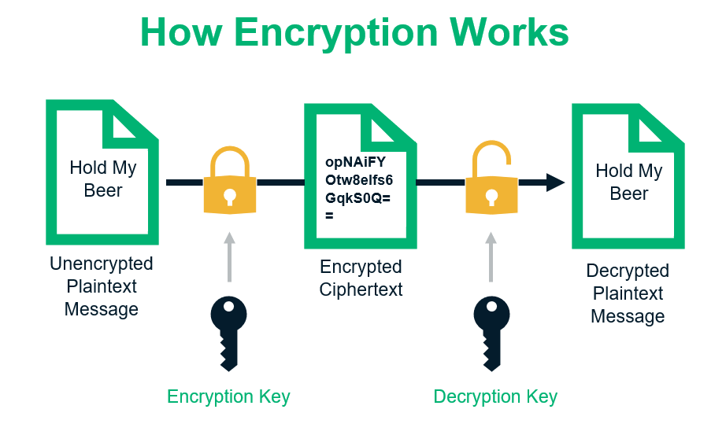
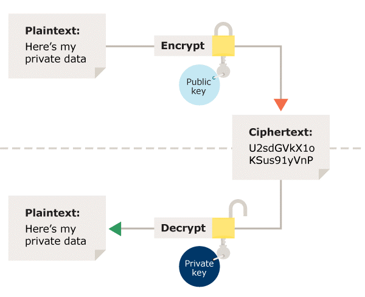

# Encryption

Encryption is a way of scrambling data so that only authorized parties can understand the information. In technical terms, it is the process of converting human-readable plaintext to incomprehensible text, also known as ciphertext. In simpler terms, encryption takes readable data and alters it so that it appears random. Encryption requires the use of a cryptographic key: a set of mathematical values that both the sender and the recipient of an encrypted message agree on.[1](https://www.cloudflare.com/learning/ssl/what-is-encryption/#:~:text=Encryption%20is%20a%20way%20of,an%20encrypted%20message%20agree%20on.)

Let’s consider the following example to see how encryption works in a general sense:

In this example, you can see how the data changes from plaintext to ciphertext and back to plaintext through the use of encryption algorithms and decryption keys. 

When we talk about encryption, it’s much like a lock on a door. To operate the lock, you need a key. This means only people who hold the key can unlock the door and gain access to whatever it’s protecting. In the digital world, a key can come in many forms — a password, code, PIN, or a complex string of computer-generated characters.[2](https://sectigostore.com/blog/what-is-asymmetric-encryption-how-does-it-work/#:~:text=Let%E2%80%99s%20consider%20the,computer%2Dgenerated%20characters.)

There are two types of encryption in widespread use today: **symmetric** and **asymmetric** encryption. The name derives from whether or not the same key is used for encryption and decryption.[3](https://ico.org.uk/for-organisations/uk-gdpr-guidance-and-resources/security/encryption/what-types-of-encryption-are-there/#:~:text=There%20are%20two%20types%20of%20encryption%20in%20widespread%20use%20today%3A%20symmetric%20and%20asymmetric%20encryption.%20The%20name%20derives%20from%20whether%20or%20not%20the%20same%20key%20is%20used%20for%20encryption%20and%20decryption.)

## [What is symmetric encryption?](https://ico.org.uk/for-organisations/uk-gdpr-guidance-and-resources/security/encryption/what-types-of-encryption-are-there/#:~:text=encryption%20and%20decryption.-,What%20is%20symmetric%20encryption%3F,-In%20symmetric%20encryption)

In symmetric encryption the same key is used for encryption and decryption. It is therefore critical that a secure method is considered to transfer the key between sender and recipient.

## [What is asymmetric encryption?](https://ico.org.uk/for-organisations/uk-gdpr-guidance-and-resources/security/encryption/what-types-of-encryption-are-there/#:~:text=encryption%20and%20decryption-,What%20is%20asymmetric%20encryption%3F,-Asymmetric%20encryption%20uses)

Asymmetric encryption uses the notion of a key pair: a different key is used for the encryption and decryption process. One of the keys is typically known as the private key and the other is known as the public key.

The private key is kept secret by the owner and the public key is either shared amongst authorised recipients or made available to the public at large.
Data encrypted with the recipient’s public key can only be decrypted with the corresponding private key. Data can therefore be transferred without the risk of unauthorised or unlawful access to the data.

# Links
[What Is Asymmetric Encryption & How Does It Work?](https://sectigostore.com/blog/what-is-asymmetric-encryption-how-does-it-work/)

[What types of encryption are there?](https://ico.org.uk/for-organisations/uk-gdpr-guidance-and-resources/security/encryption/what-types-of-encryption-are-there/)

# Next questions
[What do you know about symmetric key encryption?](https://github.com/Kirchhoff-/Android-Interview-Questions/blob/master/General/What%20do%20you%20know%20about%20Symmetric%20Key%20Encryption.md)

[What do you know about asymmetric key encryption?](https://github.com/Kirchhoff-/Android-Interview-Questions/blob/master/General/What%20do%20you%20know%20about%20asymmetric%20key%20encryption.md)
