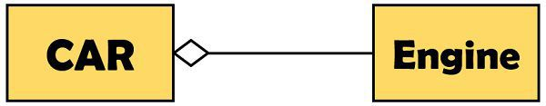

# Aggregation vs Composition

**Aggregation** - implies a relationship where the child can exist independently of the parent. Example: Class (parent) and Student (child). Delete the Class and the Students still exist.

Aggregation is also used to specify the multiplicity of objects such as one-to-one, one-to-many and many-to-many. When an object of class X is associated with a single object of class Y, in that case there exist one-to-one relationship. Similarly, if a single object of a class is associated with multiple objects of a class, then this relationship is referred to as one-to-many.

The aggregation is a type of association which describes a **“has a”** type of relationship between the objects. For instance, a car “has a” gearbox, and a car “has an” engine. For the one-to-many relationship, an example is a car “has” many wheels.

**Composition** -  implies a relationship where the child cannot exist independent of the parent. Example: House (parent) and Room (child). Rooms don't exist separate to a House.

In this type of association, the constituent part can be linked to at most one assembly. Additionally, when a constituent part collaborates with assembly, it will have the concurrent lifetime with the assembly.

Thus, composition signifies ownership of the constituent part of the whole. This would ultimately increase the convenience for the programming. The composition can trigger the deletion of the constituent object by the deletion of an assembly object.

The composition describes a **“part of”** relationship. For example, a leaf is a part of a tree, if the tree is destroyed, then leaves are must be destroyed.

| Basis for comprasion | Aggregation | Composition |
|---|---|---|
| Basic | In aggregation there exhibit a relationship where a child can exist independently of the parent  | In composition the cannot exist independently of the parent  |
| Type of relationship  | "has a"  | "part of"  |
| Association type  | Weak association  | Strong association  |
| UML design symbol  | Represented by a hollow diamond next to assembly class  | Represented by a solid diamond next to assembly class  |
| Function  | The deletion of assembly doesn't affect its parts  | If the owning class object is deleted, it could significantly affect the containing class object  |

## Links
https://stackoverflow.com/questions/1644273/what-is-the-difference-between-aggregation-composition-and-dependency  
https://www.dotnettricks.com/learn/oops/understanding-association-aggregation-composition-and-dependency-relationship  
https://techdifferences.com/difference-between-aggregation-and-composition.html  
https://javarevisited.blogspot.com/2014/02/ifference-between-association-vs-composition-vs-aggregation.html  
https://www.visual-paradigm.com/guide/uml-unified-modeling-language/uml-aggregation-vs-composition  
https://www.geeksforgeeks.org/association-composition-aggregation-java/  
