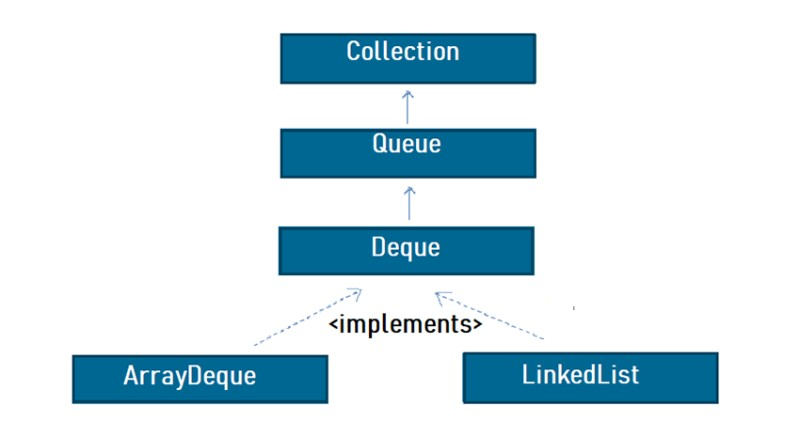

# Deque interface


```
public interface Deque<E> extends Queue<E>
```

A linear collection that supports element insertion and removal at both ends. The name *deque* is short for "double ended queue" and is usually pronounced "deck". Most `Deque` implementations place no fixed limits on the number of elements they may contain, but this interface supports capacity-restricted deques as well as those with no fixed size limit. 

This interface defines methods to access the elements at both ends of the deque. Methods are provided to insert, remove, and examine the element. Each of these methods exists in two forms: one throws an exception if the operation fails, the other returns a special value (either `null` or `false`, depending on the operation). The latter form of the insert operation is designed specifically for use with capacity-restricted `Deque` implementations; in most implementations, insert operations cannot fail.

The twelve methods described above are summarized in the following table: 
<table>
  <tr>
    <td></td>
    <td colspan="2"><b>First Element (Head)</b></td>
    <td colspan="2"><b>Last Element (Tail)</b></td>
  </tr>
  <tr>
    <td></td>
    <td><em>Throws exception</em></td>
    <td><em>Special value</em></td>
    <td><em>Throws exception</em></td>
    <td><em>Special value</em></td>
  </tr>
  <tr>
    <td><b>Insert</b></td>
    <td><code>addFirst(e)</code></td>
    <td><code>offerFirst(e)</code></td>
    <td><code>addLast(e)</code></td>
    <td><code>offerLast(e)</code></td>
  </tr>
  <tr>
    <td><b>Remove</b></td>
    <td><code>removeFirst()</code></td>
    <td><code>pollFirst()</code></td>
    <td><code>removeLast()</code></td>
    <td><code>pollLast()</code></td>
  </tr>
   <tr>
    <td><b>Examine</b>b></td>
    <td><code>getFirst()</code></td>
    <td><code>peekFirst()</code></td>
    <td><code>getLast()</code></td>
    <td><code>peekLast()</code></td>
  </tr>
</table>

This interface extends the `Queue` interface. When a deque is used as a queue, FIFO (First-In-First-Out) behavior results. Elements are added at the end of the deque and removed from the beginning. The methods inherited from the `Queue` interface are precisely equivalent to `Deque` methods as indicated in the following table: 

| **Queue Method** | **Equivalent Deque Method**  |
|---|---|
| `add(e)`  | `addLast(e)` |
| `offer(e)`  | `offerLast(e)` |
| `remove()`  | `removeFirst()` |
| `poll()`  | `pollFirst()` |
| `element()`  | `getFirst()` |
| `peek()`  | `peekFirst()` |

Deques can also be used as LIFO (Last-In-First-Out) stacks. This interface should be used in preference to the legacy `Stack` class. When a deque is used as a stack, elements are pushed and popped from the beginning of the deque. Stack methods are precisely equivalent to `Deque` methods as indicated in the table below: 

| **Stack Method** | **Equivalent Deque Method**  |
|---|---|
| `push(e)`  | `addFirst(e)` |
| `pop()`  | `removeFirst()` |
| `peek()`  | `peekFirst()` |
| `poll()`  | `pollFirst()` |
| `element()`  | `getFirst()` |
| `peek()`  | `peekFirst()` |

Note that the `peek` method works equally well when a deque is used as a queue or a stack; in either case, elements are drawn from the beginning of the deque.

Unlike the `List` interface, this interface does not provide support for indexed access to elements. 

While `Deque` implementations are not strictly required to prohibit the insertion of `null` elements, they are strongly encouraged to do so. Users of any `Deque` implementations that do allow `null` elements are strongly encouraged *not* to take advantage of the ability to insert nulls. This is so because `null` is used as a special return value by various methods to indicated that the deque is empty. 

## Most used Implementing Classes
- [`ArrayDeque`](https://docs.oracle.com/javase/8/docs/api/java/util/ArrayDeque.html) Resizable-array implementation of the `Deque` interface. Array deques have no capacity restrictions; they grow as necessary to support usage. They are not thread-safe; in the absence of external synchronization, they do not support concurrent access by multiple threads. Null elements are prohibited. This class is likely to be faster than `Stack` when used as a stack, and faster than `LinkedList` when used as a queue. <sup>[1](https://docs.oracle.com/javase/8/docs/api/java/util/ArrayDeque.html#:~:text=Resizable%2Darray%20implementation,as%20a%20queue.)</sup>
- [`LinkedList`](https://docs.oracle.com/javase/7/docs/api/java/util/LinkedList.html): Doubly-linked list implementation of the `List` and `Deque` interfaces. Implements all optional list operations, and permits all elements (including `null`). All of the operations perform as could be expected for a doubly-linked list. Operations that index into the list will traverse the list from the beginning or the end, whichever is closer to the specified index. <sup>[2](https://docs.oracle.com/javase/7/docs/api/java/util/LinkedList.html#:~:text=Doubly%2Dlinked%20list,the%20specified%20index.)</sup>

# Links
[Deque](https://docs.oracle.com/javase/8/docs/api/java/util/Deque.html)

# Next Questions
[Describe Queue interface from java collection](https://github.com/Kirchhoff-/Android-Interview-Questions/blob/master/Java/Describe%20Queue%20interface%20from%20java%20collection.md)

[What do you know about LinkedList?](https://github.com/Kirchhoff-/Android-Interview-Questions/blob/master/Java/What%20do%20you%20know%20about%20LinkedList.md)
  
# Further reading
[Java Deque](https://jenkov.com/tutorials/java-collections/deque.html)

[Deque interface in Java with Example](https://www.geeksforgeeks.org/deque-interface-java-example/)

[Java Deque Interface](https://codegym.cc/groups/posts/java-deque)
